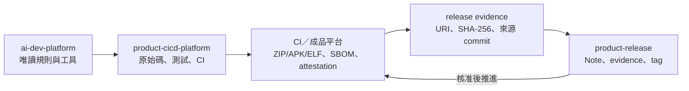

# ai-dev-platform

這是一套放在產品儲存庫旁邊共用的開發流程包，適合需要減少重複說明、固定驗證門檻與分離開發／發布權限的團隊。它提供規則、模板、初始化腳本、CI 轉接器與可驗證的 release 流程；不保存產品原始碼、不代替產品規格，也不內含第三方 Cookbook 或 skills。

## 實際提供的能力

| 需求 | 對應實作 | 限制 |
|---|---|---|
| 少載入無關內容 | `registry/workflow.yaml` 只列出各任務需要的文件 | 實際 Token 用量仍由所用工具與任務決定 |
| 建立新產品 | `scripts/init_product.py` 建立 `*-cicd-platform` 與 `*-release` | 不會替產品決定商業邏輯 |
| GitHub／GitLab／Jenkins／內部 CI | `adapters/ci/` 與同一份 release evidence 契約 | GitLab、Jenkins 與內部 runner 必須在實際環境驗收 |
| 可追溯發行 | SHA-256、SPDX SBOM、GitHub keyless attestation、獨立核准與 tag 規則 | Android／韌體仍需產品原生簽章 |
| 離線安裝 | 驗證 ZIP 內容、hash、權限後原子替換唯讀平台 | 不內含 SDK、編譯器或第三方套件 |

## 架構



開發與發行使用兩個 Git 儲存庫。建置成品留在 GitHub Releases、GitLab Package Registry 或組織核准的成品平台；release 儲存庫只保存小型中繼資料。完整元件與信任邊界見 [`docs/architecture.md`](docs/architecture.md)。

## 快速驗證

在來源儲存庫執行：

```bash
python3 -m pip install "PyYAML==6.0.3"
bash scripts/check.sh
python3 -B -m unittest discover -s tests -v
python3 -B scripts/package_release.py --dry-run --allow-dirty
```

三個可執行案例：

- [`examples/ssd-pcie-fw/SAMPLE.md`](examples/ssd-pcie-fw/SAMPLE.md)：C11 read 驗證、trace ring buffer、host test。
- [`examples/android-app/SAMPLE.md`](examples/android-app/SAMPLE.md)：AGP 9.2.0、內建 Kotlin、狀態畫面與 JVM test。
- [`examples/spec-notes/SAMPLE.md`](examples/spec-notes/SAMPLE.md)：虛構規格、閱讀筆記、需求追溯與離線 HTML 手冊。

## 建立自己的產品

```bash
cd /absolute/path/to/Work/ai-dev-platform
python3 -B scripts/init_product.py \
  --name my-product \
  --display-name "My Product" \
  --domain android \
  --ci github-actions \
  --with-example \
  --dry-run
```

確認輸出路徑後移除 `--dry-run`。Android、SSD 韌體、GitLab CI 與既有專案的完整指令見 [`docs/getting-started.md`](docs/getting-started.md)。

## 文件索引

- [`docs/getting-started.md`](docs/getting-started.md)：安裝、建立產品與案例步驟。
- [`docs/architecture.md`](docs/architecture.md)：工作區、控制流、資料流、發行時序與信任邊界。
- [`docs/documentation-validation.md`](docs/documentation-validation.md)：主要聲明的程式、測試、線上狀態與官方來源對照。
- [`docs/repository-operations.md`](docs/repository-operations.md)：GitHub／GitLab 免費方案、安全與隱私設定。
- [`docs/ci-cd-release.md`](docs/ci-cd-release.md)：CI、candidate、release repo 與正式推進。
- [`docs/maintainer-mode.md`](docs/maintainer-mode.md)：修改與發布本平台。
- [`docs/how-adopt-existing.md`](docs/how-adopt-existing.md)：不改寫歷史地導入既有專案。
- [`docs/update-existing-product.md`](docs/update-existing-product.md)：更新共用平台並驗證已導入的 dev project。
- [`docs/domain-adaptation.md`](docs/domain-adaptation.md)：查證 Android、SSD／PCIe 等版本敏感內容。
- [`docs/tool-compatibility.md`](docs/tool-compatibility.md)：`AGENTS.md`、`CLAUDE.md` 與 `opencode.json` 的載入方式。

## 公開與費用邊界

兩個 GitHub 儲存庫可在 GitHub Free 公開使用。公開儲存庫的標準 GitHub-hosted runner、分支保護、CodeQL、secret scanning、push protection 與 artifact attestations 可依 GitHub 公開方案使用；用量與功能若改版，以 GitHub 當下官方頁面為準。GitLab Free 可作次要公開鏡像，但 GitHub→GitLab 的自動 pull mirroring 不是 Free 功能，因此本專案採手動推送 `main` 與 tag，不宣稱已完成自動雙向同步。

個人 Gmail 與 hostname 已由擁有者接受公開，不重寫 Git 歷史。Token、私鑰、客戶資料與內部規格不在此例外內；發現後仍需撤銷、移除與私密通報。安全政策見 [`SECURITY.md`](SECURITY.md)。

本儲存庫原創內容採 MIT License。貢獻前請讀 [`CONTRIBUTING.md`](CONTRIBUTING.md)。
