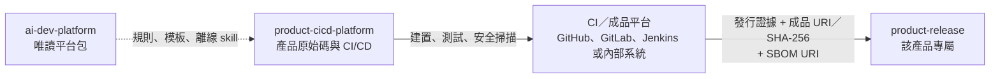

# ai-dev-platform

一個與產品類型無關的 AI 輔助開發平台（product-agnostic AI development platform）。

它不包含產品商業邏輯，而是提供 AI 代理人（AI agent）可共同遵循的流程、規範與模板。支援 Codex、Claude Code、opencode，以及其他可讀取專案指示檔的工具。

平台已提供三個工具的入口檔：Codex 與 opencode 讀取根目錄 `AGENTS.md`；Claude Code 透過根目錄 `CLAUDE.md` 的 `@AGENTS.md` 匯入相同內容。詳細機制與來源見 [`docs/tool-compatibility.md`](docs/tool-compatibility.md)。

平台核心與產品領域分離。同一套 `workflow/`、`governance/`、`templates/` 可用於 Android App、Linux kernel 模組或其他專案。領域專屬知識（例如 Material Design 或 kernel coding style）由產品儲存庫保存；查證方式見 [`docs/domain-adaptation.md`](docs/domain-adaptation.md)。

第一次使用時，先依 [`docs/getting-started.md`](docs/getting-started.md) 完成安裝、產品初始化與驗證；需要圖解總覽時再開啟 [`docs/index.html`](docs/index.html)。

## 用途

多數團隊在導入 AI 輔助開發時，會遇到三個重複發生的問題：

1. 每個新專案都要重新跟 AI「教」一次要怎麼開分支、怎麼寫 commit message、PR 要附什麼資訊
2. AI 對「這個任務該用哪個模型/哪個角色來做」沒有一致的判斷依據
3. 想借用別人維護的 prompt / skill 資源，但又不想用 submodule（clone 下來是空的，直接下載 zip 會看不到內容）

`ai-dev-platform` 用三個機制分別解決：

| 問題 | 解法 |
|---|---|
| 流程/規範重複教學 | `workflow/`、`governance/`、`templates/`，由 `AGENTS.md` 統一指揮 |
| 角色分工與 skill 選擇沒有共同依據 | `registry/providers.yaml` 提供角色範例，`registry/workflow.yaml` 與 `registry/skills.yaml` 提供工作流程與 skill 索引；實際模型仍由各工具設定 |
| 借用第三方資源但要能單純下載 zip | `external/` 用 **git subtree**（不是 submodule）同步，內容會實際併入本儲存庫 |
| 語意對齊、規格管理、執行紀律要各自重新摸索 | 整合現成的開源框架（grill-with-docs / OpenSpec / superpowers），本儲存庫只負責「什麼時候用哪個、怎麼裝」，見 [`docs/external-frameworks.md`](docs/external-frameworks.md) |

## 建議的專案結構

```
Work/
├── ai-dev-platform/        <- 唯讀平台包，跨專案共用
├── product-cicd-platform/  <- 產品原始碼與 CI/CD
└── product-release/        <- 該產品專屬的發行儲存庫
```

三者是平行的獨立目錄。`product-cicd-platform` 與 `product-release` 是兩個不同的 Git 儲存庫（Git repository）：前者保存原始碼與開發歷程，後者只接收通過驗證的版本資訊。每個產品各有一個 `product-release`。



`product-cicd-platform` 與 `product-release` 不存放平台的 `external/` skill。AI 代理人開始產品任務前，讀取 `ai-dev-platform/AGENTS.md`；發行交接依 `workflow/release.md` 執行。詳細載入方式見 [`docs/how-ai-works.md`](docs/how-ai-works.md)。

所有產品固定讀取 `Work/ai-dev-platform/` 的目前版本。產品儲存庫不內嵌平台內容、不建立平台 lock file，也不複製 `external/` skill。

## 目錄總覽

```
ai-dev-platform/
├── README.md            使用者總覽（這份文件）
├── LICENSE               本儲存庫原創內容的授權（MIT）
├── AGENTS.md             AI 代理人操作手冊（唯一事實來源，優先讀這份）
├── CLAUDE.md             Claude Code 轉接器（@AGENTS.md 匯入）
├── opencode.json         opencode 最小設定檔
├── CHANGELOG.md          框架本身的版本紀錄
├── .github/workflows/、.gitlab-ci.yml   驗證本儲存庫 + commit lint 的範例 pipeline
├── external/             git subtree 同步進來的第三方資源
├── workflow/             「怎麼做」：各類任務的標準作業流程
├── governance/           「規則是什麼」：分支/commit/審查/發布/文件/安全政策/執行紀律
├── registry/             AI 供應商、workflow、skill、外部框架的機器可讀索引（YAML）
├── templates/            Issue / PR / ADR / 架構 / benchmark / release note / task-handoff 模板
├── examples/             Android App 與 SSD PCIe 韌體的跨領域驗收 fixture
├── docs/                 關於這個儲存庫本身的說明文件
└── scripts/              產品初始化、發行驗證、subtree 同步與平台自我檢查
```

各目錄的詳細說明見 [`docs/repository-structure.md`](docs/repository-structure.md)。
從安裝到正式發行的完整步驟、三種產品案例與常見失誤見 [`docs/getting-started.md`](docs/getting-started.md)。
目前需求、實作與驗證的對照見 [`docs/requirements-traceability.md`](docs/requirements-traceability.md)。
第三方 skill 的穩定範圍、手動呼叫、觸發限制與重疊解決見 [`docs/skill-governance.md`](docs/skill-governance.md)。
GitHub 推送邊界、PR 步驟與儲存庫保護設定見 [`docs/publishing-to-github.md`](docs/publishing-to-github.md)。
GitHub Free 作為正式閘門、GitLab Free 作為第二遠端的零付費設定、CI 額度與 Public 隱私邊界，見 [`docs/free-public-hosting.md`](docs/free-public-hosting.md)。
新增 collaborator／member、同步 GitHub／GitLab CODEOWNERS 與設定 PR／MR 保護規則，見 [`docs/collaborator-management.md`](docs/collaborator-management.md)。

## 快速開始

### 使用者：下載後離線使用（不需要 Git）

```bash
# 更新既有的 Work/ai-dev-platform。輸入三個平行目錄的共同父目錄。
read -rp "Work absolute path: " WORK_ROOT
PLATFORM_VERSION=1.4.0
cd "$WORK_ROOT"

python3 -B ai-dev-platform/scripts/install_platform.py \
  "ai-dev-platform-${PLATFORM_VERSION}.zip" \
  --checksum "ai-dev-platform-${PLATFORM_VERSION}.zip.sha256" \
  --work-root "$WORK_ROOT"
```

下載版不含 `.git`，也不需要執行 `git init`。安裝器保留腳本執行權限，以發行包模式完成自我檢查後設為唯讀；維護儲存庫專用的 Git 與 subtree 資料不在此模式要求範圍。預設包含真正可載入的第三方 skill、授權與必要參考內容；完整 OpenAI Cookbook 是選用套件。首次安裝的 bootstrap 方式見 [`docs/consumer-mode.md`](docs/consumer-mode.md)。

建立產品：

```bash
# 目前位於 Work/；從唯讀平台呼叫初始化工具。
python3 -B ai-dev-platform/scripts/init_product.py \
  --name my-product \
  --domain android \
  --ci github-actions
```

此命令會在 `Work/` 建立 `my-product-cicd-platform/` 與 `my-product-release/`，並初始化為兩個獨立 Git 儲存庫。完整參數見 [`docs/product-initialization.md`](docs/product-initialization.md)。

### 維護者：開發下一版平台（需要 Git）

在 `ai_dev_platform-cicd-platform` Git 維護儲存庫修改平台本身、同步第三方 subtree 與建立發行包。完整流程見 [`docs/maintainer-mode.md`](docs/maintainer-mode.md)。

## 下載成壓縮檔

因為 `external/` 使用 **git subtree**，第三方內容會實際進入維護儲存庫的檔案樹與 commit 歷程。這代表：

- 維護儲存庫使用 `python3 scripts/package_release.py` 產生預設 ZIP；內容包含第三方 skill、授權證據、每個檔案的 SHA-256／權限與 `RELEASE-MANIFEST.json`，並排除 `.git`
- 需要完整 Cookbook 時，另用 `python3 scripts/package_optional_pack.py openai-cookbook` 建立選用 ZIP；預設包不會因 notebook 與大型參考資料膨脹到 1 GB 級

第三方更新只由維護者在 Git 維護儲存庫執行 `scripts/sync.sh pull`；下載版不執行同步。詳細流程見 [`docs/how-sync-upstream.md`](docs/how-sync-upstream.md)。

## CI 驗證

`.github/workflows/check.yml` 會在 push／PR 時執行 `scripts/check.sh`（儲存庫完整性）與 `scripts/commit-lint.sh`（commit message 格式）；`.github/workflows/codeql.yml` 掃描平台自有的 Actions 與 Python 程式碼。`.gitlab-ci.yml` 在免費第二遠端模式只自動跑 MR，預設分支需明確啟用 `ENABLE_GITLAB_MAIN_CI`，避免重複消耗 GitLab compute minutes。檢查失敗時會阻擋 GitHub PR。產品儲存庫的調整方式見 [`docs/how-enforce-rules.md`](docs/how-enforce-rules.md)。

維護者在受保護的 `main` 建立 `v*` annotated tag 後，`.github/workflows/release.yml` 會經 `release-build` environment 獨立核准，重新驗證來源、測試與 Android build，產生 ZIP、SPDX SBOM 及 GitHub/Sigstore SLSA attestation，並發布為 build candidate。完整零付費發行順序見 [`docs/free-public-hosting.md`](docs/free-public-hosting.md)。

產品 CI 可選 GitHub Actions、GitLab CI、Jenkins 或內部系統；CI 轉接器（CI adapter）與模板見 [`docs/ci-adapters.md`](docs/ci-adapters.md)。初始化工具會建立基本驗證管線，並保留發行證據模板供產品補上成品平台、SBOM 與獨立核准設定。

## 執行紀律

`governance/agent-discipline.md` 定義 AI 代理人的執行規則、三層驗證，以及異常時的還原 (rollback) 決策表。`workflow/feature.md`、`workflow/bugfix.md` 與 `AGENTS.md` 皆引用這份規則。

## 外部框架整合

語意對齊、規格與變更管理、執行紀律這三件事，分別交給三個持續在維護的外部開源框架（grill-with-docs、OpenSpec、superpowers）處理，都是**選用**，不裝也不影響本儲存庫其餘部分的運作。分工判斷、確切安裝指令（含三個工具各自的機制）、離線環境替代方案，見 [`docs/external-frameworks.md`](docs/external-frameworks.md)；機器可讀索引在 `registry/frameworks.yaml`。

## 版本

框架本身的版本演進記錄在 [`CHANGELOG.md`](CHANGELOG.md)。產品不鎖定平台版本；`Work/ai-dev-platform/` 更新後，下一次產品任務直接使用目前版本。

## 為新專案套用這套框架

產品程式碼不得放入本儲存庫。建立流程如下：

1. 在 `Work/` 執行 `ai-dev-platform/scripts/init_product.py`，選擇產品領域與 CI 系統。
2. 工具建立 `<product>-cicd-platform/`、`<product>-release/`、AI 工具入口、CI、領域文件、架構文件與第一份 ADR。
3. 依 [`docs/domain-adaptation.md`](docs/domain-adaptation.md) 補齊產品專屬規範。
4. CI 驗證通過後，依 `workflow/release.md` 將發行證據與 Release Note 交給發行儲存庫；建置成品留在 CI／成品平台。

## 授權與貢獻

本儲存庫的原創內容可依 `LICENSE` 複製與修改；此 MIT 授權不會取代 `external/` 各第三方內容自己的授權，完整證據見 [`external/README.md`](external/README.md) 與 `distribution/third-party-notices.json`。貢獻前讀 [`CONTRIBUTING.md`](CONTRIBUTING.md)；弱點請依 [`SECURITY.md`](SECURITY.md) 使用 GitHub 私密通報。修改文件前先讀 [`governance/documentation.md`](governance/documentation.md) 與 [`docs/terminology.md`](docs/terminology.md)。
