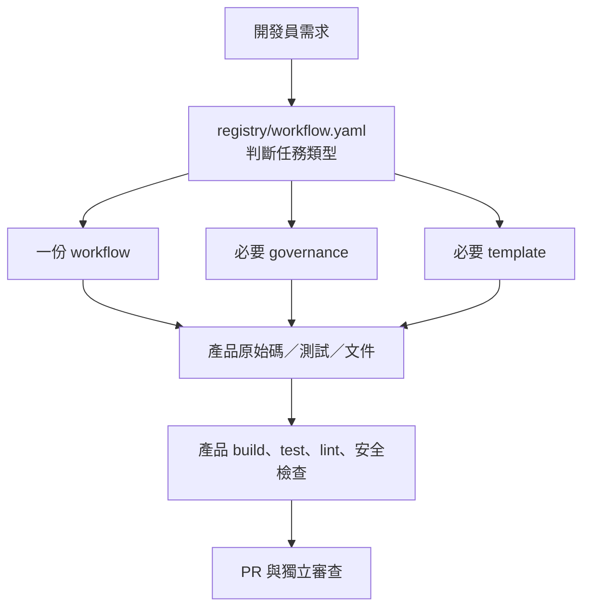
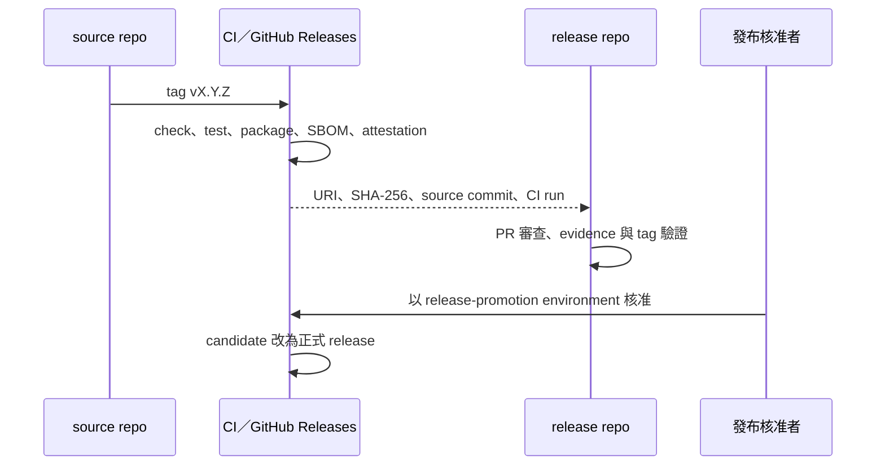

# 平台架構與資料流

本文件供開發者與維護者了解元件、資料流與信任邊界；不描述任何產品的商業架構。

## 元件

```text
ai-dev-platform/
├── AGENTS.md               任務入口與硬性邊界
├── registry/               任務、CI 轉接器與領域設定檔索引
├── workflow/               feature、bugfix、debug、review、release 等步驟
├── governance/             branch、commit、review、security、release 規則
├── templates/              issue、PR、ADR、交接與 release evidence 模板
├── adapters/ci/            GitHub、GitLab、Jenkins、internal CI 轉接器
├── scripts/                初始化、稽核、打包、安裝與發行驗證
└── examples/               SSD trace、Android、規格筆記三個驗收案例
```

平台不保存第三方來源副本、模型清單或產品原始碼。產品所需 SDK、函式庫與專屬規格由產品儲存庫管理。

## 任務資料流



減少讀取量的方式是「依 registry 只載入當前任務需要的文件」，不是壓縮需求或省略測試。平台不承諾固定 Token 節省比例，因為用量受工具、上下文與任務影響。

## 發行與信任邊界



來源儲存庫產生成品；release 儲存庫保存核准所需的中繼資料；環境核准者推進正式發布。任何一個 GitHub 帳號若同時控制來源、核准與發布，技術流程仍可運作，但人員獨立性不足，不能宣稱已符合雙人控管。

## 安全邊界

| 資料 | 保存位置 | 不得保存的位置 |
|---|---|---|
| 原始碼、測試 | `*-cicd-platform` | `*-release` |
| ZIP、APK、AAB、ELF、韌體映像 | CI／成品平台 | Git 儲存庫 |
| Release Note、evidence、tag | `*-release` | 無 |
| CI Token、簽章私鑰 | 平台 secret store／HSM | 原始碼、log、evidence |
| 非公開規格 | 獲准的內部系統 | 公開 GitHub／GitLab |

GitHub keyless attestation 證明成品來自哪個 workflow、repository 與 commit；它不證明程式沒有弱點，也不取代 Android App Signing 或韌體供應商簽章。
