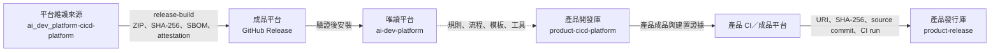
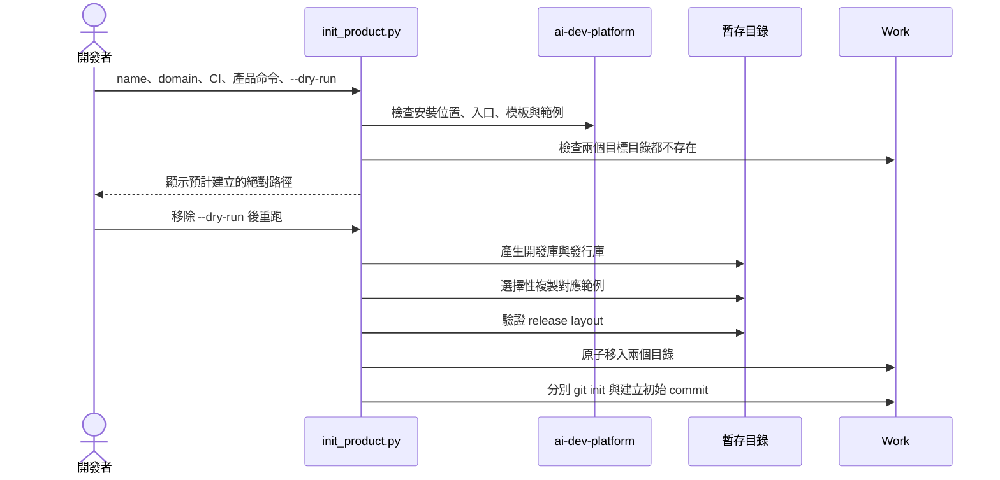
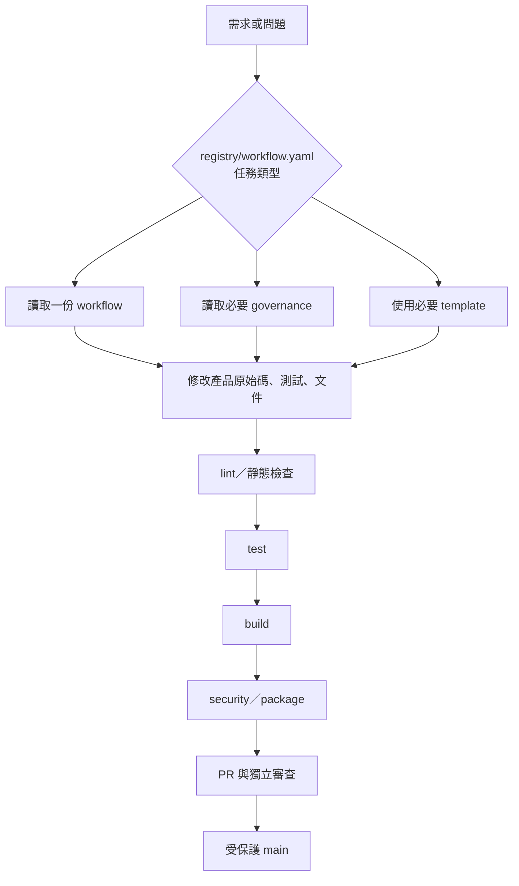
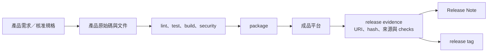
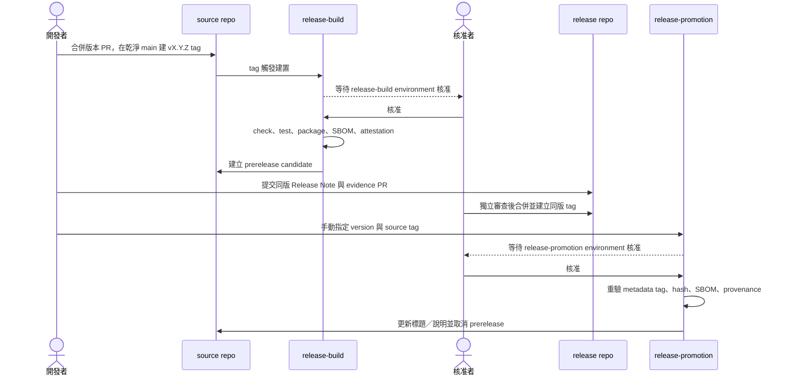
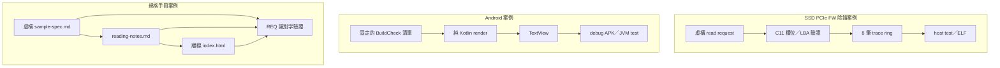

# 平台架構、流程與資料流

本文件說明平台實際保存的檔案、產品建立方式、工作流程與發布邊界。圖中的 `product` 是使用者建立的產品名稱，不代表本平台內含產品程式碼。

## 1. 工作區架構

維護來源、安裝後的平台、產品開發儲存庫與發行儲存庫是不同目錄：

```text
Work/
├── ai_dev_platform-cicd-platform/  # 平台維護來源；只有修改平台時使用
├── ai-dev-platform/                # 從 Release ZIP 安裝；產品以唯讀方式讀取
├── product-cicd-platform/          # 產品原始碼、測試、文件與 CI
└── product-release/                # Release Note、evidence 與 tag
```



相依方向只有「產品讀取唯讀平台」。產品不修改 `ai-dev-platform/`，發行儲存庫也不讀取或複製產品原始碼。

## 2. 平台元件

| 路徑 | 用途 | 不處理的內容 |
|---|---|---|
| `AGENTS.md` | 任務入口、共用邊界與文件載入規則 | 產品需求與領域決策 |
| `registry/` | workflow、CI adapter、domain profile 索引 | 執行 CI 或下載 SDK |
| `workflow/` | feature、bugfix、debug、review、release 步驟 | 產品專屬命令 |
| `governance/` | branch、commit、review、security、release 規則 | 取代 branch protection 或人工審查 |
| `templates/` | issue、PR、ADR、交接與 evidence 格式 | 自動產生正確的產品內容 |
| `adapters/ci/` | GitHub、GitLab、Jenkins、internal CI 的 evidence 契約 | 驗證未連線的 runner、權限或 secret |
| `scripts/` | 初始化、稽核、安裝、打包與發行驗證 | 安裝 Android SDK、編譯器或產品依賴 |
| `examples/` | SSD trace、Android、規格筆記三個可執行案例 | 正式韌體、商店 App、受授權規格原文 |

## 3. 建立產品的控制流

`scripts/init_product.py` 同時建立兩個獨立 Git 儲存庫。它先完成所有輸入與目標路徑檢查，才把暫存目錄移到 `Work/`，遇到既有目錄會停止。



初始化器會產生可編輯的產品骨架，不會建立遠端 repository、不會設定 branch protection、不會建立 CI secret，也不會把除錯案例轉成正式產品。

## 4. 任務控制流



Registry 只決定這項任務要讀哪些平台文件。它不會縮短產品需求、不會自動執行測試，也不保證固定的上下文或 Token 節省比例。

## 5. 產品資料流



成品資料與發行中繼資料分開保存：

| 資料 | 保存位置 | 不得保存的位置 |
|---|---|---|
| 原始碼、測試、產品文件 | `product-cicd-platform` | `product-release` |
| ZIP、APK、AAB、ELF、韌體映像 | CI／成品平台 | Git 儲存庫 |
| Release Note、evidence、tag | `product-release` | 無 |
| CI Token、簽章私鑰 | 平台 secret store／HSM | 原始碼、log、evidence |
| 非公開規格 | 獲准的內部系統 | 公開 GitHub／GitLab |

## 6. 發行時序



`release-build` 與 `release-promotion` 都使用 environment reviewer。若同一個人同時控制來源、核准與發布，流程仍可執行，但不能列為雙人控管。

## 7. 三個案例的資料邊界



SSD 案例沒有 PCIe/NVMe 命令與硬體存取；Android 案例沒有後端、正式簽章與上架設定；規格案例不是 PCIe 或 NVMe 原文。各案例的實作步驟與限制見：

- [`../examples/ssd-pcie-fw/SAMPLE.md`](../examples/ssd-pcie-fw/SAMPLE.md)
- [`../examples/android-app/SAMPLE.md`](../examples/android-app/SAMPLE.md)
- [`../examples/spec-notes/SAMPLE.md`](../examples/spec-notes/SAMPLE.md)

## 8. 信任邊界

GitHub artifact attestation 可把成品連回 workflow、repository、commit 與觸發事件。它不是弱點掃描結果，也不保證成品安全；Android App Signing、韌體供應商簽章、裝置 secure boot 與量產金鑰管理仍由產品實作。此邊界與 [GitHub 官方說明](https://docs.github.com/en/actions/concepts/security/artifact-attestations)一致，查詢日期為 2026-08-25。
