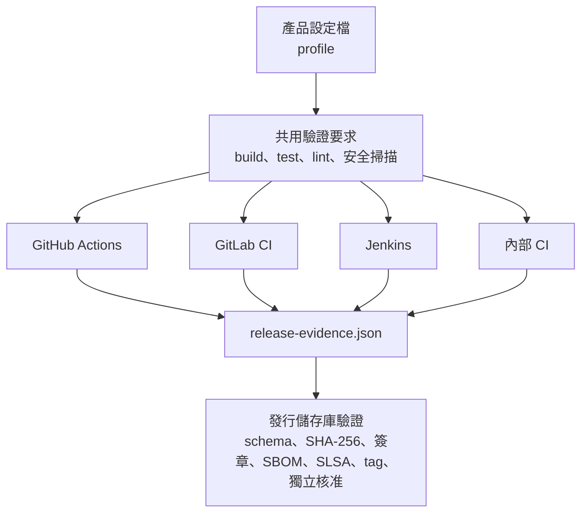

# CI 轉接器

本文件供建立產品 CI/CD 的維護者使用。平台支援 GitHub Actions、GitLab CI、Jenkins 與內部 CI；各系統使用相同的發行證據契約，但產品的建置指令由產品自行定義。

## 共用契約

## 套用方式

1. 依產品的 CI 系統，從 `adapters/ci/` 選擇 CI 轉接器（CI adapter）文件與模板。
2. 將模板中的建置（build）、測試（test）、靜態檢查（lint）、安全掃描、打包與證據產生指令替換為產品實際指令。
3. 依 `profiles/` 補上 Android、嵌入式韌體或其他領域的必要檢查。
4. 產生符合 `distribution/release-evidence.schema.json` 的 `release-evidence.json`。
5. 發行工作在儲存庫外的暫存區或成品平台重新驗證證據與建置成品（artifact）；發行儲存庫只提交發行中繼資料，再決定是否推進正式發行。

平台可離線驗證轉接器的契約結構，但 GitLab、Jenkins 與內部 CI 的 runner、權限、成品 API 與密鑰管理必須在產品實際環境驗收。`scripts/validate_ci_adapters.py` 不會將靜態模板驗證誤報為已完成線上連線。

新增 CI 系統時，必須新增轉接器文件與模板、登記到 `registry/ci-adapters.yaml`，並保留所有必要的發行證據欄位。

CI 憑證（credential）只能存放在 CI 的秘密資料儲存區（secret store）。不得寫入 YAML、模板、manifest 或發行證據。
