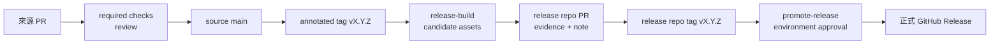

# CI/CD 與 release 操作

本文件供平台維護者與發布核准者使用，說明 GitHub 的已實作流程及其他 CI 的契約邊界。產品專屬發布通路仍須由產品團隊補上。

## 流程總覽



## GitHub Actions 已實作內容

| Workflow | 觸發 | 做什麼 | 不做什麼 |
|---|---|---|---|
| `check.yml` | source push／PR | repository self-check、Python tests、SSD host build、Android build/test/lint | 不發布 |
| `codeql.yml` | push／PR／每週 | Actions 與 Python CodeQL | 不掃描產品私有依賴 |
| `release.yml` | annotated `v*` tag | 重驗來源、產生 ZIP／SHA-256／SPDX、keyless attestation、prerelease candidate | 不直接成為正式 release |
| `promote-release.yml` | 指向 source tag 的手動 dispatch | 讀取同版 release metadata tag、重驗 readiness、將 candidate 推進正式版 | 不建立或修改 release evidence |

Actions 都以完整 commit SHA 固定。release 工作需要 `contents: write`、`id-token: write`、`attestations: write`；一般檢查維持 `contents: read`。

## 第一次正式發布

目前尚無 GitHub Release。來源 PR 合併且 `distribution/manifest.json` 為 `1.5.0` 後：

1. 在來源 repository 的乾淨 `main` 建立 annotated tag：

   ```bash
   git switch main
   git pull --ff-only origin main
   test -z "$(git status --porcelain)"
   git tag -a v1.5.0 -m "release: v1.5.0"
   git push origin v1.5.0
   ```

2. `release-build` 會停在 `release-build` environment，必須由不同人核准。完成後確認 GitHub Releases 出現 prerelease，並下載驗證：

   ```bash
   gh release download v1.5.0 \
     --repo JiaChangGit/ai_dev_platform-cicd-platform \
     --dir /tmp/ai-dev-platform-1.5.0
   cd /tmp/ai-dev-platform-1.5.0
   sha256sum -c ai-dev-platform-1.5.0.zip.sha256
   gh attestation verify ai-dev-platform-1.5.0.zip \
     -R JiaChangGit/ai_dev_platform-cicd-platform
   ```

3. 在 release repository 建功能分支，提交 `releases/1.5.0/release-evidence.json` 與 Release Note。evidence 必須引用實際 source commit、tag、CI run、asset URI、SHA-256、SBOM 與 Sigstore bundle，不能先寫假值。
4. release PR 經 `repository-policy`、CodeQL 與獨立核准合併後，在 release `main` 建 annotated `v1.5.0` tag，先跑 readiness，再推送：

   ```bash
   python3 -B scripts/verify_release_readiness.py . \
     --version 1.5.0 \
     --source-repo ../ai_dev_platform-cicd-platform \
     --artifact-file /tmp/ai-dev-platform-1.5.0/ai-dev-platform-1.5.0.zip \
     --signature-file /tmp/ai-dev-platform-1.5.0/ai-dev-platform-1.5.0.provenance.sigstore.json \
     --sbom-file /tmp/ai-dev-platform-1.5.0/ai-dev-platform-1.5.0.spdx.json \
     --provenance-file /tmp/ai-dev-platform-1.5.0/ai-dev-platform-1.5.0.provenance.sigstore.json
   git push origin v1.5.0
   ```

   實際參數以 release repository README 與腳本 `--help` 為準；不要把本段的 `/tmp` 路徑寫進 evidence。

5. 從 source tag 啟動 promotion，否則 workflow 的 ref 驗證會失敗：

   ```bash
   gh workflow run promote-release.yml \
     --repo JiaChangGit/ai_dev_platform-cicd-platform \
     --ref v1.5.0 \
     -f version=1.5.0
   ```

6. `release-promotion` environment 由不同人核准。完成後確認 prerelease 已轉為 latest 正式版，再安裝唯讀包。

## GitLab、Jenkins 與內部 CI

`adapters/ci/` 提供語法模板，四種 CI 都要產生符合 `distribution/release-evidence.schema.json` 的相同欄位：build、test、lint、security、package，另含成品、SBOM、provenance、簽章與核准資訊。

`scripts/validate_ci_adapters.py` 只驗證模板語法、佔位符與契約一致，不能證明 runner、權限、網路、成品 API 或 secret store 可用。每種實際環境至少執行一次測試 pipeline 並保存 run URL，才能稱為完成連線驗收。詳細欄位見 `docs/ci-adapters.md` 與 `workflow/release.md`。

## 失敗與還原

- candidate 建置失敗：修正來源後以新版本 tag 發布；不要移動既有公開 tag。
- evidence 或 readiness 失敗：修正 release PR；不要略過驗證或直接編輯正式 Release。
- 正式版有問題：將舊版重新標為 latest 或停止下游推進；程式修正回到 source repo 走 bugfix PR。
- tag 已公開後發現內容錯誤：保留稽核紀錄並發新 patch 版本，除非已確認沒有任何外部取用者且 owner 明確批准破壞性刪除。
