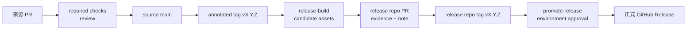

# CI/CD 與 release 操作

本文件供平台維護者與發布核准者使用，說明 GitHub 的已實作流程及其他 CI 的契約邊界。產品專屬發布通路仍須由產品團隊補上。

## 流程總覽



## GitHub Actions 已實作內容

| Workflow | 觸發 | 做什麼 | 不做什麼 |
|---|---|---|---|
| `check.yml` | source push／PR | repository self-check、Python tests、SSD host build、Android build/test/lint | 不發布 |
| `codeql.yml` | push／PR／每週 | Actions 與 Python CodeQL | 不掃描產品私有依賴 |
| `release.yml` | annotated `v*` tag | 重驗來源、產生 ZIP／SHA-256／SPDX、keyless attestation、prerelease candidate | 不直接成為正式 release |
| `promote-release.yml` | 指向 source tag 的手動 dispatch | 讀取同版 release metadata tag、重驗 readiness、更新正式標題／說明並將 candidate 推進正式版 | 不建立或修改 release evidence |

Actions 都以完整 commit SHA 固定。release 工作需要 `contents: write`、`id-token: write`、`attestations: write`；一般檢查維持 `contents: read`。

## 後續正式發布

`v1.5.0` 已完成第一份正式 Release。以下以 `v1.5.1` 示範後續版本；實際版本必須與 `distribution/manifest.json` 一致。

0. 從最新 source `main` 建 `release/1.5.1`，把不同邏輯拆成不同 commit。每筆訊息在 commit 前先用 `--message` 檢查；push 前再檢查整個 PR 範圍：

   ```bash
   git switch main
   git pull --ff-only origin main
   git switch -c release/1.5.1

   git add <files-for-one-change>
   bash scripts/commit-lint.sh --message "fix(scope): describe one change"
   git commit -m "fix(scope): describe one change"
   # 其他獨立變更重複 add／lint／commit，不使用 git add -A 混在一起。

   bash scripts/commit-lint.sh --range origin/main..HEAD
   bash scripts/check.sh
   python3 -B -m unittest discover -s tests -v
   python3 -B scripts/pre_push_audit.py
   git diff --check origin/main..HEAD
   git push -u origin release/1.5.1
   gh pr create --base main --head release/1.5.1 \
     --title "chore(release): prepare v1.5.1" \
     --body "列出每筆 commit、驗證結果、限制與回復方式。"
   gh pr checks --watch
   ```

   作者不得核准自己的 PR。不同帳號的 reviewer 核准且 required checks 全綠後，以 `gh pr merge <number> --rebase --delete-branch` 保留原子 commits 並維持 linear history。若核准後又 push，必須重新取得 last-push approval。

1. 在來源 repository 的乾淨 `main` 建立 annotated tag：

   ```bash
   git switch main
   git pull --ff-only origin main
   test -z "$(git status --porcelain)"
   git tag -a v1.5.1 -m "release: v1.5.1"
   git push origin v1.5.1
   ```

2. `release-build` 會停在 `release-build` environment，必須由不同人核准。完成後確認 GitHub Releases 出現 prerelease，並下載驗證：

   ```bash
   gh release download v1.5.1 \
     --repo JiaChangGit/ai_dev_platform-cicd-platform \
     --dir /tmp/ai-dev-platform-1.5.1
   cd /tmp/ai-dev-platform-1.5.1
   sha256sum -c ai-dev-platform-1.5.1.zip.sha256
   gh attestation verify ai-dev-platform-1.5.1.zip \
     -R JiaChangGit/ai_dev_platform-cicd-platform
   ```

3. 在 release repository 建功能分支，提交 `release-evidence/1.5.1.json` 與 `release-notes/1.5.1.md`。evidence 必須引用實際 source commit、tag、CI run、asset URI、SHA-256、SBOM 與 Sigstore bundle，不能先寫假值。
4. release PR 經 `repository-policy`、CodeQL 與獨立核准合併後，在 release `main` 建 annotated `v1.5.1` tag，先跑 readiness，再推送：

   ```bash
   git tag -a v1.5.1 -m "release: v1.5.1"
   python3 -B ../ai-dev-platform/scripts/verify_release_readiness.py . \
     --version 1.5.1 \
     --source-repo ../ai_dev_platform-cicd-platform \
     --artifact-file /tmp/ai-dev-platform-1.5.1/ai-dev-platform-1.5.1.zip \
     --signature-file /tmp/ai-dev-platform-1.5.1/ai-dev-platform-1.5.1.provenance.sigstore.json \
     --sbom-file /tmp/ai-dev-platform-1.5.1/ai-dev-platform-1.5.1.spdx.json \
     --provenance-file /tmp/ai-dev-platform-1.5.1/ai-dev-platform-1.5.1.provenance.sigstore.json
   git push origin v1.5.1
   ```

   實際參數以 release repository README 與腳本 `--help` 為準；不要把本段的 `/tmp` 路徑寫進 evidence。

5. 從 source tag 啟動 promotion，否則 workflow 的 ref 驗證會失敗：

   ```bash
   gh workflow run promote-release.yml \
     --repo JiaChangGit/ai_dev_platform-cicd-platform \
     --ref v1.5.1 \
     -f version=1.5.1
   ```

6. `release-promotion` environment 由不同人核准。完成後確認 prerelease 已轉為 latest 正式版，Release 標題不再含 `build candidate`，內容已連結同版 Release Note／evidence，再安裝唯讀包。

## GitLab、Jenkins 與內部 CI

`adapters/ci/` 提供語法模板，四種 CI 都要產生符合 `distribution/release-evidence.schema.json` 的相同欄位：build、test、lint、security、package，另含成品、SBOM、provenance、簽章與核准資訊。

`scripts/validate_ci_adapters.py` 只驗證模板語法、佔位符與契約一致，不能證明 runner、權限、網路、成品 API 或 secret store 可用。每種實際環境至少執行一次測試 pipeline 並保存 run URL，才能稱為完成連線驗收。詳細欄位見 `docs/ci-adapters.md` 與 `workflow/release.md`。

## 失敗與還原

- candidate 建置失敗：修正來源後以新版本 tag 發布；不要移動既有公開 tag。
- evidence 或 readiness 失敗：修正 release PR；不要略過驗證或直接編輯正式 Release。
- 正式版有問題：將舊版重新標為 latest 或停止下游推進；程式修正回到 source repo 走 bugfix PR。
- tag 已公開後發現內容錯誤：保留稽核紀錄並發新 patch 版本，除非已確認沒有任何外部取用者且 owner 明確批准破壞性刪除。
