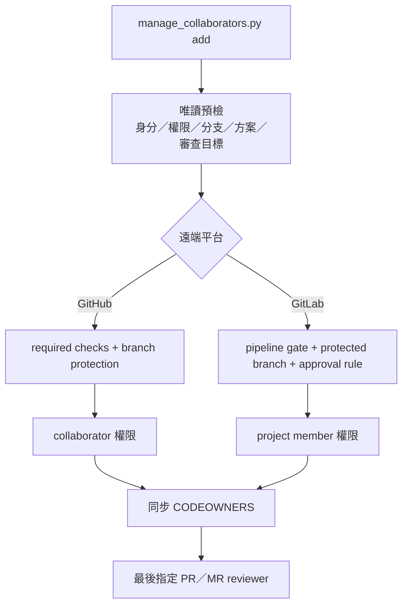

# Collaborator 與審查政策管理

`scripts/manage_collaborators.py` 用來處理 repository 協作者、Code Owner、PR／Merge Request 與預設分支保護。平台維護 repository 與 release repository 各自保存腳本，兩者可獨立執行。

## 管理範圍



| 項目 | GitHub | GitLab |
|---|---|---|
| 成員權限 | Repository collaborator | Project member |
| 擁有者檔 | `.github/CODEOWNERS` | `.gitlab/CODEOWNERS` |
| 變更範本 | Pull Request template | Merge Request template |
| CI 阻擋 | Required status checks | Pipeline must succeed |
| 審查阻擋 | Code Owner、過期核准失效、最後推送需核准 | Code Owner、approval rule、作者與提交者不得自行核准 |
| 分支保護 | 禁止 force push／刪除，必須經 PR | 禁止直接 push／force push，必須經 MR |

GitHub Free 只在公開 repository 提供 protected branch。私人 repository 必須使用 GitHub Pro、GitHub Team 或 GitHub Enterprise，才能把核准、Code Owner 與 required checks 設成合併阻擋條件。腳本會在寫入 CODEOWNERS、邀請 collaborator 或修改 merge 設定前先做方案預檢；不支援時會停止，避免遠端只套用一部分。

本平台把分支保護列為必要條件。遠端操作若使用 `--no-configure-policy`，腳本會直接拒絕，不可用它避開 GitHub 或 GitLab 方案限制。

GitLab 的強制 Code Owner 核准與 project approval rule 需要 Premium 或 Ultimate。腳本會先確認 Token 有效且包含完整 API 讀寫用的 `api` scope、身分至少具有 Maintainer／Owner 權限、目標 username 是 active、分支存在，並以唯讀方式查詢 direct membership、group membership lock、protected branch、approvals、approval rules 與指定的 Merge Request；全部通過後才寫入 CODEOWNERS、member 或 project policy。既有 protected branch 的 push、merge 與 unprotect 權限會一併正規化。遇到不支援的方案或權限時會失敗，不會自動改成較寬鬆的規則。

## 資安設計

- GitHub 只使用已登入的 GitHub CLI（`gh auth login`），不接收 `--token` 參數。
- GitLab Token 只從指定的環境變數讀取；預設名稱為 `GITLAB_TOKEN`。
- CI 只執行 `check`，權限為唯讀，不邀請成員，也不保存管理權限 Token。
- API 參數不透過 shell 字串串接；username、repository 路徑、環境變數名稱與 API URL 都會先驗證。
- GitLab API 預設只接受 HTTPS。`--allow-insecure-gitlab-http` 只供隔離測試環境，不得用於正式服務。
- 新增成員不會自動執行 `git add`、commit、push 或 merge。所有本機政策變更仍需人工檢視後送 PR／MR。
- 遠端寫入順序固定為「保護政策 → 成員權限 → 本機 CODEOWNERS → reviewer」。新 GitHub 帳號只先收到 `pull` 唯讀邀請，接受後重跑才會升為指定的 write 權限。
- 遠端 API 無法提供跨服務交易（transaction），而且預檢與寫入之間仍可能發生遠端狀態變更。執行中斷時先看 `[OK]`／`[FAIL]`，修正後以相同參數重跑；操作採可重複執行（idempotent）設計。

## 先決條件

1. 先把 workflow 與 CODEOWNERS 推到遠端，至少成功執行一次 CI，讓 required check 名稱出現在 repository。
2. 執行者必須有 repository 管理權限。
3. GitHub 環境先完成：

   ```bash
   gh auth login --git-protocol ssh --web
   gh auth status
   ```

4. GitLab 使用 Project Access Token 或 Personal Access Token 時，必須包含標準 `api` scope；`read_api`、`write_repository` 與 CI Job Token 都不足以管理 member、project、protected branch 與 approval rule。Token 只放在執行當下的環境變數。
5. GitLab 執行者必須是專案 Maintainer 或 Owner；Developer 無法新增 member 或設定必要的 repository policy。

以下命令在同一個終端機執行。先輸入三個平行目錄的共同父目錄：

```bash
read -rp "Work absolute path: " WORK_ROOT
```

## 新增 GitHub collaborator

兩個 repository 必須分別執行，避免其中一個遠端失敗時影響另一個。

### 平台維護 repository

```bash
read -rp "GitHub username: " GITHUB_USERNAME
cd "$WORK_ROOT/ai_dev_platform-cicd-platform"

# 預覽：不寫檔、不呼叫 API。
python3 -B scripts/manage_collaborators.py add "$GITHUB_USERNAME"

# 遠端唯讀預檢：查詢 API，但不寫入檔案或設定。
python3 -B scripts/manage_collaborators.py add "$GITHUB_USERNAME" --preflight-only

# 套用：先設定 PR 與 main 保護規則，再處理權限與 CODEOWNERS。
python3 -B scripts/manage_collaborators.py add "$GITHUB_USERNAME" --apply
```

若要同時把對方加入既有 PR，例如 PR `#1`：

```bash
python3 -B scripts/manage_collaborators.py add "$GITHUB_USERNAME" \
  --apply \
  --request-review 1
```

平台維護 repository 預設將 `self-check` 與 `android-example` 設為 required checks。若實際 job 名稱不同，用多個 `--required-check` 明確覆寫：

```bash
python3 -B scripts/manage_collaborators.py add "$GITHUB_USERNAME" \
  --apply \
  --required-check self-check \
  --required-check android-example
```

### Release repository

```bash
cd "$WORK_ROOT/ai_dev_platform-release"

python3 -B scripts/manage_collaborators.py add "$GITHUB_USERNAME"
python3 -B scripts/manage_collaborators.py add "$GITHUB_USERNAME" --preflight-only
python3 -B scripts/manage_collaborators.py add "$GITHUB_USERNAME" --apply
```

release repository 會把 `repository-policy` 設為 required check。兩個 repository 的預設協作者權限都是 `push`；可用 `--github-permission push|maintain|admin` 調整。Code Owner 必須至少具有 write（`push`）權限，因此腳本不接受 `pull` 或 `triage`。

### 邀請尚未接受

GitHub 新邀請不會立即成為有效 collaborator。腳本會先套用 branch protection，再送出 `pull` 唯讀邀請，接著回傳狀態碼 `2`；這一輪不修改 CODEOWNERS，也不指定 reviewer。受邀者接受後重跑，腳本才會在受保護的分支上把權限升為 `push`、`maintain` 或 `admin`。

處理順序如下：

1. 對方接受 GitHub 邀請。
2. 以完全相同的 `--apply` 命令重跑。
3. 確認顯示 collaborator 權限、CODEOWNERS 與 reviewer 都已設定。
4. 執行 `python3 -B scripts/manage_collaborators.py check`，並以遠端 API 查核 branch protection。

## 新增 GitLab member

目前兩個 repository 的 `origin` 指向 GitHub，因此要明確提供 GitLab project。以下命令只處理 GitLab；若要同時同步 GitHub，移除 `--skip-github`。

```bash
cd "$WORK_ROOT/ai_dev_platform-cicd-platform"

read -rsp "GitLab Token: " GITLAB_TOKEN
printf '\n'
export GITLAB_TOKEN
read -rp "GitLab username: " GITLAB_USERNAME
read -rp "GitLab project path (group/project): " GITLAB_PROJECT

python3 -B scripts/manage_collaborators.py add "$GITLAB_USERNAME" \
  --preflight-only \
  --skip-github \
  --gitlab-project "$GITLAB_PROJECT"

python3 -B scripts/manage_collaborators.py add "$GITLAB_USERNAME" \
  --apply \
  --skip-github \
  --gitlab-project "$GITLAB_PROJECT"

unset GITLAB_TOKEN
```

指定既有 Merge Request reviewer，例如 MR `!12`：

```bash
python3 -B scripts/manage_collaborators.py add "$GITLAB_USERNAME" \
  --apply \
  --skip-github \
  --gitlab-project "$GITLAB_PROJECT" \
  --request-merge-request-review 12
```

內部 GitLab 使用不同位置時，加上 `--gitlab-api-url https://gitlab.example.com/api/v4`。Token 不可直接寫在命令、`.env`、YAML、shell script 或 Git remote URL。

release repository 也要在該目錄內獨立執行相同命令，並把 `--gitlab-project` 改成 release project 路徑。

`--preflight-only` 會實際查詢 GitHub／GitLab 的身分、權限、方案、分支與政策 API，但不寫檔、不邀請成員、不修改遠端設定。預設不加 `--apply` 的模式只顯示計畫，兩者用途不同。

## 只修改本機政策

尚未準備遠端權限時，可先同步 CODEOWNERS：

```bash
read -rp "Repository username: " COLLABORATOR_USERNAME
python3 -B scripts/manage_collaborators.py add "$COLLABORATOR_USERNAME" --apply --local-only
python3 -B scripts/manage_collaborators.py check
git diff -- .github/CODEOWNERS .gitlab/CODEOWNERS
```

`--local-only` 不會驗證該帳號是否真的存在於 GitHub 或 GitLab，因此合併前仍要由 repository 管理者完成遠端確認。

## CI 的責任

GitHub Actions 與 GitLab CI 都只執行下列唯讀檢查：

```bash
python3 -B -c 'compile(open("scripts/manage_collaborators.py", encoding="utf-8").read(), "scripts/manage_collaborators.py", "exec")'
python3 -B scripts/manage_collaborators.py check
```

`check` 會阻擋以下狀況：

- GitHub／GitLab CODEOWNERS 缺少或內容不同。
- 任一規則少於兩位不同 owner。
- 必要路徑沒有 Code Owner 規則。
- repository 缺少對應的 GitHub Actions 或 GitLab CI 設定。
- release repository 出現允許清單外的檔案。

遠端 branch protection 是否真的生效，仍須用 repository 管理權限在 GitHub／GitLab 設定頁或 API 查核；CI 不持有管理 Token，因此不代替此項查核。

## 常見失誤

| 現象 | 原因 | 處理方式 |
|---|---|---|
| 第一次 `--apply` 回傳狀態碼 2 | 新 GitHub 帳號只收到唯讀邀請，尚未成為有效 collaborator | 對方接受後，以完全相同參數重跑；不要把狀態碼 2 當成部分失敗後改用手動降級 |
| GitHub 回傳私人儲存庫方案限制 | 目前方案不支援必要 branch protection | 升級適用方案；不得改公開或使用 `--no-configure-policy` 繞過 |
| Required check 不存在 | workflow 尚未在遠端產生該 job 名稱 | 先成功執行一次 CI，再使用實際 check 名稱 |
| GitLab 顯示 Token scope 不足 | 使用了 `read_api`、`write_repository` 或 CI Job Token | 改用包含標準 `api` scope 的核准 Token，執行完立刻 `unset` |
| `--preflight-only` 通過後 `--apply` 仍失敗 | 預檢與寫入之間的遠端狀態改變 | 依已顯示的 `[OK]`／`[FAIL]` 判斷進度，修正後用相同參數重跑 |
| CODEOWNERS 已改，但遠端權限未完成 | 使用了 `--local-only` | 在合併 CODEOWNERS 前，由管理者完成遠端預檢與政策設定 |

## 官方 API 依據

- [GitHub REST API：Repository collaborators](https://docs.github.com/en/rest/collaborators/collaborators)
- [GitHub REST API：Protected branches](https://docs.github.com/en/rest/branches/branch-protection)
- [GitHub Docs：Protected branch 的方案適用範圍](https://docs.github.com/en/repositories/configuring-branches-and-merges-in-your-repository/managing-protected-branches)
- [GitLab API：Project members](https://docs.gitlab.com/api/project_members/)
- [GitLab API：Branches](https://docs.gitlab.com/api/branches/)
- [GitLab API：Protected branches](https://docs.gitlab.com/api/protected_branches/)
- [GitLab API：Merge request approvals](https://docs.gitlab.com/api/merge_request_approvals/)
- [GitLab API：Personal access token self-information](https://docs.gitlab.com/api/personal_access_tokens/#self-inform)
- [GitLab API：Groups (`membership_lock`)](https://docs.gitlab.com/api/groups/)
- [GitLab Docs：Access token scopes](https://docs.gitlab.com/security/tokens/access_token_scopes/)
