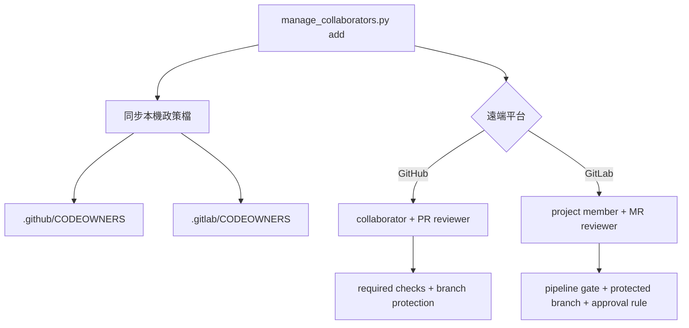

# Collaborator 與審查政策管理

`scripts/manage_collaborators.py` 用來處理 repository 協作者、Code Owner、PR／Merge Request 與預設分支保護。平台維護 repository 與 release repository 各自保存腳本，兩者可獨立執行。

## 管理範圍



| 項目 | GitHub | GitLab |
|---|---|---|
| 成員權限 | Repository collaborator | Project member |
| 擁有者檔 | `.github/CODEOWNERS` | `.gitlab/CODEOWNERS` |
| 變更範本 | Pull Request template | Merge Request template |
| CI 阻擋 | Required status checks | Pipeline must succeed |
| 審查阻擋 | Code Owner、過期核准失效、最後推送需核准 | Code Owner、approval rule、作者與提交者不得自行核准 |
| 分支保護 | 禁止 force push／刪除，必須經 PR | 禁止直接 push／force push，必須經 MR |

GitLab 的強制 Code Owner 核准與 project approval rule 需要 Premium 或 Ultimate。腳本遇到不支援的方案或權限時會失敗，不會自動改成較寬鬆的規則。

## 資安設計

- GitHub 只使用已登入的 GitHub CLI（`gh auth login`），不接收 `--token` 參數。
- GitLab Token 只從指定的環境變數讀取；預設名稱為 `GITLAB_TOKEN`。
- CI 只執行 `check`，權限為唯讀，不邀請成員，也不保存管理權限 Token。
- API 參數不透過 shell 字串串接；username、repository 路徑、環境變數名稱與 API URL 都會先驗證。
- GitLab API 預設只接受 HTTPS。`--allow-insecure-gitlab-http` 只供隔離測試環境，不得用於正式服務。
- 新增成員不會自動執行 `git add`、commit、push 或 merge。所有本機政策變更仍需人工檢視後送 PR／MR。
- 遠端 API 無法提供跨服務交易（transaction）。執行中斷時先看 `[OK]`／`[FAIL]`，修正後以相同參數重跑；操作採可重複執行（idempotent）設計。

## 先決條件

1. 先把 workflow 與 CODEOWNERS 推到遠端，至少成功執行一次 CI，讓 required check 名稱出現在 repository。
2. 執行者必須有 repository 管理權限。
3. GitHub 環境先完成：

   ```bash
   gh auth login --git-protocol ssh --web
   gh auth status
   ```

4. GitLab 使用 Project Access Token 或 Personal Access Token 時，只授予完成 member、project、protected branch、approval rule 所需的最小 API 權限；不要使用 CI Job Token 代替管理權限。

## 新增 GitHub collaborator

兩個 repository 必須分別執行，避免其中一個遠端失敗時影響另一個。

### 平台維護 repository

```bash
cd /home/user/Work/ai_dev_platform-cicd-platform

# 預覽：不寫檔、不呼叫 API。
python3 -B scripts/manage_collaborators.py add <github-username>

# 套用：加入 collaborator、同步兩份 CODEOWNERS、設定 PR 與 main 保護規則。
python3 -B scripts/manage_collaborators.py add <github-username> --apply
```

若要同時把對方加入既有 PR，例如 PR `#1`：

```bash
python3 -B scripts/manage_collaborators.py add <github-username> \
  --apply \
  --request-review 1
```

平台維護 repository 預設將 `self-check` 與 `android-example` 設為 required checks。若實際 job 名稱不同，用多個 `--required-check` 明確覆寫：

```bash
python3 -B scripts/manage_collaborators.py add <github-username> \
  --apply \
  --required-check self-check \
  --required-check android-example
```

### Release repository

```bash
cd /home/user/Work/ai_dev_platform-release

python3 -B scripts/manage_collaborators.py add <github-username>
python3 -B scripts/manage_collaborators.py add <github-username> --apply
```

release repository 會把 `repository-policy` 設為 required check。兩個 repository 的預設協作者權限都是 `push`；需要較低或較高權限時使用 `--github-permission pull|triage|push|maintain|admin`，並先確認最小權限原則（least privilege）。

### 邀請尚未接受

GitHub 新邀請不會立即成為有效 collaborator。此時腳本回傳狀態碼 `2`，並暫停 branch protection 與 reviewer 指派，避免建立「作者不能自行核准、受邀者又尚未能核准」的死結。

處理順序如下：

1. 對方接受 GitHub 邀請。
2. 以完全相同的 `--apply` 命令重跑。
3. 確認顯示 `PR／branch protection 已設定`。
4. 執行 `python3 -B scripts/manage_collaborators.py check`。

## 新增 GitLab member

目前兩個 repository 的 `origin` 指向 GitHub，因此要明確提供 GitLab project。以下命令只處理 GitLab；若要同時同步 GitHub，移除 `--skip-github`。

```bash
cd /home/user/Work/ai_dev_platform-cicd-platform

read -rsp "GitLab Token: " GITLAB_TOKEN
printf '\n'
export GITLAB_TOKEN

python3 -B scripts/manage_collaborators.py add <gitlab-username> \
  --apply \
  --skip-github \
  --gitlab-project <group/project>

unset GITLAB_TOKEN
```

指定既有 Merge Request reviewer，例如 MR `!12`：

```bash
python3 -B scripts/manage_collaborators.py add <gitlab-username> \
  --apply \
  --skip-github \
  --gitlab-project <group/project> \
  --request-merge-request-review 12
```

內部 GitLab 使用不同位置時，加上 `--gitlab-api-url https://gitlab.example.com/api/v4`。Token 不可直接寫在命令、`.env`、YAML、shell script 或 Git remote URL。

release repository 也要在該目錄內獨立執行相同命令，並把 `--gitlab-project` 改成 release project 路徑。

## 只修改本機政策

尚未準備遠端權限時，可先同步 CODEOWNERS：

```bash
python3 -B scripts/manage_collaborators.py add <username> --apply --local-only
python3 -B scripts/manage_collaborators.py check
git diff -- .github/CODEOWNERS .gitlab/CODEOWNERS
```

`--local-only` 不會驗證該帳號是否真的存在於 GitHub 或 GitLab，因此合併前仍要由 repository 管理者完成遠端確認。

## CI 的責任

GitHub Actions 與 GitLab CI 都只執行下列唯讀檢查：

```bash
python3 -m py_compile scripts/manage_collaborators.py
python3 -B scripts/manage_collaborators.py check
```

`check` 會阻擋以下狀況：

- GitHub／GitLab CODEOWNERS 缺少或內容不同。
- 任一規則少於兩位不同 owner。
- 必要路徑沒有 Code Owner 規則。
- repository 缺少對應的 GitHub Actions 或 GitLab CI 設定。
- release repository 出現允許清單外的檔案。

遠端 branch protection 是否真的生效，仍須用 repository 管理權限在 GitHub／GitLab 設定頁或 API 查核；CI 不持有管理 Token，因此不代替此項查核。

## 官方 API 依據

- [GitHub REST API：Repository collaborators](https://docs.github.com/en/rest/collaborators/collaborators)
- [GitHub REST API：Protected branches](https://docs.github.com/en/rest/branches/branch-protection)
- [GitLab API：Project members](https://docs.gitlab.com/api/project_members/)
- [GitLab API：Protected branches](https://docs.gitlab.com/api/protected_branches/)
- [GitLab API：Merge request approvals](https://docs.gitlab.com/api/merge_request_approvals/)
