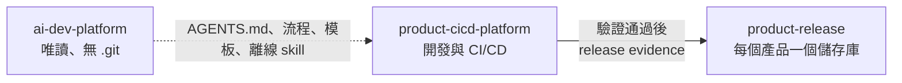

# 使用者模式：唯讀平台包

本文件供產品團隊使用。適用對象是下載並解壓 `ai-dev-platform-<version>.zip` 的使用者，不適用於維護平台本身的人員。

安裝後的 `ai-dev-platform/` 是不含 `.git` 的唯讀平台包（read-only platform package）。預設內含第三方 skill、授權與必要參考內容；完整 OpenAI Cookbook 為選用套件。Android SDK、編譯器、Gradle 與其他建置工具不在離線保證範圍。不要在此目錄執行 `git init`、同步 subtree，或加入產品程式碼。

## 目錄結構

```text
Work/
├── ai-dev-platform/             唯讀平台包，含預設離線 skill
├── <product>-cicd-platform/     產品原始碼與 CI/CD Git 儲存庫
└── <product>-release/           該產品專屬的發行 Git 儲存庫
```



`<product>-cicd-platform/` 與 `<product>-release/` 不複製 `external/`。第三方 skill 只保留在中央平台包，供 AI 工具在離線環境讀取。

## 使用步驟

先輸入三個平行目錄的共同父目錄；平台版本不同時只修改 `PLATFORM_VERSION`。同一個終端機後續沿用這些變數。

```bash
read -rp "Work absolute path: " WORK_ROOT
PLATFORM_VERSION=1.4.0
cd "$WORK_ROOT"
```

1. 首次安裝時，只從 ZIP 取出安裝器與離線驗證器，再由安裝器驗證與部署：

   ```bash
   mkdir .ai-dev-platform-bootstrap
   unzip -j "ai-dev-platform-${PLATFORM_VERSION}.zip" \
     ai-dev-platform/scripts/install_platform.py \
     ai-dev-platform/scripts/verify_package.py \
     -d .ai-dev-platform-bootstrap
   python3 -B .ai-dev-platform-bootstrap/install_platform.py \
     "ai-dev-platform-${PLATFORM_VERSION}.zip" \
     --checksum "ai-dev-platform-${PLATFORM_VERSION}.zip.sha256" \
     --work-root "$WORK_ROOT"
   ```

   正式執行前可先在同一命令加上 `--dry-run`，確認版本與目標目錄。更新時直接執行既有平台內的 `scripts/install_platform.py`：

   ```bash
   python3 -B ai-dev-platform/scripts/install_platform.py \
     "ai-dev-platform-${PLATFORM_VERSION}.zip" \
     --checksum "ai-dev-platform-${PLATFORM_VERSION}.zip.sha256" \
     --work-root "$WORK_ROOT" \
     --dry-run

   python3 -B ai-dev-platform/scripts/install_platform.py \
     "ai-dev-platform-${PLATFORM_VERSION}.zip" \
     --checksum "ai-dev-platform-${PLATFORM_VERSION}.zip.sha256" \
     --work-root "$WORK_ROOT"
   ```

   工具會核對 sidecar SHA-256、逐檔 hash 與權限，再以 `scripts/check.sh --consumer` 檢查發行包。這個模式不要求發行包具備 `.git`、`.ai/product.json` 或 subtree 同步資料；其他完整性檢查仍會執行。全部通過後才原子替換目錄，失敗會保留舊版並顯示檢查結果。

   需要完整 OpenAI Cookbook 時，在同一次安裝加上 `--optional-pack "ai-dev-platform-openai-cookbook-${PLATFORM_VERSION}.zip"`。選用 ZIP 與其 `.sha256` 必須與預設包版本一致；安裝器會先驗證再疊加，不會直接改寫現有唯讀目錄。

2. 使用初始化工具建立產品開發與發行儲存庫：

   ```bash
   python3 -B ai-dev-platform/scripts/init_product.py \
     --name my-product \
     --domain android \
     --ci github-actions
   ```

3. 產品入口檔固定指向相鄰的 `../ai-dev-platform/AGENTS.md`；不複製平台內容，也不鎖定平台版本。
4. 依 [`product-initialization.md`](product-initialization.md) 補齊產品領域、CI 與成品平台設定。
5. CI 驗證通過後，依 [`release-evidence.md`](release-evidence.md) 將發行證據與 Release Note 交給產品的發行儲存庫。

6. 安裝或新增產品後，在 `$WORK_ROOT/` 執行：

   ```bash
   bash ai-dev-platform/scripts/check.sh --consumer
   python3 -B ai-dev-platform/scripts/audit_workspace.py "$WORK_ROOT"
   ```

   第一個命令驗證平台包；第二個命令檢查每個產品是否讀取共用平台目前版本。

## 常見失誤

| 現象 | 原因 | 處理方式 |
|---|---|---|
| 找不到 `scripts/init_product.py` | 在 `<Work>/` 使用了平台內部相對路徑 | 使用 `ai-dev-platform/scripts/init_product.py`，或先切換到 `ai-dev-platform/` |
| 安裝器拒絕含 `.git` 的目標 | 把 Git 維護儲存庫當成唯讀平台 | 確認目標是 `<Work>/ai-dev-platform`；不要直接刪除未知 `.git` |
| 安裝後檔案不可寫 | 這是預期的唯讀權限 | 在產品儲存庫開發；平台變更必須回到維護儲存庫處理 |
| 範例缺少 SDK 或編譯器 | 建置工具不屬於離線平台包 | 在本機或 CI 安裝產品工具鏈 |
| 想修改 `registry/providers.yaml` | 把角色範例誤認為產品設定 | 實際模型與登入由工具或組織設定；不要修改唯讀平台 |

完整端到端案例見 [`getting-started.md`](getting-started.md)。
