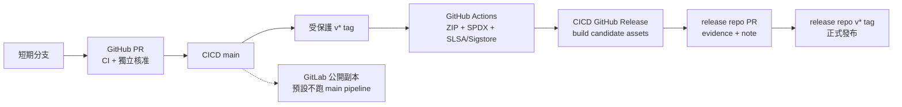

# GitHub Free／GitLab Free 公開託管方案

本專案以 GitHub 公開儲存庫作為唯一正式來源與發行閘門，GitLab 公開專案只作為第二份遠端副本與可攜式 CI 驗證入口。這個分工不是品牌偏好，而是免費方案的控制能力不同：GitHub Free 對公開儲存庫可強制 PR 核准與必要狀態檢查；GitLab Free 的 MR 核准只能記錄、不能阻擋合併。

## 零付費架構



- GitHub 公開儲存庫的標準 hosted runner 不計費；不要選 larger runner。Actions artifact 儲存空間仍有方案額度，因此正式 ZIP 放 GitHub Release assets，不把有期限的 workflow artifact 當長期成品平台。
- GitHub Release 每個 asset 必須小於 2 GiB，單一 release 最多 1,000 個 assets，總大小與頻寬沒有額外上限。
- GitHub Artifact Attestations 在 GitHub Free 的公開儲存庫可用，使用 OIDC 與 Sigstore 短效憑證，不需要保存長效私鑰。
- GitLab.com Free namespace 每月有 400 compute minutes；本專案的 `.gitlab-ci.yml` 預設只跑 MR、手動與排程 pipeline。只有把 `ENABLE_GITLAB_MAIN_CI` 設為 `true` 才在預設分支 push 時重跑，避免 GitHub 與 GitLab 重複消耗運算。

官方依據：

- [GitHub Free 公開儲存庫可用 protected branches](https://docs.github.com/en/repositories/configuring-branches-and-merges-in-your-repository/managing-protected-branches)
- [公開儲存庫使用標準 GitHub-hosted runner 免費](https://docs.github.com/en/billing/concepts/product-billing/github-actions#free-use-of-github-actions)
- [GitHub Artifact Attestations 的方案與驗證方式](https://docs.github.com/en/actions/how-tos/secure-your-work/use-artifact-attestations/use-artifact-attestations)
- [GitHub Release assets 的大小與頻寬限制](https://docs.github.com/en/repositories/releasing-projects-on-github/about-releases#storage-and-bandwidth-quotas)
- [GitLab Free compute minutes](https://docs.gitlab.com/ci/pipelines/compute_minutes/)
- [GitLab Free 的 MR 核准不會阻擋合併](https://docs.gitlab.com/user/project/merge_requests/approvals/#required-approvals)
- [GitLab pull mirroring 需要 Premium／Ultimate](https://docs.gitlab.com/user/project/repository/mirror/pull/)

## GitHub 必要設定

兩個 GitHub repository 都維持 Public。不要為了取得 branch protection 購買 GitHub Pro；公開儲存庫在 GitHub Free 已可使用。

### `main` 分支

- 一律經 PR；要求 1 位核准者、CODEOWNERS、最後一次 push 由其他人核准。
- 新 commit 使舊核准失效；所有討論必須解決。
- 必要 CI 必須與分支同步；禁止 force push、刪除與管理員繞過。
- 只允許 squash merge，合併後自動刪除分支。

維護庫的必要檢查是 `self-check`、`android-example`；發行庫是 `repository-policy`。CodeQL 作為持續安全掃描，不與一般測試互相取代。

### `v*` tag 與 release environment

- 建立 tag ruleset，include `refs/tags/v*`，啟用 Restrict creations、updates、deletions，只讓 repository admin 永久 bypass。
- `release-build` 與 `release-promotion` environment 指定 `louisxchangtw` 為 required reviewer，開啟 prevent self-review，且不允許管理員略過 protection rule。
- 正式 tag 由 `JiaChangGit` 在已合併、乾淨且同步的 `main` 建立 annotated tag；workflow 或一般 write collaborator 不自行建立／移動 tag。

### Actions 與安全功能

- 預設 `GITHUB_TOKEN` 權限設為 read；不允許 Actions 核准 PR。
- Workflow 內所有 action 以完整 commit SHA 固定，後方註解保留對應版本。合併這些設定後，再把 repository 的 Actions policy 設為 GitHub-owned／verified actions，並要求 SHA pinning。
- 啟用 secret scanning、push protection、Dependabot alerts、Dependabot security updates、CodeQL 與 private vulnerability reporting。
- 這套 GitHub release 流程不需要 repository secret：attestation 使用 OIDC，發布同一 repository 的 candidate assets 使用當次最小權限 `GITHUB_TOKEN`。

## GitLab Free 的安全邊界

GitLab Free 可保護分支、要求 pipeline 成功與解決討論，但不能把 Code Owner／指定人數核准設成強制 merge gate。因此：

1. GitHub 是唯一可接受變更與正式 release 的來源；GitLab 專案標示為 mirror／read-only。
2. GitLab `main` 設定 Allowed to push and merge = No one、Allowed to merge = Maintainers，禁止 force push，要求 pipeline 成功與所有討論解決。
3. `CODEOWNERS` 在 GitLab Free 用來顯示責任人，不宣稱它能強制核准。
4. 不做雙向同步，不在兩邊各自接受變更；否則 histories、tags 與安全判斷會分叉。

GitLab Free 不提供從 GitHub 自動 pull mirror。建立兩個空白 Public project（不要勾選初始化 README）後，分別在本機加入第二個 SSH remote：

```bash
git remote add gitlab git@gitlab.com:<namespace>/ai_dev_platform-cicd-platform.git
git push gitlab main
git push gitlab --tags
```

發行儲存庫同樣操作。之後只在 GitHub PR 合併、GitHub tag 驗證完成後同步：

```bash
git switch main
git pull --ff-only origin main
git push gitlab main --follow-tags
```

SSH key 留在使用者帳號或 SSH agent；不得把 GitLab Token 放進 remote URL、repository variables、文件或 shell history。若日後一定要自動同步，使用 GitLab write deploy key 存在 GitHub environment secret，且 workflow 只能從受保護的 `main`／tag 執行。

## Public 後的隱私清單

Public 代表檔案、完整 Git 歷史、commit 作者資訊、Issue／PR、Actions log、release assets 與 evidence 內的 URI／身分都可能被永久複製。公開前與每次發布前確認：

- Evidence 只用公開 GitHub handle，不放姓名、Email、員工編號、內部帳號或內部成品 URI。
- 不公開內部 hostname、內網 IP、客戶／公司名稱、私有 repository path、CI runner label 或雲端帳號 ID。
- Actions log 不列印 environment、Token、私鑰或含憑證的 URL；fork PR 不取得 release environment 權限。
- GitLab 必須與 GitHub 採相同 Public 邊界；若資料不適合公開，就不能只靠「另一邊較少人看」當保護。

已公開的歷史資料無法靠新增 `.gitignore`、刪除目前檔案或 `.mailmap` 真正抹除。重寫 history 會更換大量 commit SHA、破壞 subtree 追溯與既有 PR／tag，且已被第三方 clone 的副本仍存在；只能在擁有者明確批准破壞性遷移後另案執行。

## 首次正式發行

1. 在維護庫 PR 更新 `distribution/manifest.json`、`CHANGELOG.md` 與必要文件，CI 全綠並由非作者核准後合併。
2. 擁有者在最新 `main` 建立 annotated `v<version>` tag。`release-build` environment 經獨立 reviewer 核准後，workflow 產生 ZIP、SHA-256、SPDX SBOM 與 GitHub/Sigstore SLSA bundle，並建立 prerelease build candidate。
3. 下載 candidate assets，在 `ai_dev_platform-release` 的功能分支建立同版本 evidence 與 Release Note。`signatureAlgorithm` 使用 `github-attestation`，signature 與 provenance 指向同一份 Sigstore bundle。
4. 發行庫 PR 的 `repository-policy` 通過並由非作者核准後合併；在合併後 `main` 建立同版本 annotated tag。
5. `release-promotion` environment 再次取得獨立核准，下載並驗證 SHA-256、SPDX、來源 commit／tag 與 `gh attestation verify` 的 repository、workflow、source digest/ref，才建立正式 GitHub Release。
6. 驗證完成後，將兩個 `main` 與 tags 單向同步到 GitLab；GitLab 不重新產生另一套正式成品。
