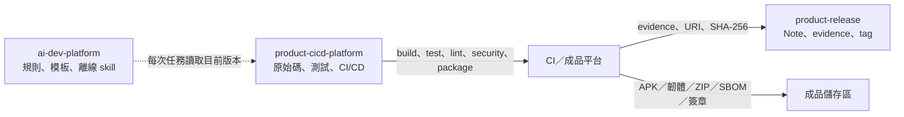
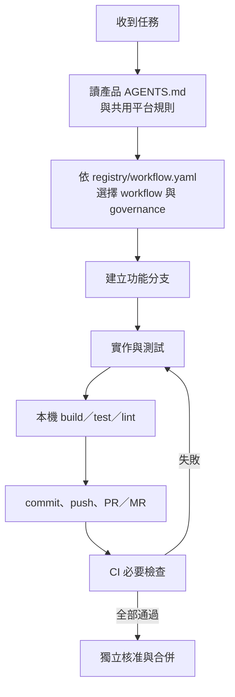
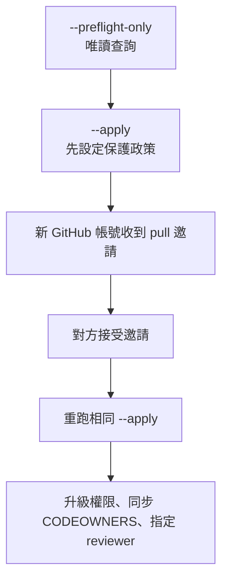
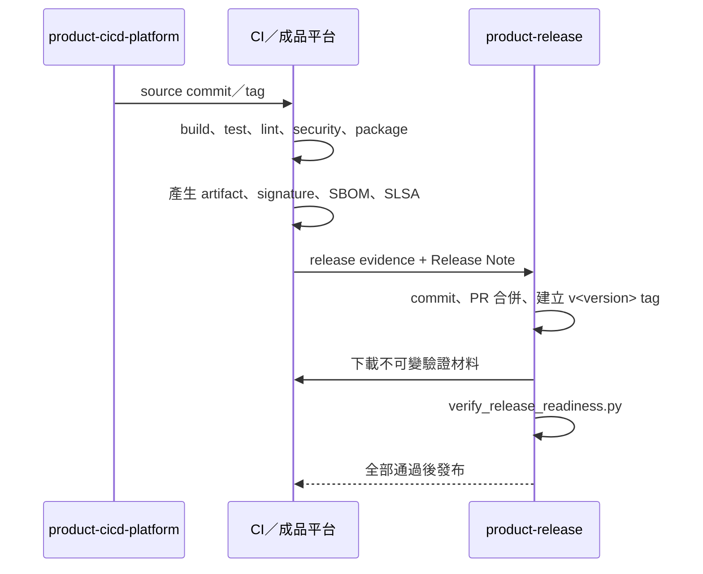

# 新手操作手冊：從安裝到正式發行

本文件供第一次使用 `ai-dev-platform` 的產品開發者與維護者閱讀。內容涵蓋唯讀平台安裝、產品儲存庫建立、日常開發、CI 驗證與正式發行。平台本身的開發方式另見 [`maintainer-mode.md`](maintainer-mode.md)。

## 先理解三個平行目錄

```text
Work/
├── ai-dev-platform/             共用唯讀平台，不含 .git
├── <product>-cicd-platform/     產品原始碼、測試與 CI/CD
└── <product>-release/           發行證據、Release Note 與 Git tag
```



三個目錄的責任不能互換：

- `ai-dev-platform/` 由已驗證 ZIP 安裝，不執行 `git init`，也不放產品程式碼。
- `<product>-cicd-platform/` 是產品開發儲存庫，保存原始碼、測試、CI 與產品領域規範。
- `<product>-release/` 是另一個 Git 儲存庫，只保存發行中繼資料。建置成品留在 CI／成品平台。

## 選擇操作路徑

| 目前情況 | 從哪一節開始 |
|---|---|
| `Work/` 還沒有 `ai-dev-platform/` | 首次安裝 |
| 已有唯讀平台，要換成新版 | 更新平台 |
| 要建立全新產品 | 建立產品儲存庫 |
| 產品已經有 Git 歷史與 CI | [`how-adopt-existing.md`](how-adopt-existing.md) |
| 要修改平台本身 | [`maintainer-mode.md`](maintainer-mode.md) |
| CI 已通過，要正式發行 | 正式發行 |

## 先決條件

最低需求：

- Python 3
- Bash
- Git；只用於產品開發與發行儲存庫
- ZIP 解壓工具
- 對應產品的建置工具；例如 Android SDK／Gradle，或 C 編譯器／Make

平台 ZIP 只離線內含已登記的第三方 skill、授權與必要參考內容，不包含 Android SDK、編譯器、CI runner、簽章私鑰或產品相依套件。

先輸入三個平行目錄的共同父目錄；平台版本不同時只修改 `PLATFORM_VERSION`。同一個終端機後續沿用這兩個變數，開啟新終端機時須重新設定。

```bash
read -rp "Work absolute path: " WORK_ROOT
PLATFORM_VERSION=1.4.0
cd "$WORK_ROOT"
pwd
```

## 首次安裝唯讀平台

首次安裝時尚未有可信任的安裝器，因此只從 ZIP 取出安裝器與驗證器，再由安裝器驗證完整 ZIP。

1. 將下列兩個檔案放在 `$WORK_ROOT/`：

   ```text
   ai-dev-platform-1.4.0.zip
   ai-dev-platform-1.4.0.zip.sha256
   ```

2. 取出 bootstrap 工具：

   ```bash
   mkdir .ai-dev-platform-bootstrap
   unzip -j "ai-dev-platform-${PLATFORM_VERSION}.zip" \
     ai-dev-platform/scripts/install_platform.py \
     ai-dev-platform/scripts/verify_package.py \
     -d .ai-dev-platform-bootstrap
   ```

3. 先預覽安裝目標：

   ```bash
   python3 -B .ai-dev-platform-bootstrap/install_platform.py \
     "ai-dev-platform-${PLATFORM_VERSION}.zip" \
     --checksum "ai-dev-platform-${PLATFORM_VERSION}.zip.sha256" \
     --work-root "$WORK_ROOT" \
     --dry-run
   ```

4. 確認目標是 `$WORK_ROOT/ai-dev-platform` 後正式安裝：

   ```bash
   python3 -B .ai-dev-platform-bootstrap/install_platform.py \
     "ai-dev-platform-${PLATFORM_VERSION}.zip" \
     --checksum "ai-dev-platform-${PLATFORM_VERSION}.zip.sha256" \
     --work-root "$WORK_ROOT"
   ```

5. 驗證平台邊界：

   ```bash
   test ! -e ai-dev-platform/.git
   bash ai-dev-platform/scripts/check.sh --consumer
   python3 -B ai-dev-platform/scripts/audit_workspace.py "$WORK_ROOT"
   ```

`check.sh --consumer` 不要求維護儲存庫才有的 `.git`、`.ai/product.json` 或 subtree 同步資料；skill、授權、模板、範例與其他發行包完整性仍會檢查。

## 更新平台

更新時使用既有唯讀平台內的安裝器。安裝器會先在暫存目錄驗證，全部通過才替換舊目錄。

```bash
cd "$WORK_ROOT"

python3 -B ai-dev-platform/scripts/install_platform.py \
  "ai-dev-platform-${PLATFORM_VERSION}.zip" \
  --checksum "ai-dev-platform-${PLATFORM_VERSION}.zip.sha256" \
  --work-root "$WORK_ROOT" \
  --dry-run

python3 -B ai-dev-platform/scripts/install_platform.py \
  "ai-dev-platform-${PLATFORM_VERSION}.zip" \
  --checksum "ai-dev-platform-${PLATFORM_VERSION}.zip.sha256" \
  --work-root "$WORK_ROOT"
```

安裝失敗時，舊平台不會被替換。先依 `[FAIL]` 內容處理，不要手動刪除目前可用的 `ai-dev-platform/`。

## 建立產品儲存庫

所有初始化命令都從 `$WORK_ROOT/` 呼叫 `ai-dev-platform/scripts/init_product.py`。先使用 `--dry-run` 確認名稱與輸出位置，再正式建立。

### Android App

```bash
cd "$WORK_ROOT"

python3 -B ai-dev-platform/scripts/init_product.py \
  --name sample-android \
  --display-name "Sample Android" \
  --domain android \
  --ci github-actions \
  --with-example \
  --dry-run

python3 -B ai-dev-platform/scripts/init_product.py \
  --name sample-android \
  --display-name "Sample Android" \
  --domain android \
  --ci github-actions \
  --with-example
```

建立結果：

```text
sample-android-cicd-platform/
├── app/                         最小 Android App
├── .github/workflows/check.yml  build、unit test、lint
├── .ci/release/                 發行證據轉接模板
├── docs/                        架構、ADR、領域規範
└── .git/

sample-android-release/
├── release-evidence/
├── release-notes/
└── .git/
```

### SSD PCIe 韌體

```bash
cd "$WORK_ROOT"

python3 -B ai-dev-platform/scripts/init_product.py \
  --name sample-ssd-fw \
  --display-name "Sample SSD Firmware" \
  --domain ssd-pcie-fw \
  --ci gitlab-ci \
  --with-example
```

最小範例使用 C11 與 Make，驗證 `make all`、`make test`、`make lint`、`make package`。它不包含真實 SSD 控制器暫存器、NVMe 管理命令、PCIe 相容性測試、簽章金鑰或未公開規格。

### 其他產品

`generic` 不猜測工具鏈，必須明確提供五個命令與安全的相對成品路徑。

```bash
cd "$WORK_ROOT"

python3 -B ai-dev-platform/scripts/init_product.py \
  --name sample-service \
  --display-name "Sample Service" \
  --domain generic \
  --ci jenkins \
  --product-type "Web Service" \
  --target-platform "Linux container" \
  --language-framework "Go toolchain" \
  --build-command "go build ./..." \
  --test-command "go test ./..." \
  --lint-command "go vet ./..." \
  --package-command "make package" \
  --artifact-path "dist/sample-service.tar.gz"
```

### 初始化後必做

1. 檢查兩個獨立 Git 儲存庫：

   以下使用 Android 範例名稱；若建立的是其他產品，只修改 `PRODUCT_NAME`。

   ```bash
   PRODUCT_NAME=sample-android
   git -C "${PRODUCT_NAME}-cicd-platform" status -sb
   git -C "${PRODUCT_NAME}-release" status -sb
   ```

2. 補齊產品領域規範：

   ```text
   <product>-cicd-platform/docs/domain-standards.md
   ```

3. 在產品儲存庫實際執行 build、test、lint 與 package 命令。
4. 接上 CI runner、成品平台、機密掃描、相依套件弱點掃描、SBOM、SLSA 來源證明與簽章管理。
5. 設定真實 CODEOWNERS 與獨立核准者。
6. 執行工作區稽核：

   ```bash
   python3 -B ai-dev-platform/scripts/audit_workspace.py "$WORK_ROOT"
   ```

`registry/providers.yaml` 位於共用唯讀平台，只提供角色與模型選型的範例中繼資料，不會設定 Codex、Claude Code 或 opencode，也不得保存 API Token。產品初始化後不需要修改這份檔案；實際模型與登入方式由各工具或組織核准的設定管理。

## 將新產品連接到 GitHub 或 GitLab

初始化工具只建立本機 Git 儲存庫，不會建立遠端專案或推送。每個產品需要兩個同名遠端：`${PRODUCT_NAME}-cicd-platform` 與 `${PRODUCT_NAME}-release`。第一次推送前先建立初始 commit：

```bash
PRODUCT_NAME=sample-android
PRODUCT_REPO="$WORK_ROOT/${PRODUCT_NAME}-cicd-platform"
RELEASE_REPO="$WORK_ROOT/${PRODUCT_NAME}-release"

read -rp "Public commit name: " COMMIT_AUTHOR_NAME
read -rp "Public or noreply commit email: " COMMIT_AUTHOR_EMAIL

for REPOSITORY_PATH in "$PRODUCT_REPO" "$RELEASE_REPO"; do
  git -C "$REPOSITORY_PATH" config user.name "$COMMIT_AUTHOR_NAME"
  git -C "$REPOSITORY_PATH" config user.email "$COMMIT_AUTHOR_EMAIL"
  git -C "$REPOSITORY_PATH" add -A
  git -C "$REPOSITORY_PATH" diff --cached --check
  git -C "$REPOSITORY_PATH" commit -m "chore: initialize repository"
done
```

`git add -A` 只適用於剛由初始化工具建立、且已人工確認內容的新目錄。既有產品不得用這段指令覆蓋或重建歷史。

### GitHub

先執行 `gh auth login --git-protocol ssh --web`。下列命令會建立兩個空白 Private repository、加入 `origin` 並推送初始 `main`：

```bash
gh auth status
read -rp "GitHub user or organization: " GITHUB_OWNER

gh repo create "${GITHUB_OWNER}/${PRODUCT_NAME}-cicd-platform" \
  --private \
  --source "$PRODUCT_REPO" \
  --remote origin \
  --push

gh repo create "${GITHUB_OWNER}/${PRODUCT_NAME}-release" \
  --private \
  --source "$RELEASE_REPO" \
  --remote origin \
  --push
```

若 GitHub repository 已存在，不要重跑 `gh repo create`。先確認遠端是空白且名稱正確，再依序執行：

```bash
read -rp "Product repository SSH URL: " PRODUCT_REMOTE_URL
git -C "$PRODUCT_REPO" remote add origin "$PRODUCT_REMOTE_URL"
git -C "$PRODUCT_REPO" push -u origin main

read -rp "Release repository SSH URL: " RELEASE_REMOTE_URL
git -C "$RELEASE_REPO" remote add origin "$RELEASE_REMOTE_URL"
git -C "$RELEASE_REPO" push -u origin main
```

遠端已有 commit 時改用 clone 與既有專案導入流程，不得 force push。

### GitLab

先在 GitLab 建立兩個空白 Private project，不要自動加入 README、License 或 `.gitignore`。再輸入 namespace，連接 SSH remote：

```bash
read -rp "GitLab namespace (group or user): " GITLAB_NAMESPACE

git -C "$PRODUCT_REPO" remote add origin \
  "git@gitlab.com:${GITLAB_NAMESPACE}/${PRODUCT_NAME}-cicd-platform.git"
git -C "$PRODUCT_REPO" push -u origin main

git -C "$RELEASE_REPO" remote add origin \
  "git@gitlab.com:${GITLAB_NAMESPACE}/${PRODUCT_NAME}-release.git"
git -C "$RELEASE_REPO" push -u origin main
```

內部 GitLab 使用不同 hostname 時，只替換 `gitlab.com`。不要把 Token 放進 remote URL。

### 初始推送後的必要設定

空白遠端第一次推送是為了建立 `main`；完成本節後，後續變更一律走功能分支與 PR／MR，不再直接推送 `main`。

1. 先讓產品 CI 成功執行一次，再以遠端顯示的實際 job 名稱設定 required checks 或 pipeline must succeed。初始化產生的基本 job 通常名為 `verify`。
2. `main` 必須要求 PR／MR、至少一位非作者核准、過期核准失效、對話解決，並禁止 force push、刪除與 bypass。
3. 產品開發儲存庫加入至少兩位有效 Code Owner；Code Owner 必須具有可審查與合併所需權限。
4. 初始化產生的 release repo 沒有綁定特定 Git 服務的管理 workflow。正式使用前，必須依組織環境加入唯讀的 layout／evidence 檢查與分支保護；正式 tag 仍須通過後述 readiness 關卡。
5. GitHub 私人 repository 的 protected branch 需要支援該功能的付費方案；GitLab 的強制 Code Owner approval 需要 Premium 或 Ultimate。不支援時不得改公開或降低阻擋條件來繞過。

## 日常開發流程



1. 在 `<product>-cicd-platform/` 開始任務。
2. 讀取產品 `AGENTS.md`；入口會指向相鄰的 `../ai-dev-platform/AGENTS.md`。
3. 依任務選擇 `feature`、`bugfix`、`debug`、`review`、`benchmark`、`release` 或 `documentation` workflow。
4. 建立功能分支，不直接在 `main` 累積變更。
5. 實作並執行產品自己的 build、test、lint、安全與 package 檢查。
6. 推送 PR／MR，等待 CI 與獨立核准者通過。

平台的 `registry/providers.yaml` 不會自動切換模型；`suggested_roles` 是工作分工建議。是否能委派角色、選擇模型或載入 skill，仍由實際工具功能與產品設定決定。

## 新增 collaborator 或 GitLab member

維護儲存庫與發行儲存庫必須各自執行自己的 `scripts/manage_collaborators.py`。完整參數見 [`collaborator-management.md`](collaborator-management.md)。



不要把 Token 寫進命令列、`.env`、CI YAML、Git remote URL 或文件。GitHub 使用本機 `gh auth login`；GitLab Token 只在執行當下透過指定環境變數提供。

## 正式發行



1. CI 必須完成 `build`、`test`、`lint`、`security`、`package`。
2. 成品平台保存建置成品、分離式簽章、SBOM 與 SLSA 來源證明。
3. 以下用 `sample-android` 的 `1.0.0` 示範。先設定路徑與檔名，再在發行儲存庫的最新 `main` 建立功能分支：

   ```bash
   PRODUCT_NAME=sample-android
   RELEASE_VERSION=1.0.0
   RELEASE_REPO="$WORK_ROOT/${PRODUCT_NAME}-release"
   SOURCE_REPO="$WORK_ROOT/${PRODUCT_NAME}-cicd-platform"
   RELEASE_BRANCH="agent/release-v${RELEASE_VERSION}"
   EVIDENCE_FILE="release-evidence/${RELEASE_VERSION}.json"
   NOTE_FILE="release-notes/${RELEASE_VERSION}.md"

   cd "$RELEASE_REPO"
   git switch main
   git pull --ff-only origin main
   git switch -c "$RELEASE_BRANCH"
   ```

   接著建立：

   ```text
   release-evidence/1.0.0.json
   release-notes/1.0.0.md
   ```

4. 驗證中繼資料：

   ```bash
   python3 -B ../ai-dev-platform/scripts/verify_release_layout.py .
   python3 -B ../ai-dev-platform/scripts/verify_release_evidence.py \
     "$EVIDENCE_FILE"
   ```

5. 在 release 功能分支 commit，推送後建立 PR：

   ```bash
   git add "$EVIDENCE_FILE" "$NOTE_FILE"
   git diff --cached --check
   git commit -m "chore(release): prepare v${RELEASE_VERSION}"
   git push -u origin "$RELEASE_BRANCH"
   ```

6. PR 通過必要 CI 與獨立核准後合併。更新本機 `main`，在合併後的 HEAD 建立尚未推送的正式 tag：

   ```bash
   git switch main
   git pull --ff-only origin main
   git status -sb
   test "$(git rev-parse HEAD)" = "$(git rev-parse origin/main)"
   git tag -a "v${RELEASE_VERSION}" -m "v${RELEASE_VERSION}"
   ```

7. 將成品、簽章、SBOM 與 SLSA JSON 下載到發行儲存庫外的暫存目錄，執行正式關卡：

   ```bash
   RELEASE_MATERIALS_DIR="$(mktemp -d)"
   ARTIFACT_FILE="$RELEASE_MATERIALS_DIR/sample-android-${RELEASE_VERSION}.apk"
   SIGNATURE_FILE="${ARTIFACT_FILE}.sig"
   SBOM_FILE="$RELEASE_MATERIALS_DIR/sample-android-${RELEASE_VERSION}.spdx.json"
   PROVENANCE_FILE="$RELEASE_MATERIALS_DIR/sample-android-${RELEASE_VERSION}.provenance.json"
   TRUSTED_PUBLIC_KEY=/path/to/trusted-release-public-key.pem

   # 先從 evidence 指向的不可變位置下載四個檔案，再確認路徑正確。
   test -f "$ARTIFACT_FILE"
   test -f "$SIGNATURE_FILE"
   test -f "$SBOM_FILE"
   test -f "$PROVENANCE_FILE"
   test -f "$TRUSTED_PUBLIC_KEY"

   python3 -B ../ai-dev-platform/scripts/verify_release_readiness.py . \
     --version "$RELEASE_VERSION" \
     --source-repo "$SOURCE_REPO" \
     --artifact-file "$ARTIFACT_FILE" \
     --signature-file "$SIGNATURE_FILE" \
     --public-key "$TRUSTED_PUBLIC_KEY" \
     --sbom-file "$SBOM_FILE" \
     --provenance-file "$PROVENANCE_FILE"
   ```

8. 全部通過後才推送 tag：

   ```bash
   git push origin "v${RELEASE_VERSION}"
   ```

Evidence／Note 已由 PR 合併到 `main`，不直接推送 `main`。`verify_release_evidence.py` 只驗證 JSON 契約與欄位格式；`verify_release_readiness.py` 才會讀取實體檔案、重算 SHA-256、驗證簽章、SBOM、SLSA、來源 commit、tag 與乾淨工作樹。兩者不能互相取代。

初始化工具產生的基本 CI 只執行 build、test 與 lint；`.ci/release/` 是轉接模板，不會自動產生正式簽章、SBOM、SLSA，也不會替你建立可信任的 `security`／`package` 證據。正式發行前必須由產品 CI 補上這些工作。驗證程式不會連線查詢 CI、URI 或身分系統，因此發行人仍須在 GitHub、GitLab、Jenkins 或內部平台確認 run 成功、下載來源可信任，且核准者確實獨立。

## 常見失誤

| 現象 | 原因 | 正確處理 |
|---|---|---|
| `python3: can't open file scripts/init_product.py` | 在 `<Work>/` 使用了錯誤相對路徑 | 改用 `ai-dev-platform/scripts/init_product.py`，或先 `cd ai-dev-platform` |
| 安裝器顯示 `Command '['bash', 'scripts/check.sh']'` | ZIP 仍是修正前的舊內容 | 從已合併最新版維護來源重新封裝，不要只重算舊 ZIP 的 sidecar |
| 安裝器拒絕替換目標 | `ai-dev-platform/` 內含 `.git` | 不要刪除未知 Git 歷史；確認目錄用途，使用正確的唯讀平台目標 |
| 初始化拒絕建立產品 | 同名開發或發行目錄已存在 | 更換產品名稱；若是既有產品，改走既有專案導入流程 |
| `src refspec main does not match any` | 新儲存庫尚未有初始 commit | 先依遠端連接章節設定 Git 身分、stage 並 commit，再推送 |
| `remote origin already exists` | 重複執行遠端建立命令 | 先用 `git remote -v` 確認目前 origin；正確就不要重加，錯誤時先釐清再修改 |
| Required check 找不到 `verify` | workflow 尚未成功執行，或實際 job 名稱不同 | 先完成一次遠端 CI，再從 Git 服務顯示的名稱設定，不猜測名稱 |
| Android／韌體範例無法建置 | 平台不內含 SDK、Gradle、編譯器或 Make | 在本機或 CI 安裝產品工具鏈，再執行初始化文件列出的命令 |
| 想修改 `registry/providers.yaml` | 把共用角色範例誤認為產品設定 | 不修改唯讀平台；在實際工具或組織核准的設定管理模型與登入資訊 |
| GitHub 私人儲存庫設定 branch protection 失敗 | 帳戶方案不支援必要保護功能 | 升級適用方案；不得改成公開或降低必要阻擋條件來繞過 |
| 新 collaborator 第一次 `--apply` 回傳等待 | 對方尚未接受唯讀邀請 | 對方接受後以完全相同參數重跑 |
| release layout 拒絕 APK、ELF、ZIP、SBOM 或簽章 | 建置成品被放進 release repo | 將實體檔移到儲存庫外或成品平台，只保留 URI 與 SHA-256 |
| readiness 找不到 tag 或顯示工作樹不乾淨 | 尚未合併／commit，或 `v<version>` 不指向最新 `main` | 合併 release PR 後在最新 `main` 建立正確 tag；不要以 `--force` 移動已發布 tag |
| evidence 驗證通過但 readiness 失敗 | JSON 格式正確，不代表實體成品與供應鏈證據正確 | 依 readiness 的 `[FAIL]` 修正實體檔、hash、簽章、來源或 tag |

## 不要移除的內容

- 不要刪除產品開發儲存庫的 `.git`。
- 不要刪除發行儲存庫的 `.git`；需要重建時只連接空白同名遠端，遠端已有歷史就重新 clone。
- 不要把 `external/` 複製到產品開發或發行儲存庫。
- 不要把 `.ai/handoffs/`、`.env`、私鑰、Token、本機 SDK 路徑或建置成品加入 Git。
- 不要直接修改唯讀 `ai-dev-platform/`；平台更新必須經過維護儲存庫、測試、封裝與安裝流程。

## 文件閱讀順序

| 需求 | 後續文件 |
|---|---|
| 安裝與更新 | [`consumer-mode.md`](consumer-mode.md) |
| 初始化完整參數 | [`product-initialization.md`](product-initialization.md) |
| 產品領域規範 | [`domain-adaptation.md`](domain-adaptation.md) |
| CI 轉接 | [`ci-adapters.md`](ci-adapters.md)、[`how-enforce-rules.md`](how-enforce-rules.md) |
| GitHub 推送 | [`publishing-to-github.md`](publishing-to-github.md) |
| Collaborator／GitLab member | [`collaborator-management.md`](collaborator-management.md) |
| 發行證據 | [`release-evidence.md`](release-evidence.md)、[`../workflow/release.md`](../workflow/release.md) |
| 平台維護 | [`maintainer-mode.md`](maintainer-mode.md) |
| 第三方 skill | [`skill-governance.md`](skill-governance.md) |
