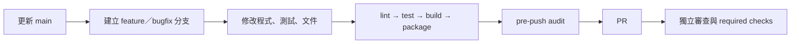

# 建立、設定與使用產品專案

本文件從空白 `Work/` 開始，建立一個產品開發儲存庫與一個發行儲存庫。平台不替產品選硬體、套件、商業邏輯、簽章方式或規格版本；這些值必須在建立前由產品團隊確認。

## 0. 先分清楚四個位置

| 位置 | 何時需要 | 可否修改 |
|---|---|---|
| `ai_dev_platform-cicd-platform/` | 修改平台本身、送平台 PR 時 | 可，在功能分支修改 |
| `ai-dev-platform/` | 開發產品時讀取共用規則與工具 | 不可，從已驗證 Release 安裝 |
| `<name>-cicd-platform/` | 開發產品程式碼、測試、文件與 CI | 可 |
| `<name>-release/` | 保存 Release Note、evidence 與 tag | 可，但不得放原始碼或成品 |

產品日常開發只需要後三者。平台維護來源不是產品的執行時相依項目。

## 1. 建立前要決定的值

先填下表，不要把佔位值直接提交：

| 項目 | 範例 | 用途 |
|---|---|---|
| `name` | `controller-fw` | 目錄與 repository 名稱，只能用小寫字母、數字、連字號 |
| `display-name` | `Controller Firmware` | README 顯示名稱 |
| `domain` | `android`、`ssd-pcie-fw`、`generic` | 選擇預設命令與案例 |
| `ci` | `github-actions` | 產生哪一份基本 CI |
| build／test／lint／package | `make test` 等 | 本機與 CI 共用的產品命令 |
| artifact path | `dist/controller-fw.elf` | evidence 所指的成品相對路徑 |
| target platform | 控制器型號、Android API、規格 revision | 避免使用「目前最新」這類不固定描述 |

`generic` 沒有產品預設值，九個產品欄位都必須明確提供。Android 與 SSD 領域可覆寫預設命令。

## 2. 準備本機工具

### 共用工具

平台 CI 使用 Python 3.12；本機腳本需要 Git、Bash、Python 3 與 PyYAML。驗證 Release attestation 另需 GitHub CLI：

```bash
git --version
bash --version
python3 --version
gh --version
python3 -m pip install --user "PyYAML==6.0.3"
python3 -c "import yaml; print(yaml.__version__)"
```

建立 Git commit 前設定身分，內容會公開出現在 public repository：

```bash
git config --global user.name "你的公開顯示名稱"
git config --global user.email "你接受公開的信箱或 GitHub noreply 信箱"
gh auth status
```

不要把 access token、cookie、私鑰或內部網址寫進 shell script、README、CI log 或 Git remote URL。

### 案例工具

| 案例 | 本機工具 | 本平台沒有提供的內容 |
|---|---|---|
| SSD PCIe FW | `make`、支援 C11 的 `cc` | controller SDK、cross compiler、NVMe/PCIe 授權文件、燒錄器 |
| Android | JDK 17、Android SDK 36、Gradle 9.4.1 | Android Studio、SDK 授權、正式 keystore、Play Console |
| 規格手冊 | Python 3、瀏覽器 | PCI-SIG/NVM Express 會員文件、內部規格、發布站台 |

Android 範例沒有 Gradle Wrapper，執行前須確認 `gradle --version` 顯示 Gradle 9.4.1 與 JVM 17。

## 3. 下載並驗證唯讀平台

第一份正式 Release 是 `v1.5.0`。從[來源 repository 的 Releases](https://github.com/JiaChangGit/ai_dev_platform-cicd-platform/releases/tag/v1.5.0)下載下列檔案：

- `ai-dev-platform-1.5.0.zip`
- `ai-dev-platform-1.5.0.zip.sha256`
- `ai-dev-platform-1.5.0.spdx.json`
- `ai-dev-platform-1.5.0.provenance.sigstore.json`

先驗證 ZIP，再執行 ZIP 內的安裝器：

```bash
mkdir -p /absolute/path/to/downloads/v1.5.0/bootstrap
cd /absolute/path/to/downloads/v1.5.0
sha256sum -c ai-dev-platform-1.5.0.zip.sha256
gh attestation verify ai-dev-platform-1.5.0.zip \
  -R JiaChangGit/ai_dev_platform-cicd-platform
python3 -m zipfile -e ai-dev-platform-1.5.0.zip bootstrap
python3 -B bootstrap/ai-dev-platform/scripts/install_platform.py \
  ai-dev-platform-1.5.0.zip \
  --checksum ai-dev-platform-1.5.0.zip.sha256 \
  --work-root /absolute/path/to/Work \
  --dry-run
```

確認 dry-run 的目標是 `/absolute/path/to/Work/ai-dev-platform`，再移除 `--dry-run` 重跑。安裝器會：

1. 驗證 sidecar SHA-256。
2. 驗證 ZIP 內逐檔 hash、路徑與執行權限。
3. 在暫存位置執行 consumer self-check。
4. 原子替換 `Work/ai-dev-platform/`。
5. 將安裝內容設為唯讀；`--writable` 只供安裝器除錯。

若目標是 Git 儲存庫或驗證失敗，安裝器會停止。失敗時不要刪除既有穩定平台。

## 4. 建立產品：先 dry-run

所有範例都從已安裝的 `Work/ai-dev-platform/` 執行。

### 4.1 Android App

```bash
cd /absolute/path/to/Work/ai-dev-platform
python3 -B scripts/init_product.py \
  --name sample-android \
  --display-name "Sample Android" \
  --domain android \
  --ci github-actions \
  --with-example \
  --dry-run
```

### 4.2 SSD PCIe 韌體

```bash
cd /absolute/path/to/Work/ai-dev-platform
python3 -B scripts/init_product.py \
  --name sample-ssd-fw \
  --display-name "Sample SSD Firmware" \
  --domain ssd-pcie-fw \
  --ci gitlab-ci \
  --with-example \
  --dry-run
```

若 GitHub 是正式閘門，將 `--ci gitlab-ci` 改為 `--ci github-actions`。GitLab Free 手動鏡像不等於正式 CI 已在 GitLab 驗收。

### 4.3 規格閱讀與離線 HTML 手冊

```bash
cd /absolute/path/to/Work/ai-dev-platform
python3 -B scripts/init_product.py \
  --name sample-spec-handbook \
  --display-name "Sample Spec Handbook" \
  --domain generic \
  --ci github-actions \
  --product-type "規格閱讀與靜態手冊" \
  --target-platform "產品核准的規格 revision" \
  --language-framework "Markdown、HTML、Python 3" \
  --build-command "python3 -B validate.py" \
  --test-command "python3 -B validate.py" \
  --lint-command "python3 -B validate.py" \
  --package-command "mkdir -p dist && python3 -m zipfile -c dist/spec-handbook.zip SAMPLE.md source-register.md sample-spec.md reading-notes.md index.html validate.py" \
  --artifact-path "dist/spec-handbook.zip" \
  --with-example \
  --dry-run
```

`generic --with-example` 會把虛構 `spec-notes` 案例放到產品根目錄。它不是 PCIe 或 NVMe 規格副本。

## 5. 正式建立並檢查輸出

確認 dry-run 顯示的兩個目標目錄正確後，以同一條命令移除 `--dry-run`。初始化器會拒絕既有目錄，不覆寫資料。

```text
Work/
├── ai-dev-platform/
├── sample-*-cicd-platform/
│   ├── .git/
│   ├── .ai/product.json
│   ├── AGENTS.md
│   ├── README.md
│   ├── docs/architecture.md
│   ├── docs/domain-standards.md
│   ├── 選定案例的原始碼與測試
│   └── 選定 CI 的基本設定
└── sample-*-release/
    ├── .git/
    ├── AGENTS.md
    ├── release-notes/
    └── release-evidence/
```

立即執行以下檢查：

```bash
cd /absolute/path/to/Work/sample-android-cicd-platform
git status --short --branch
git log -1 --oneline
test -f ../ai-dev-platform/AGENTS.md
python3 -B ../ai-dev-platform/scripts/audit_workspace.py /absolute/path/to/Work
```

預期兩個 repository 都已有自己的 `.git` 與初始 commit，產品入口指向 `../ai-dev-platform/AGENTS.md`。Workspace audit 是唯讀檢查，不會修改產品。

## 6. 把案例改成實際產品

依序處理，不要先發布案例成品：

1. 在 `docs/domain-standards.md` 記錄採用的規格名稱、revision／ECN、硬體或 SDK 版本、官方來源、查詢日期與授權邊界。
2. 在 `docs/architecture.md` 改成實際元件、介面、執行緒／中斷模型、資料流、錯誤處理與信任邊界。
3. 以產品檔案取代範例名稱、package ID、namespace、測試資料與成品路徑。
4. 將 lint、test、build、security、package 五類命令補齊；初始化產生的基本 CI 只執行 lint、test、build。
5. 設定成品保存期、SBOM、attestation 或產品簽章。Android 與韌體仍需自己的正式簽章流程。
6. 刪除不再使用的範例檔案，但保留或重寫對應測試；不要保留會被誤認為產品資料的虛構值。

三個案例的具體替換清單見：

- [`../examples/ssd-pcie-fw/SAMPLE.md`](../examples/ssd-pcie-fw/SAMPLE.md)
- [`../examples/android-app/SAMPLE.md`](../examples/android-app/SAMPLE.md)
- [`../examples/spec-notes/SAMPLE.md`](../examples/spec-notes/SAMPLE.md)

## 7. 建立遠端與保護規則

先在 GitHub 建立兩個空白 Public repository，不初始化 README、`.gitignore` 或 License。名稱分別是 `<name>-cicd-platform`、`<name>-release`。

```bash
cd /absolute/path/to/Work/<name>-cicd-platform
git remote add origin git@github.com:<owner>/<name>-cicd-platform.git
git push -u origin main

cd /absolute/path/to/Work/<name>-release
git remote add origin git@github.com:<owner>/<name>-release.git
git push -u origin main
```

完成第一次推送後再設定：

1. `main` 要求 PR、1 位核准者、CODEOWNERS、dismiss stale review、last push approval、conversation resolution 與 linear history。
2. 禁止 force push 與刪除；管理員也受規則約束。
3. 將 CI 實際產生的 job 名稱設為 required checks，先用測試 PR 確認名稱。
4. 建立 `v*` tag ruleset。
5. Actions 預設權限設為 read，關閉 Actions 核准 PR。
6. 建立產品自己的 release environments 與非本人 reviewer。
7. Secret 只放 GitHub Environments／Actions secrets 或組織核准的 secret store。

完整設定與 GitLab Free 手動鏡像方式見 [`repository-operations.md`](repository-operations.md)。

## 8. 日常開發步驟



```bash
cd /absolute/path/to/Work/<name>-cicd-platform
git switch main
git pull --ff-only origin main
git switch -c feature/<short-name>

# 執行 README 所列的產品 lint、test、build、package
python3 -B ../ai-dev-platform/scripts/pre_push_audit.py
git status --short
git diff --check
```

送 PR 前，README 的命令必須與 CI 使用相同的工作目錄與工具版本。不能在本機執行的檢查要寫明原因，交由已設定的 CI 驗證，不可寫成「已通過」。

## 9. 驗證內建案例

```bash
cd /absolute/path/to/Work/ai-dev-platform
make -C examples/ssd-pcie-fw clean all test lint package
python3 -B examples/spec-notes/validate.py

cd examples/android-app
gradle --version
gradle --no-daemon :app:assembleDebug
gradle --no-daemon :app:testDebugUnitTest
gradle --no-daemon :app:lintDebug
```

| 輸出 | 能證明 | 不能證明 |
|---|---|---|
| SSD host ELF 與單元測試 | C11 模擬的驗證與 trace 行為 | 控制器可燒錄、PCIe/NVMe 相容、即時性 |
| Android debug APK 與 JVM test | 範例可編譯、純 Kotlin render 行為 | 正式簽章、裝置相容、Play 上架 |
| 規格 validator | 三份文件包含相同 REQ ID 且 HTML 無外部 script/stylesheet | 解讀正確、規格完整、授權允許公開 |

## 10. 更新既有 dev project

不要對既有產品重新執行初始化器。平台更新只替換 `Work/ai-dev-platform/`；產品入口、CI 與程式碼差異另開產品 PR 處理。完整演練見 [`update-existing-product.md`](update-existing-product.md)。最短驗證順序是：

```bash
sha256sum -c ai-dev-platform-X.Y.Z.zip.sha256
gh attestation verify ai-dev-platform-X.Y.Z.zip \
  -R JiaChangGit/ai_dev_platform-cicd-platform
python3 -B /path/to/current/ai-dev-platform/scripts/install_platform.py \
  /path/to/ai-dev-platform-X.Y.Z.zip \
  --checksum /path/to/ai-dev-platform-X.Y.Z.zip.sha256 \
  --work-root /absolute/path/to/Work \
  --dry-run
python3 -B /absolute/path/to/Work/ai-dev-platform/scripts/audit_workspace.py \
  /absolute/path/to/Work
```

安裝後仍要逐一執行每個產品自己的 lint、test、build、package。

## 11. 要下載、同步、設定與移除的項目

| 動作 | 要做 | 不要做 |
|---|---|---|
| 下載 | 平台 ZIP、ZIP checksum、SBOM、provenance；產品需要的官方 SDK／編譯器 | 下載未核准規格到 public repo；把第三方工具整包放進平台 |
| 同步 | GitHub canonical `main` 與 tag；唯讀平台以正式 Release 更新；GitLab Free 可手動鏡像 | GitHub/GitLab 雙邊直接開發；把 source repo 複製進 release repo |
| 設定 | Git 身分、產品命令、domain standards、CI、required checks、CODEOWNERS、environment reviewer、secret store | 把 Token 寫進 remote URL、設定檔或 log；沿用案例的虛構產品值 |
| 移除／排除 | `build/`、`dist/`、`.gradle/`、`local.properties`、暫存 bootstrap、失效案例檔、未使用 CI 骨架 | 刪除既有穩定平台後才驗證新版；刪除測試來讓 CI 通過 |
| 不提交 | APK/AAB/ELF/BIN/ZIP、keystore、私鑰、客戶資料、完整受限規格 | 以 `git add -f` 繞過 `.gitignore` |

清除案例建置輸出可執行：

```bash
make -C /absolute/path/to/Work/ai-dev-platform/examples/ssd-pcie-fw clean
rm -rf /absolute/path/to/Work/ai-dev-platform/examples/android-app/.gradle \
  /absolute/path/to/Work/ai-dev-platform/examples/android-app/app/build
```

執行刪除前確認路徑位於指定案例目錄。平台 Release ZIP 的安裝器會排除這些可重建輸出。

## 12. 既有專案導入

已有產品原始碼但尚未使用平台時，先依 [`how-adopt-existing.md`](how-adopt-existing.md)做只讀盤點。不要用初始化器覆蓋既有目錄，也不要改寫 Git 歷史來配合範例。
