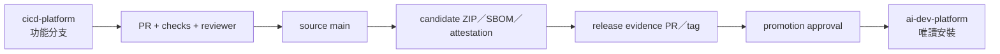

# 平台維護模式

本文件供修改 `ai_dev_platform-cicd-platform` 的維護者使用。下載後的 `ai-dev-platform/` 是唯讀安裝結果，不在其中直接修改。

## 來源與穩定包



來源儲存庫的候選規則只有在完整發行並安裝後，才成為產品共用的穩定規則。

## 修改步驟

1. 更新本機主線並建立分支：

   ```bash
   cd /absolute/path/to/Work/ai_dev_platform-cicd-platform
   git switch main
   git pull --ff-only origin main
   git switch -c agent/change-name
   ```

2. 修改核心內容。新增 workflow 或 template 時，同步更新 `registry/workflow.yaml`；新增 CI 或領域時，更新對應 registry、文件與測試。平台不接受第三方來源樹、Cookbook 或模型清單。
3. 更新 `CHANGELOG.md` 與 `distribution/manifest.json` 的版本。移除 CLI 參數或設定欄位屬於不相容變更，至少提高 minor 版本並清楚記錄。
4. 執行完整本機驗證：

   ```bash
   python3 -m pip install "PyYAML==6.0.3"
   bash scripts/check.sh
   python3 -B -m unittest discover -s tests -v
   make -C examples/ssd-pcie-fw clean all test lint package
   python3 -B examples/spec-notes/validate.py
   python3 -B scripts/package_release.py --dry-run --allow-dirty
   ```

5. Android 版本或程式有變更時另跑：

   ```bash
   cd examples/android-app
   gradle --no-daemon :app:assembleDebug
   gradle --no-daemon :app:testDebugUnitTest
   gradle --no-daemon :app:lintDebug
   ```

6. commit、推送並建立 PR。`main` 受保護，實作者不得核准自己的 PR。
7. PR 合併後，回到乾淨 `main` 重新跑完整驗證與不帶 `--allow-dirty` 的 package dry-run。
8. 依 `docs/ci-cd-release.md` 建 candidate、release evidence 與正式 release。
9. 下載正式 ZIP，驗證 attestation 與 SHA-256，再用 `scripts/install_platform.py` 更新平行的穩定包。

## 檔案新增原則

- 同一規則只保留一份權威說明，其他頁面連結過去。
- 三個以上階段才畫 Mermaid；一個命令可說清楚的內容不要再建腳本。
- 範例必須能執行、可測試，並明列它不是什麼。
- 不將產品專屬 SDK、規格摘錄或商業規則放回平台核心。
- 刪除功能時同輪刪除 registry、CI、測試與文件中的引用。

## 大型歷史

目前版已從工作樹移除先前 vendored 的 Cookbook 與第三方 skills，新的 checkout 內容會顯著變小；但 Git 歷史仍保存舊 blob。歷史重寫會更換 commit SHA、影響 PR、tag、clone 與 attestation，不能當成一般清理直接執行。如需真正縮小 `.git`，另開遷移計畫、備份、暫停推送、重建 tag／規則並通知所有使用者重新 clone。
