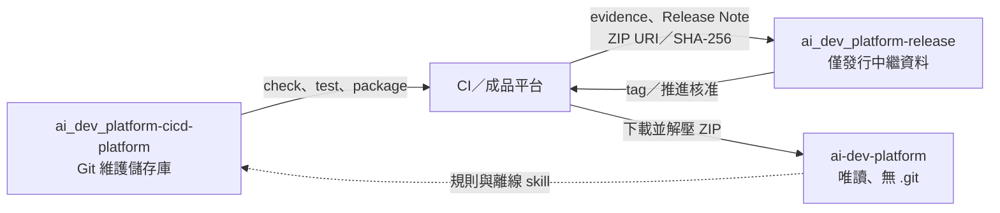

# 維護者模式：開發與發行平台

本文件供 `ai-dev-platform` 維護者使用。實際 Git 開發發生在 `ai_dev_platform-cicd-platform/`；下載後的 `ai-dev-platform/` 不進行維護操作。

這是平台自我開發模式（self-hosting）：平台使用自己的規則、驗證與發行流程來開發下一版平台。

先輸入三個平行目錄的共同父目錄；同一個終端機後續沿用此變數。

```bash
read -rp "Work absolute path: " WORK_ROOT
```

## 儲存庫與成品流向



## 維護流程

1. 從最新 `main` 建立功能分支：

   ```bash
   cd "$WORK_ROOT/ai_dev_platform-cicd-platform"
   git switch main
   git pull --ff-only origin main
   git switch -c agent/update-platform
   ```

2. 在 Git 維護儲存庫修改平台內容，並同步更新 registry、文件與測試。
3. 更新第三方內容時，依 [`how-sync-upstream.md`](how-sync-upstream.md) 執行 subtree 同步。下載版平台不得執行此操作。
4. 執行檢查與測試：

   ```bash
   bash scripts/check.sh
   python3 -B -m unittest discover -s tests -v
   python3 -B scripts/package_release.py --dry-run --allow-dirty
   python3 -B scripts/package_optional_pack.py openai-cookbook --dry-run
   ```

5. 將變更 commit，使工作目錄保持乾淨，再以不含 `--allow-dirty` 的指令重跑 dry-run。正式打包器預設拒絕從未 commit 的工作目錄建立發行包。

   ```bash
   python3 -B scripts/package_release.py --dry-run
   ```
6. 推送功能分支、建立 PR，等待 `self-check`、`android-example` 與獨立核准全部通過。合併後更新本機 `main`：

   ```bash
   git push -u origin agent/update-platform
   # 建立並合併 PR 後：
   git switch main
   git pull --ff-only origin main
   git status -sb
   ```

7. 只有乾淨且已合併的來源才能建立正式發行包：

   ```bash
   PLATFORM_VERSION="$(python3 -c 'import json; print(json.load(open("distribution/manifest.json", encoding="utf-8"))["version"])')"
   PLATFORM_ARCHIVE="dist/ai-dev-platform-${PLATFORM_VERSION}.zip"
   python3 scripts/package_release.py --source-ref "$(git rev-parse HEAD)"
   ```

8. 使用 `scripts/verify_package.py` 驗證 ZIP，再以 `scripts/install_platform.py --dry-run` 預覽並更新共用唯讀平台。不要直接複製維護工作樹：

   ```bash
   python3 -B scripts/verify_package.py "$PLATFORM_ARCHIVE"
   python3 -B scripts/install_platform.py "$PLATFORM_ARCHIVE" \
     --checksum "${PLATFORM_ARCHIVE}.sha256" \
     --work-root "$WORK_ROOT" \
     --dry-run
   python3 -B scripts/install_platform.py "$PLATFORM_ARCHIVE" \
     --checksum "${PLATFORM_ARCHIVE}.sha256" \
     --work-root "$WORK_ROOT"
   bash "$WORK_ROOT/ai-dev-platform/scripts/check.sh" --consumer
   ```

9. ZIP、`.sha256` 與 SBOM 留在 CI／成品平台；只將發行證據、Release Note，以及不可變 ZIP URI／SHA-256 交給 `ai_dev_platform-release`。
10. 發行儲存庫在功能分支 commit 發行證據與 Release Note，經 PR 合併到 `main` 後建立尚未推送的 `v<version>` tag，再執行 `scripts/verify_release_readiness.py` 核對來源 commit／ref、evidence 宣告的必要 CI 名稱、建置成品、SBOM、SLSA 來源證明、OpenSSL 分離式簽章、核准者／發布者字串與 tag。全部通過後才可推送 tag 與發布；CI run 與核准者身分仍須在實際平台確認。

目前 `.github/workflows/check.yml` 驗證平台來源、測試、封裝計畫與 Android 範例，但不產生正式簽章、SBOM、SLSA，也不發布不可變成品。正式發行前，CI／成品平台還必須提供 `build`、`test`、`lint`、`security`、`package` 五項契約證據與上述供應鏈材料；不得把本機 dry-run 當成正式發行證據。

## 發行包必要內容

- 預設離線第三方 skill、授權證據與必要參考內容
- `RELEASE-MANIFEST.json` 與每個檔案的 SHA-256、大小及權限
- 根目錄 `AGENTS.md`、`CLAUDE.md`、`opencode.json` 與 `README.md`
- 不得包含 `.git` 或維護儲存庫的暫存檔

完整 OpenAI Cookbook 使用 `distribution/optional-packs.json` 定義的選用套件，不屬於預設發行包必要內容。

發行儲存庫不得保存或解壓 ZIP；核准與發布都以不可變成品 URI、SHA-256 和發行證據為準。

## 常見失誤

| 現象 | 原因 | 處理方式 |
|---|---|---|
| 正式封裝器拒絕 dirty worktree | 尚有未 commit 變更 | 開發診斷才用 `--allow-dirty`；正式包先 commit、PR 合併並更新乾淨 `main` |
| PR 已合併，但 ZIP 仍是舊程式 | 在舊分支或未更新的 `main` 封裝 | 核對 `git log -1` 與 `git status -sb` 後重建 ZIP |
| consumer 安裝檢查失敗 | 發行包內容與維護資料混用，或 ZIP 來自舊來源 | 直接查看安裝器顯示的完整 `[FAIL]`；不要手動覆蓋唯讀平台 |
| `verify_package.py` 通過但 readiness 失敗 | ZIP 結構正確，不代表正式發行證據、簽章與 tag 完整 | 到 release repo 執行完整 `verify_release_readiness.py` |
| 想在 `ai-dev-platform/` 修文件 | 把安裝結果當成來源 | 回到 `ai_dev_platform-cicd-platform/` 建分支修改，重新封裝與安裝 |
