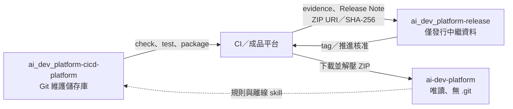

# 維護者模式：開發與發行平台

本文件供 `ai-dev-platform` 維護者使用。實際 Git 開發發生在 `ai_dev_platform-cicd-platform/`；下載後的 `ai-dev-platform/` 不進行維護操作。

這是平台自我開發模式（self-hosting）：平台使用自己的規則、驗證與發行流程來開發下一版平台。

## 儲存庫與成品流向



## 維護流程

1. 在 Git 維護儲存庫修改平台內容，並同步更新 registry、文件與測試。
2. 更新第三方內容時，依 [`how-sync-upstream.md`](how-sync-upstream.md) 執行 subtree 同步。下載版平台不得執行此操作。
3. 執行檢查與測試：

   ```bash
   bash scripts/check.sh
   python3 -B -m unittest discover -s tests -v
   python3 -B scripts/package_release.py --dry-run --allow-dirty
   python3 -B scripts/package_optional_pack.py openai-cookbook --dry-run
   ```

4. 將變更 commit，使工作目錄保持乾淨，再以不含 `--allow-dirty` 的指令重跑 dry-run。正式打包器預設拒絕從未 commit 的工作目錄建立發行包。

   ```bash
   python3 -B scripts/package_release.py --dry-run
   ```
5. 由 CI 或發行工作執行：

   ```bash
   python3 scripts/package_release.py --source-ref "$(git rev-parse HEAD)"
   ```

6. ZIP、`.sha256` 與 SBOM 留在 CI／成品平台；只將發行證據、Release Note，以及不可變 ZIP URI／SHA-256 交給 `ai_dev_platform-release`。
7. 發行儲存庫先 commit 發行證據與 Release Note，建立 `v<version>` tag，再執行 `scripts/verify_release_readiness.py` 驗證來源 commit／ref、必要 CI 檢查、建置成品、SBOM、SLSA 來源證明、OpenSSL 分離式簽章、獨立核准與 tag。全部通過後才可推進。

## 發行包必要內容

- 預設離線第三方 skill、授權證據與必要參考內容
- `RELEASE-MANIFEST.json` 與每個檔案的 SHA-256、大小及權限
- 根目錄 `AGENTS.md`、`CLAUDE.md`、`opencode.json` 與 `README.md`
- 不得包含 `.git` 或維護儲存庫的暫存檔

完整 OpenAI Cookbook 使用 `distribution/optional-packs.json` 定義的選用套件，不屬於預設發行包必要內容。

發行儲存庫不得保存或解壓 ZIP；核准與發布都以不可變成品 URI、SHA-256 和發行證據為準。
