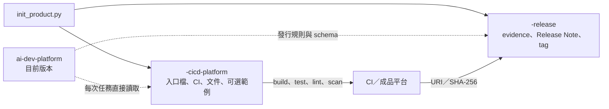

# 產品初始化工具

`scripts/init_product.py` 用一個命令建立產品開發與發行兩個 Git 儲存庫。它只在下載版 `Work/ai-dev-platform/` 執行，確保產生的入口檔永遠指向同一個共用平台目前版本。

## 建立結果

```text
Work/
├── ai-dev-platform/              唯讀、無 .git、預設離線第三方 skill
├── <name>-cicd-platform/         產品原始碼與 CI/CD Git 儲存庫
└── <name>-release/               發行中繼資料 Git 儲存庫
```



工具不會修改 `ai-dev-platform/`，也不會覆寫既有的產品或發行目錄。任一目標已存在時，整個動作會在寫入前停止。

## 內建領域

| `--domain` | 預設工具鏈 | 可加入的範例 |
|---|---|---|
| `android` | Kotlin、Gradle、Android SDK | 最小 Android App |
| `ssd-pcie-fw` | C11、Make | 可攜式 SSD PCIe 韌體流程範例 |
| `generic` | 由命令列完整指定 | 無 |

SSD PCIe 範例只驗證韌體常見的編譯、單元測試、靜態警告與封裝介面，不包含真實控制器暫存器、NVMe 管理命令、簽章金鑰或未公開規格。

## CI 選項

`--ci` 支援 `github-actions`、`gitlab-ci`、`jenkins`、`internal-ci`。工具會建立基本 build／test／lint 管線，並把對應的發行證據轉接模板放在 `.ci/release/`。正式使用前仍須接上實際成品平台、SBOM、安全掃描與獨立核准機制。

## 使用範例

先切換到下載版平台：

```bash
cd Work/ai-dev-platform
```

建立含最小範例的 Android 產品：

```bash
python3 scripts/init_product.py \
  --name demo-android \
  --display-name "Demo Android" \
  --domain android \
  --ci github-actions \
  --with-example
```

建立含最小範例的 SSD PCIe 韌體產品：

```bash
python3 scripts/init_product.py \
  --name demo-ssd-fw \
  --display-name "Demo SSD Firmware" \
  --domain ssd-pcie-fw \
  --ci jenkins \
  --with-example
```

建立其他類型的產品時，需提供完整命令與成品路徑：

```bash
python3 scripts/init_product.py \
  --name demo-service \
  --domain generic \
  --ci internal-ci \
  --product-type "Web Service" \
  --target-platform "Linux container" \
  --language-framework "Go toolchain" \
  --build-command "go build ./..." \
  --test-command "go test ./..." \
  --lint-command "go vet ./..." \
  --package-command "make package" \
  --artifact-path "dist/demo-service.tar.gz"
```

若只要確認路徑，可加上 `--dry-run`。`--no-git` 只供測試環境使用，正式產品應保留預設行為，建立兩個獨立 Git 儲存庫。

## 初始化後檢查

```bash
cd ../<name>-cicd-platform
git status

cd ../<name>-release
python3 ../ai-dev-platform/scripts/verify_release_layout.py .
```

第三方 skill 只存在 `ai-dev-platform/external/`。產品的 Android SDK、Gradle、編譯器及其他建置相依項目由開發環境或 CI 提供，不屬於離線內含範圍。
