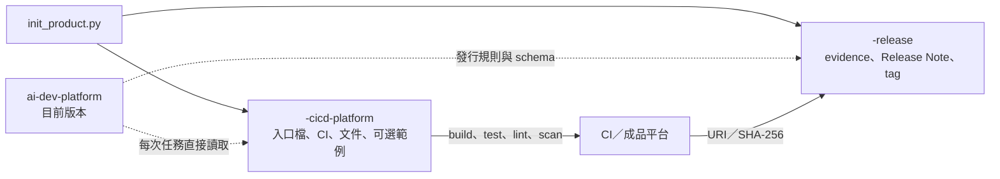

# 產品初始化工具

`scripts/init_product.py` 用一個命令建立產品開發與發行兩個 Git 儲存庫。它只在下載版 `Work/ai-dev-platform/` 執行，確保產生的入口檔永遠指向同一個共用平台目前版本。

## 建立結果

```text
Work/
├── ai-dev-platform/              唯讀、無 .git、預設離線第三方 skill
├── <name>-cicd-platform/         產品原始碼與 CI/CD Git 儲存庫
└── <name>-release/               發行中繼資料 Git 儲存庫
```



工具不會修改 `ai-dev-platform/`，也不會覆寫既有的產品或發行目錄。任一目標已存在時，整個動作會在寫入前停止。

## 內建領域

| `--domain` | 預設工具鏈 | 可加入的範例 |
|---|---|---|
| `android` | Kotlin、Gradle、Android SDK | 最小 Android App |
| `ssd-pcie-fw` | C11、Make | 可攜式 SSD PCIe 韌體流程範例 |
| `generic` | 由命令列完整指定 | 無 |

SSD PCIe 範例只驗證韌體常見的編譯、單元測試、靜態警告與封裝介面，不包含真實控制器暫存器、NVMe 管理命令、簽章金鑰或未公開規格。

## CI 選項

`--ci` 支援 `github-actions`、`gitlab-ci`、`jenkins`、`internal-ci`。工具會建立基本 build／test／lint 管線，並把對應的發行證據轉接模板放在 `.ci/release/`。正式使用前仍須接上實際成品平台、SBOM、安全掃描與獨立核准機制。

## 使用範例

先輸入三個平行目錄的共同父目錄。下列命令都從唯讀平台呼叫初始化工具：

```bash
read -rp "Work absolute path: " WORK_ROOT
cd "$WORK_ROOT"
```

建立含最小範例的 Android 產品：

```bash
python3 -B ai-dev-platform/scripts/init_product.py \
  --name demo-android \
  --display-name "Demo Android" \
  --domain android \
  --ci github-actions \
  --with-example
```

建立含最小範例的 SSD PCIe 韌體產品：

```bash
python3 -B ai-dev-platform/scripts/init_product.py \
  --name demo-ssd-fw \
  --display-name "Demo SSD Firmware" \
  --domain ssd-pcie-fw \
  --ci jenkins \
  --with-example
```

建立其他類型的產品時，需提供完整命令與成品路徑：

```bash
python3 -B ai-dev-platform/scripts/init_product.py \
  --name demo-service \
  --domain generic \
  --ci internal-ci \
  --product-type "Web Service" \
  --target-platform "Linux container" \
  --language-framework "Go toolchain" \
  --build-command "go build ./..." \
  --test-command "go test ./..." \
  --lint-command "go vet ./..." \
  --package-command "make package" \
  --artifact-path "dist/demo-service.tar.gz"
```

第一次執行時先在相同命令加上 `--dry-run`，確認預計建立的兩個路徑。`--dry-run` 不會建立目錄。`--no-git` 只供測試環境使用，正式產品應保留預設行為，建立兩個獨立 Git 儲存庫。

```bash
python3 -B ai-dev-platform/scripts/init_product.py \
  --name demo-android \
  --domain android \
  --ci github-actions \
  --with-example \
  --dry-run
```

## 產生的主要檔案

```text
<name>-cicd-platform/
├── AGENTS.md、CLAUDE.md、opencode.json
├── .ai/product.json
├── docs/architecture.md
├── docs/adr/0001-use-shared-ai-dev-platform.md
├── docs/domain-standards.md
├── CI 設定
└── .ci/release/ 發行證據轉接模板

<name>-release/
├── AGENTS.md、CLAUDE.md、opencode.json
├── release-evidence/README.md
├── release-notes/README.md
└── .gitignore
```

產品入口固定讀取相鄰的 `../ai-dev-platform/`。工具不會把 `workflow/`、`governance/` 或 `external/` 複製到產品或發行儲存庫。

共用平台的 `registry/providers.yaml` 只提供角色與模型選型範例，不會設定實際模型，也不會保存登入資訊。產品初始化後不需要修改唯讀平台；實際模型、帳號與 Token 由各工具或組織核准的設定管理。

## 初始化後檢查

以下使用前述 Android 範例的 `demo-android`；若建立的是其他產品，只修改 `PRODUCT_NAME`。

```bash
PRODUCT_NAME=demo-android
git -C "${PRODUCT_NAME}-cicd-platform" status -sb
git -C "${PRODUCT_NAME}-release" status -sb

python3 -B ai-dev-platform/scripts/verify_release_layout.py \
  "${PRODUCT_NAME}-release"

python3 -B ai-dev-platform/scripts/audit_workspace.py "$WORK_ROOT"
```

第三方 skill 只存在 `ai-dev-platform/external/`。產品的 Android SDK、Gradle、編譯器及其他建置相依項目由開發環境或 CI 提供，不屬於離線內含範圍。

## 常見失誤

| 現象 | 原因 | 處理方式 |
|---|---|---|
| 同名目錄已存在 | 工具為避免覆寫而在寫入前停止 | 使用其他 `--name`；既有產品改依 `how-adopt-existing.md` 導入 |
| `generic` 顯示缺少欄位 | 通用領域沒有預設工具鏈 | 補齊產品類型、平台、語言、四個執行命令與成品路徑 |
| 使用 `--no-git` 後沒有 `.git` | 此參數只建立檔案骨架 | 正式使用不要加 `--no-git`；遠端已有歷史時應重新 clone，不得 force push |
| 初始化成功但 CI 失敗 | 產生的是可執行骨架，不包含 runner 與工具鏈 | 安裝產品工具、設定 CI 權限與成品平台，再依失敗 job 修正 |
| 想把第三方 skill 複製進產品 | 誤解中央平台的讀取方式 | 產品透過 `../ai-dev-platform/` 讀取，不複製 `external/` |

完整的安裝、初始化與發行範例見 [`getting-started.md`](getting-started.md)。
