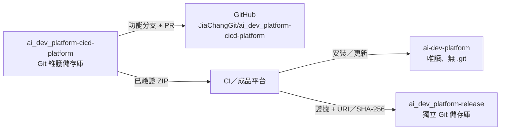

# GitHub 推送與儲存庫設定

本文件說明 AI Dev Platform 的三個平行目錄哪一個能推送、如何建立 PR，以及 GitHub 應啟用的保護設定。

## 推送邊界



| Work 目錄 | 是否推送 | 目的地 |
|---|---|---|
| `ai_dev_platform-cicd-platform/` | 是 | 既有 `git@github.com:JiaChangGit/ai_dev_platform-cicd-platform.git` |
| `ai-dev-platform/` | 否 | 不含 `.git`，只由已驗證 ZIP 安裝 |
| `ai_dev_platform-release/` | 另案處理 | 必須建立獨立 remote；不得推到 `ai_dev_platform-cicd-platform` 維護儲存庫 |
| `*.backup-*`、`*.legacy-*` | 否 | 驗收後刪除，不得加入 Git |

## 推送前檢查

在 WSL 執行：

```bash
cd /home/user/Work/ai_dev_platform-cicd-platform

git status -sb
git diff --check
bash scripts/check.sh
python3 -B -m unittest discover -s tests -v
python3 -B scripts/audit_skills.py
python3 -B scripts/pre_push_audit.py
python3 -B scripts/package_release.py --dry-run --allow-dirty
```

`pre_push_audit.py` 會掃描 Git 追蹤檔與尚未追蹤、且沒有被 `.gitignore` 排除的檔案。命中金鑰、Token、憑證檔、建置目錄或含憑證的 remote URL 時必須停止。

目前 Git `user.email` 會寫入公開的 commit metadata。若不希望公開個人信箱，先到 GitHub **Settings → Emails** 啟用 Keep my email addresses private，複製 GitHub 顯示的 noreply 地址，再只對此儲存庫設定：

```bash
git config user.email "<GitHub 顯示的 noreply 地址>"
git config --get user.name
git config --get user.email
```

## 建立分支與 commit

```bash
git switch -c agent/harden-ai-dev-platform

# 本次已確認整個工作樹都屬於平台強化範圍時，才能使用 -A。
git add -A

git diff --cached --stat
git diff --cached --check
python3 -B scripts/pre_push_audit.py

git commit -m "feat(platform): harden universal development workflow"
python3 -B scripts/package_release.py --dry-run
git push -u origin agent/harden-ai-dev-platform
```

`dist/`、`__pycache__/`、個人 AI 工具設定與 `.ai/handoffs/` 已由 `.gitignore` 排除。`external/openai-cookbook/` 的大型快照是已追蹤的維護來源；預設下載包不包含完整 Cookbook，不要為了縮小發行 ZIP 而從 Git 來源儲存庫刪除它。

## 建立草稿 PR

GitHub CLI（`gh`）需要另行安裝與登入；Git SSH remote 可連線不代表 `gh` 已有 API 授權。Ubuntu 的社群套件可能落後，以下使用 GitHub 維護的官方 APT 來源：

```bash
(type -p wget >/dev/null || (sudo apt update && sudo apt install wget -y)) \
  && sudo mkdir -p -m 755 /etc/apt/keyrings \
  && tmp_keyring="$(mktemp)" \
  && wget -nv -O "$tmp_keyring" https://cli.github.com/packages/githubcli-archive-keyring.gpg \
  && sudo tee /etc/apt/keyrings/githubcli-archive-keyring.gpg < "$tmp_keyring" >/dev/null \
  && rm -f "$tmp_keyring" \
  && sudo chmod go+r /etc/apt/keyrings/githubcli-archive-keyring.gpg \
  && sudo mkdir -p -m 755 /etc/apt/sources.list.d \
  && echo "deb [arch=$(dpkg --print-architecture) signed-by=/etc/apt/keyrings/githubcli-archive-keyring.gpg] https://cli.github.com/packages stable main" \
    | sudo tee /etc/apt/sources.list.d/github-cli.list >/dev/null \
  && sudo apt update \
  && sudo apt install gh -y

gh auth login --git-protocol ssh --web
gh auth status

gh pr create \
  --draft \
  --base main \
  --head agent/harden-ai-dev-platform \
  --title "feat(platform): harden universal development workflow" \
  --fill
```

若不安裝 `gh`，推送分支後開啟：

```text
https://github.com/JiaChangGit/ai_dev_platform-cicd-platform/compare/main...agent/harden-ai-dev-platform?expand=1
```

建立 PR 時保持 Draft，使用 `.github/pull_request_template.md`。GitHub Actions 的 `self-check` 與 `android-example` 實際通過後，再改為 Ready for review。

## GitHub 儲存庫設定

在 **Settings** 完成下列設定：

1. **General → Pull Requests**：啟用 Automatically delete head branches；合併方式建議只保留 Squash merging。
2. **Collaborators**：先加入至少一位不會是 PR 作者的可信任協作者，並把該帳號加入 `.github/CODEOWNERS`。GitHub 不接受作者自行核准；CODEOWNERS 只有 `@JiaChangGit` 時，不得先啟用必要 CODEOWNERS 審查，否則會形成無人可核准的死結。
3. **Rules → Rulesets**：建立 `main` 規則，禁止 force push 與刪除，要求 PR、1 位獨立核准者、駁回過期核准（dismiss stale approvals）與 CODEOWNERS 審查。確認前一步的獨立審查者可用後才啟用這些阻擋條件，且不設定 bypass。
4. **Required status checks**：在第一個 PR 工作流程出現後，將 `self-check` 與 `android-example` 設為必要檢查。
5. **Actions → General**：workflow permissions 選擇 Read repository contents permission；維持 `.github/workflows/check.yml` 的 `permissions: contents: read`。
6. **Code security and analysis**：啟用 Dependency graph、Dependabot alerts、Secret scanning、Push protection 與 Private vulnerability reporting（若帳戶／儲存庫類型支援）。
7. **Tags**：發行 tag 只能由發行流程建立；建議另建 `v*` tag ruleset，禁止修改或刪除。

## 發行儲存庫

`/home/user/Work/ai_dev_platform-release` 目前沒有 commit 與 remote。建議先使用 **Private** 儲存庫，因為未來的成品 URI、CI run ID 或核准識別資訊可能不適合公開。建立後才在發行目錄設定獨立 `origin`：

```bash
cd /home/user/Work/ai_dev_platform-release
git add -A
git commit -m "chore: initialize release metadata repository"
git remote add origin git@github.com:JiaChangGit/ai_dev_platform-release.git
git push -u origin main
```

不得把這個 remote 改成 `JiaChangGit/ai_dev_platform-cicd-platform.git`，也不得把 ZIP、SBOM、簽章或其他建置成品提交到發行儲存庫。
