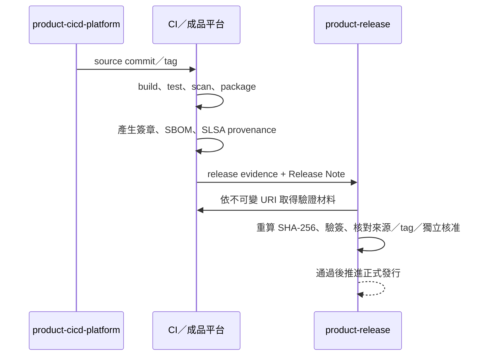

# 發行證據契約

本文件供 CI/CD 與發行流程維護者使用。發行證據（release evidence）是一份機器可驗證的 JSON，用來證明某個版本的來源、檢查結果、建置成品與核准狀態。

每個產品有自己的發行儲存庫。產品 CI/CD 只有在所有必要檢查通過後，才可將發行證據交給該儲存庫。該儲存庫只保存發行中繼資料，不保存原始碼、建置成品或第三方 skill。

## 發行儲存庫邊界

| 允許 | 不允許 |
|---|---|
| `release-evidence/<version>.json` | 產品原始碼與測試碼 |
| `release-notes/<version>.md` | APK、AAB、BIN、ELF、映像檔或壓縮檔 |
| Git tag | `external/` 或任何第三方 skill |
| 必要的 README、AI 入口與儲存庫管理檔 | CI 工作目錄、`build/`、`dist/`、`artifacts/` |

成品 URI 與 SHA-256 寫在發行證據 JSON；tag 保存在 Git。每次交接前後執行：

```bash
python3 ../ai-dev-platform/scripts/verify_release_layout.py .
```

## 交接內容



發行證據的必要欄位如下：

| 類別 | 必要內容 |
|---|---|
| 產品 | 產品識別字與版本 |
| 來源 | 儲存庫、commit、ref |
| 建置成品 | 不可變 URI、SHA-256、分離式簽章 URI／SHA-256 |
| CI 驗證 | CI 系統、run ID、`build`、`test`、`lint`、`security`、`package` |
| 供應鏈 | SPDX／CycloneDX SBOM 與 SLSA provenance 的 URI／SHA-256 |
| 職務分離 | 獨立核准者與不同的發布者 |

JSON Schema 位於 `distribution/release-evidence.schema.json`，範本位於 `templates/release-evidence.json.template`。

## 驗證責任

CI 轉接器可使用相同的離線驗證指令：

```bash
read -rp "Release evidence JSON path: " EVIDENCE_FILE
python3 -B scripts/verify_release_evidence.py "$EVIDENCE_FILE"
```

此指令只驗證 JSON 欄位、格式、必要 check 名稱、SHA-256 字串格式與核准者／發布者名稱不同；不會讀取或驗證實體成品。真正發布前必須使用嚴格關卡：

```bash
RELEASE_VERSION=1.0.0
SOURCE_REPO=../sample-product-cicd-platform
read -rp "Downloaded artifact path: " ARTIFACT_FILE
read -rp "Downloaded signature path: " SIGNATURE_FILE
read -rp "Trusted public key path: " TRUSTED_PUBLIC_KEY
read -rp "Downloaded SBOM JSON path: " SBOM_FILE
read -rp "Downloaded SLSA JSON path: " PROVENANCE_FILE

python3 -B ../ai-dev-platform/scripts/verify_release_readiness.py . \
  --version "$RELEASE_VERSION" \
  --source-repo "$SOURCE_REPO" \
  --artifact-file "$ARTIFACT_FILE" \
  --signature-file "$SIGNATURE_FILE" \
  --public-key "$TRUSTED_PUBLIC_KEY" \
  --sbom-file "$SBOM_FILE" \
  --provenance-file "$PROVENANCE_FILE"
```

關卡會同時檢查：

1. 發行證據檔名、JSON `version`、Release Note 標題與 `v<version>` tag 一致。
2. `product-release` 工作目錄乾淨，tag 指向 HEAD，且儲存庫內沒有建置成品或 skill。
3. 來源 commit 屬於允許的 `main`、`release/*` 或發行 tag。
4. 成品位於含版本或摘要的不可變 URI，實體檔案的 SHA-256 一致，OpenSSL SHA-256 簽章驗證通過。
5. SBOM 是可解析的 SPDX 2.x 或 CycloneDX JSON；provenance 是 `https://slsa.dev/provenance/v1`。
6. 五項必要 CI 檢查全部存在，核准者與發布者不同。

程式不會連線到 CI、成品 URI 或身分系統。`verification.checks`、`runId`、`approvedBy` 與 `publisher` 是 evidence 中的宣告值；CI／Git 服務的保護規則仍須證明該 run 確實成功、核准者身分有效且與發布者不同。實體檔案也必須由發行人從 evidence 指向的受信任不可變位置取得，再交給 readiness 驗證。

發行儲存庫不複製產品原始碼，也不得以可變的 CI 工作目錄（workspace）路徑取代不可變 URI 與 SHA-256。

## 建議執行順序

```text
CI 全部通過
  → 建立 evidence 與 Release Note
  → verify_release_layout.py
  → verify_release_evidence.py
  → 功能分支 commit 與 PR
  → 必要 CI、獨立核准、合併到 main
  → 在合併後的 main 建立本機 v<version> tag
  → 下載實體驗證材料到 release repo 外
  → verify_release_readiness.py
  → 推送 tag
  → 發布成品
```

`verify_release_readiness.py` 要求 release 工作樹乾淨且 tag 指向 HEAD，因此 evidence／Note 必須先經 PR 合併，tag 再建立於合併後的 `main`。實體驗證材料不得放在 release repo 內。採 squash merge 時，不得在 PR 分支先建立正式 tag，因為合併後會產生不同的 commit。

## 常見失誤

| 現象 | 原因 | 處理方式 |
|---|---|---|
| Evidence verifier 通過，readiness 仍失敗 | 前者只驗證契約，後者驗證實體內容與 Git 狀態 | 依 readiness 的每一項 `[FAIL]` 修正，不可略過 |
| `artifact.uri` 被判定可變 | URI 含 `latest`、`current`、`snapshot` 或 `nightly` | 使用包含版本或 SHA-256 前 12 碼的不可變 URI |
| SHA-256 不一致 | 下載檔與 evidence 指向的內容不同 | 從不可變 URI 重新下載；不得只修改 JSON 迎合錯誤檔案 |
| 簽章驗證失敗 | 公開金鑰、簽章或成品不是同一組 | 核對受信任公開金鑰來源與 CI 簽章工作，不把私鑰放進儲存庫 |
| Tag 驗證失敗 | `v<version>` 不存在或不指向 release HEAD | Commit evidence／Note 後建立 tag；不得移動已發布 tag |
| Layout 拒絕驗證材料 | artifact、signature、SBOM 或 provenance 放進 release repo | 移到儲存庫外暫存目錄，只保留 URI 與 SHA-256 |
