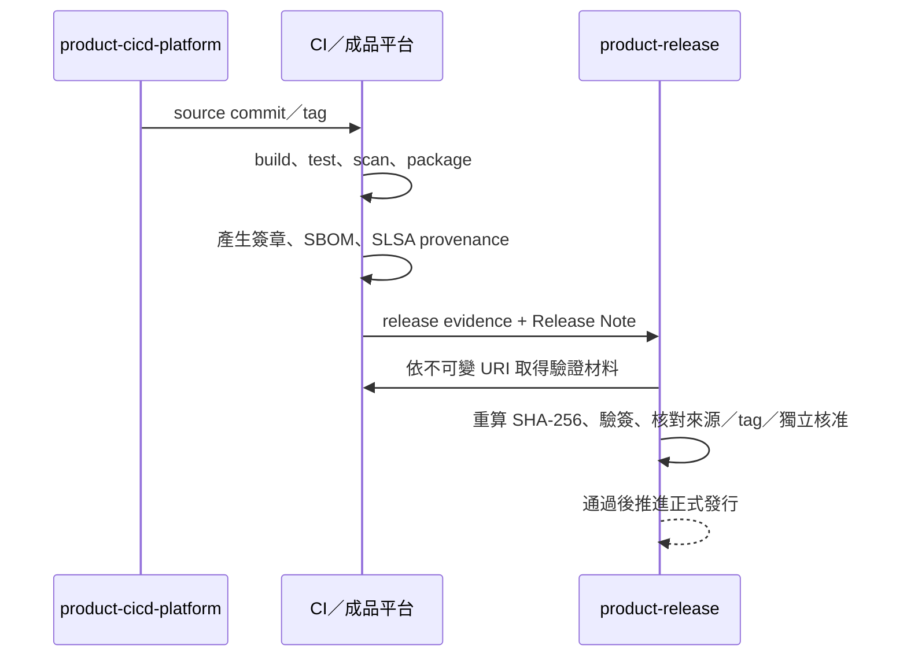

# 發行證據契約

本文件供 CI/CD 與發行流程維護者使用。發行證據（release evidence）是一份機器可驗證的 JSON，用來證明某個版本的來源、檢查結果、建置成品與核准狀態。

每個產品有自己的發行儲存庫。產品 CI/CD 只有在所有必要檢查通過後，才可將發行證據交給該儲存庫。該儲存庫只保存發行中繼資料，不保存原始碼、建置成品或第三方 skill。

## 發行儲存庫邊界

| 允許 | 不允許 |
|---|---|
| `release-evidence/<version>.json` | 產品原始碼與測試碼 |
| `release-notes/<version>.md` | APK、AAB、BIN、ELF、映像檔或壓縮檔 |
| Git tag | `external/` 或任何第三方 skill |
| 必要的 README、AI 入口與儲存庫管理檔 | CI 工作目錄、`build/`、`dist/`、`artifacts/` |

成品 URI 與 SHA-256 寫在發行證據 JSON；tag 保存在 Git。每次交接前後執行：

```bash
python3 ../ai-dev-platform/scripts/verify_release_layout.py .
```

## 交接內容



發行證據的必要欄位如下：

| 類別 | 必要內容 |
|---|---|
| 產品 | 產品識別字與版本 |
| 來源 | 儲存庫、commit、ref |
| 建置成品 | 不可變 URI、SHA-256、分離式簽章 URI／SHA-256 |
| CI 驗證 | CI 系統、run ID、`build`、`test`、`lint`、`security`、`package` |
| 供應鏈 | SPDX／CycloneDX SBOM 與 SLSA provenance 的 URI／SHA-256 |
| 職務分離 | 獨立核准者與不同的發布者 |

JSON Schema 位於 `distribution/release-evidence.schema.json`，範本位於 `templates/release-evidence.json.template`。

## 驗證責任

CI 轉接器可使用相同的離線驗證指令：

```bash
python3 scripts/verify_release_evidence.py <RELEASE_EVIDENCE.json>
```

此指令驗證欄位與格式。真正發布前必須使用嚴格關卡：

```bash
python3 -B ../ai-dev-platform/scripts/verify_release_readiness.py . \
  --version <VERSION> \
  --source-repo ../<product>-cicd-platform \
  --artifact-file <DOWNLOADED_ARTIFACT> \
  --signature-file <DOWNLOADED_SIGNATURE> \
  --public-key <TRUSTED_PUBLIC_KEY> \
  --sbom-file <DOWNLOADED_SBOM_JSON> \
  --provenance-file <DOWNLOADED_SLSA_JSON>
```

關卡會同時檢查：

1. 發行證據檔名、JSON `version`、Release Note 標題與 `v<version>` tag 一致。
2. `product-release` 工作目錄乾淨，tag 指向 HEAD，且儲存庫內沒有建置成品或 skill。
3. 來源 commit 屬於允許的 `main`、`release/*` 或發行 tag。
4. 成品位於含版本或摘要的不可變 URI，實體檔案的 SHA-256 一致，OpenSSL SHA-256 簽章驗證通過。
5. SBOM 是可解析的 SPDX 2.x 或 CycloneDX JSON；provenance 是 `https://slsa.dev/provenance/v1`。
6. 五項必要 CI 檢查全部存在，核准者與發布者不同。

發行儲存庫不複製產品原始碼，也不得以可變的 CI 工作目錄（workspace）路徑取代不可變 URI 與 SHA-256。
