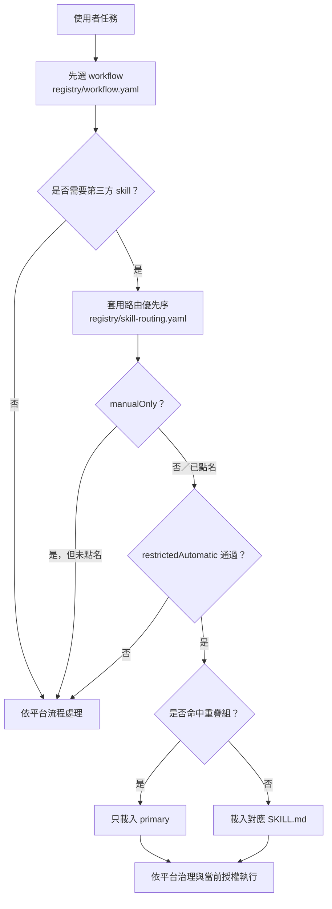

# 第三方 skill 治理與觸發邊界

本文件定義預設離線包如何挑選、驗證與路由第三方 skill。來源快照保留上游原文；平台透過發行清單與路由護欄處理不同工具的 frontmatter 差異，不直接修改 `external/` 內容。

## 執行順序



`external/` 沒有放在 `.codex/skills/`、`.claude/skills/` 或 `.opencode/skills/`，因此「離線內含」不等於「全部自動觸發」。若產品另行使用上游安裝器將 skill 掛載到工具的自動發現目錄，工具可能直接採用上游 `description`；此時仍須將本路由檔當作產品入口規則。

## 預設包範圍

| 分類 | 數量 | 處理 |
|---|---:|---|
| 預設打包的穩定 skill | 62 | 驗證 frontmatter、命名、參照與路由 |
| 手動呼叫（manual-only invocation） | 15 | 未點名時不得推測觸發 |
| 情境限制（restricted automatic invocation） | 5 | 供應商、儲存庫或內外部用途必須命中 |
| 功能重疊組 | 6 | 定義一個 `primary` 與情境化替代項 |
| 排除的範本／實驗中 skill | 7 | Anthropic `template/` 與 Matt Pocock `in-progress/` 不進入預設包 |

## 書寫與結構檢查

`scripts/audit_skills.py` 對每份預設打包的 `SKILL.md` 檢查：

- frontmatter 至少包含 `name` 與 `description`，且名稱為小寫 hyphen-case、與目錄名一致。
- `description` 不得為佔位內容；工具特定的 `disable-model-invocation` 與 `argument-hint` 必須有平台手動路由。
- Markdown 本機參照必須存在，避免只打包 `SKILL.md` 卻遺漏必要 script／reference／asset。
- 超過 500 行時必須在 `acceptedLengthExceptions` 記錄原因與路由限制，避免無意識地擠壓上下文。
- 排除路徑、手動路由、限制路由與重疊組必須指向實際打包內容。
- 觸發測試（trigger test）的 `expect` 與 `forbid` 不得重疊；手動 skill 的測試必須明確點名。

三份上游 skill 超過 500 行：`claude-api`、`subagent-driven-development`、`writing-skills`。平台保留完整上游內容，並用供應商限制、任務前置條件或手動呼叫降低誤觸與上下文浪費。

## 已解決的重疊

| 重疊區域 | 預設路由 | 替代項的使用時機 |
|---|---|---|
| 錯誤診斷 | `systematic-debugging` | 明確點名 Matt Pocock 流程才用 `diagnosing-bugs` |
| TDD | `test-driven-development` | 明確點名 Matt TDD 才切換 |
| skill 建立 | `skill-creator` | `writing-skills` 只供點名驗證；`writing-for-agents` 處理 AGENTS.md／CLAUDE.md |
| 設計訪談 | `brainstorming` | `grilling` 用於壓力測試；`grill-with-docs` 用於同時產生 ADR／詞彙表 |
| 程式碼審查 | `code-review` | `requesting-code-review` 是邀請；`receiving-code-review` 是處理回饋 |
| 角色交接 | `templates/task-handoff.md` | 第三方 `handoff` 只供點名的對話壓縮 |

## 維護指令

```bash
python3 -B scripts/audit_skills.py
python3 -B -m unittest tests.test_skill_audit -v
python3 -B scripts/package_release.py --dry-run --allow-dirty
```

上游更新若新增、移動或刪除 skill，`expectedPackagedSkillCount`、`discovery`、重疊路由與觸發測試必須在同一個變更中更新。
