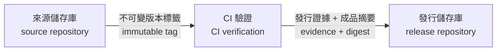

# 術語與文字風格

本文件供平台維護者與文件作者使用。目的是讓專案自有的文件、註解與訊息採用一致的台灣繁體中文，並保留查詢技術資料時需要的英文關鍵字。

## 固定術語

| 建議用詞 | 英文關鍵字 | 使用方式 |
|---|---|---|
| 儲存庫 | repository | 內文使用「儲存庫」；只有路徑、指令或既有名稱可使用 `repo` |
| 唯讀平台包 | read-only platform package | 指下載並解壓後、刻意不含 `.git` 的 `ai-dev-platform/` |
| 維護儲存庫 | maintenance repository | 指用來開發下一版平台的 `ai_dev_platform-cicd-platform/` |
| 建置 | build | 不使用「構建」 |
| 建置成品 | artifact | 指 CI 產生且可供驗證、交付的檔案，例如 APK、韌體映像檔或 ZIP |
| 發行 | release | 指完成驗證、核准到對外提供版本的完整流程 |
| 發布 | publish | 指把已核准版本送到下載區、商店或部署通路的動作 |
| 發行證據 | release evidence | 指 CI/CD 與發行儲存庫之間的機器可驗證 JSON |
| 軟體物料清單 | Software Bill of Materials, SBOM | 第一次出現時寫出全名，後續可只寫 `SBOM` |
| 雜湊值 | hash | 指一般雜湊結果；演算法明確時直接寫 `SHA-256` |
| 摘要 | digest | 指用來確認內容身分的雜湊摘要 |
| CI 轉接器 | CI adapter | 指 GitHub Actions、GitLab CI、Jenkins 或內部 CI 的介接模板 |
| 相依套件 | dependency | 指程式使用的外部套件；描述關係時使用「相依於」 |
| 還原 | rollback | 第一次出現時寫成「還原 (rollback)」 |
| 平台自我開發 | self-hosting | 指使用本平台的規則與流程開發平台本身 |

## 撰寫原則

1. 先寫結論或適用範圍，再寫操作步驟與背景。
2. 一句只表達一個主要動作；刪除沒有判斷或操作價值的開場語。
3. 英文關鍵字在第一次出現時放在中文後方，例如「發行證據 (release evidence)」；後文固定使用中文或既有縮寫。
4. 指令、檔名、JSON 欄位與產品名稱維持原樣，不為了中文化而改動介面。
5. 流程有三個以上階段、分支或跨儲存庫交接時，優先使用 Mermaid 圖。簡單對照使用表格，不重複繪圖。
6. 不使用宣傳式或對話式語句，例如「你只要」、「神奇地」、「輕鬆搞定」；直接說明條件、動作與結果。

## Mermaid 圖例

圖中的節點名稱使用中文，必要的技術識別字放在第二行。跨儲存庫資料流必須標示傳遞內容，不能只畫箭頭。

