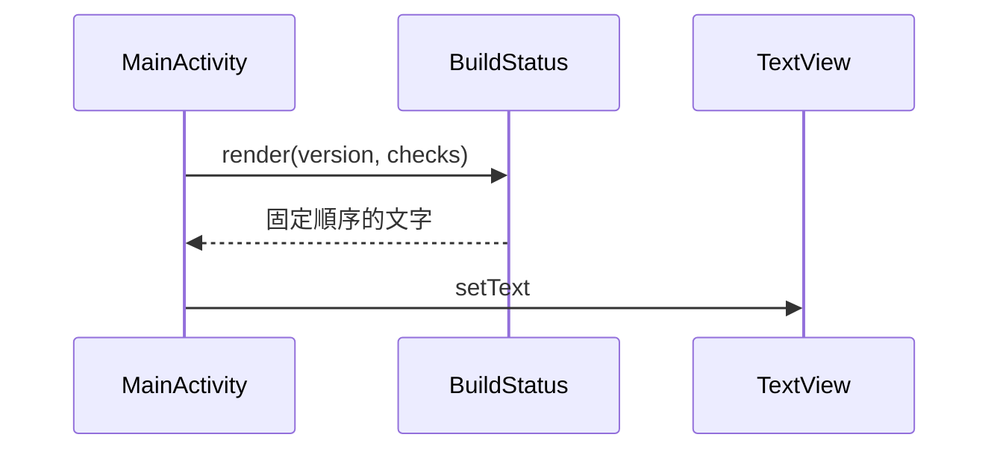

# Android App 開發範例

本範例供 Android 開發者驗證需求拆解、純 Kotlin 邏輯、Activity 顯示、單元測試與 lint。畫面依序列出版本及建置關卡；資料格式化不依賴 Android API，所以能在本機 JVM 快速測試。範例不連線、不讀取真實 CI，也不包含產品商業邏輯。



版本基準：

- Android Gradle Plugin 9.2.0
- Gradle 9.4.1
- JDK 17
- AGP 9.2 內建 Kotlin（built-in Kotlin）
- compileSdk／targetSdk 36

AGP 9 已預設啟用內建 Kotlin，因此範例不套用舊的 `org.jetbrains.kotlin.android` 外掛。版本依 Android 官方的 AGP 9.2 相容表固定；升級前重新查證，不以本文件推測未來版本。

## 執行

先安裝 JDK 17、Android SDK 36 與 Gradle 9.4.1，再執行：

```bash
cd examples/android-app
gradle --no-daemon :app:assembleDebug
gradle --no-daemon :app:testDebugUnitTest
gradle --no-daemon :app:lintDebug
```

除錯版 APK 位於 `app/build/outputs/apk/debug/app-debug.apk`。它未使用正式 Android App Signing，不可當作商店發行成品。

版本依據：[Android Gradle Plugin 9.2.0](https://developer.android.com/build/releases/agp-9-2-0-release-notes)、[AGP 與 Gradle 相容性](https://developer.android.com/build/releases/about-agp)、[內建 Kotlin 遷移說明](https://developer.android.com/build/migrate-to-built-in-kotlin)。
