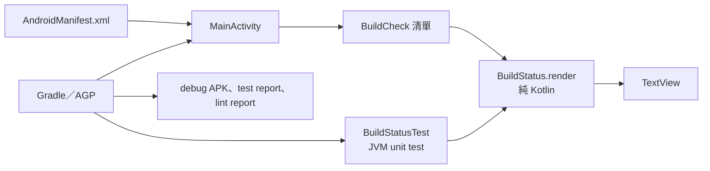
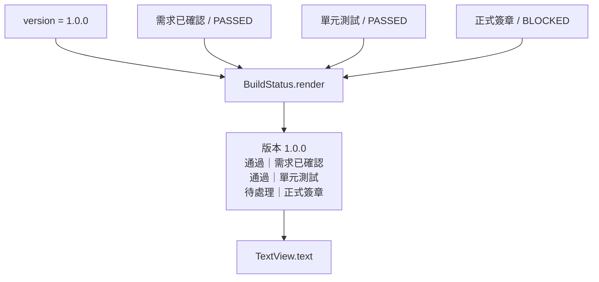
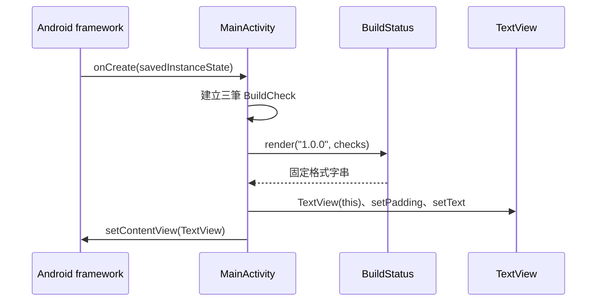
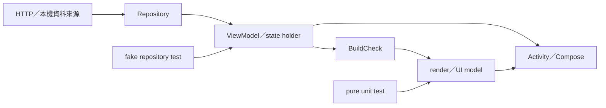
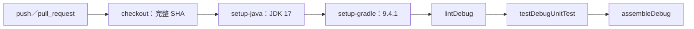

# Android App 開發案例

本案例是一個單一 `app` module 的最小 Android 專案。畫面顯示版本與三個建置關卡，文字格式由純 Kotlin 函式產生，JVM 單元測試不需要 emulator。案例沒有網路、資料庫、後端、Compose、instrumented test、正式簽章或 Play 發布設定。

## 1. 已固定的工具版本

| 項目 | 案例值 | 可查證位置 |
|---|---:|---|
| Android Gradle Plugin | 9.2.0 | 根目錄 `build.gradle.kts` |
| Gradle | 9.4.1 | 平台 CI 與產品初始化器的 `setup-gradle` 設定；案例不含 wrapper |
| JDK | 17 | `app/build.gradle.kts` 的 compile options 與 CI |
| compileSdk | 36 | `app/build.gradle.kts` |
| targetSdk | 36 | `app/build.gradle.kts` |
| minSdk | 23 | `app/build.gradle.kts` |
| Kotlin | AGP 9.2 內建 Kotlin | module 只套用 `com.android.application` |
| JVM test | JUnit 4.13.2 | `app/build.gradle.kts` |

Android 官方 AGP 9.2 相容表列出最低／預設 Gradle 9.4.1、JDK 17、SDK Build Tools 36.0.0，支援最高 API 37。案例選擇 compile/target SDK 36，不表示所有產品都應採相同 API。

AGP 9.0 起預設啟用 built-in Kotlin，因此本案例沒有 `org.jetbrains.kotlin.android`。若既有專案仍有該 plugin、`kapt` 或舊 `kotlinOptions`，先依官方遷移文件處理，不要直接複製本案例的 plugin block。

版本來源（查詢日期 2026-08-25）：[AGP 9.2 release notes](https://developer.android.com/build/releases/agp-9-2-0-release-notes)、[built-in Kotlin migration](https://developer.android.com/build/migrate-to-built-in-kotlin)。

## 2. 程式架構



| 檔案 | 內容 |
|---|---|
| `settings.gradle.kts` | plugin 與 dependency repository、`:app` module |
| `build.gradle.kts` | 固定 AGP 9.2.0 |
| `app/build.gradle.kts` | Android SDK、Java 17、application ID、JUnit |
| `AndroidManifest.xml` | launcher Activity |
| `BuildStatus.kt` | state、row model、純文字 render |
| `MainActivity.kt` | 建立固定資料、建立 TextView、設定畫面 |
| `BuildStatusTest.kt` | 輸入順序、空清單、空白版本三項測試 |

## 3. 畫面資料流



`BuildStatus.render()` 有三個可測試規則：

1. `version` 為空白時丟出 `IllegalArgumentException`。
2. checks 依呼叫端輸入順序輸出，不自行排序。
3. checks 為空時顯示 `待處理｜尚無檢查結果`。

## 4. Activity 時序



案例沒有 ViewModel 或持久化狀態；旋轉螢幕時 Activity 會重建並重新產生同一組固定資料。

## 5. 從零建立 Android 產品

```bash
cd /absolute/path/to/Work/ai-dev-platform
python3 -B scripts/init_product.py \
  --name field-status-app \
  --display-name "Field Status App" \
  --domain android \
  --ci github-actions \
  --with-example \
  --dry-run
```

確認目標後移除 `--dry-run`。初始化器會複製本案例到 `field-status-app-cicd-platform/`，建立 release metadata repository，並產生基本 GitHub Actions。它不會建立 GitHub repository、不會接受 Android SDK license，也不會建立 signing key。

建立後先檢查工具：

```bash
cd /absolute/path/to/Work/field-status-app-cicd-platform
java -version
gradle --version
test -n "$ANDROID_HOME"
test -d "$ANDROID_HOME/platforms/android-36"
```

預期 Gradle 顯示 9.4.1，JVM 顯示 17。若組織使用 `ANDROID_SDK_ROOT`，用該變數檢查，不要把本機 SDK 絕對路徑提交到 Git。

## 6. 本機建置與測試

依 CI 順序執行：

```bash
gradle --no-daemon :app:lintDebug
gradle --no-daemon :app:testDebugUnitTest
gradle --no-daemon :app:assembleDebug
```

主要輸出：

| 輸出 | 路徑 | 性質 |
|---|---|---|
| debug APK | `app/build/outputs/apk/debug/app-debug.apk` | debug key 簽章，只供開發驗證 |
| unit test report | `app/build/reports/tests/testDebugUnitTest/index.html` | JVM test 結果 |
| lint report | `app/build/reports/lint-results-debug.html` | Android lint 結果 |

路徑由 AGP task 產生，實際存在與否應以該次命令結果確認。`app/build/`、`.gradle/` 與 `local.properties` 已排除，不應提交。

沒有本機 Gradle 或 Android SDK 時，不可寫成本機已通過。可在 GitHub Actions 的 `android-example` job 查 build、test、lint 結果，但仍要記錄 runner 與 commit。

## 7. 具體開發案例：把固定狀態改成產品狀態

目標：顯示從 repository 取得的建置關卡，同時保持格式化邏輯可做 JVM test。

### 步驟 A：先定義資料契約

在產品文件記錄 API 回傳欄位，例如：

```text
version: 非空字串
checks[]:
  name: 顯示名稱
  state: PASSED | FAILED | BLOCKED
更新時間：ISO 8601，時區必須明確
錯誤：HTTP 狀態、重試與離線畫面
```

此契約不是本案例現有功能；產品必須自行實作與測試。

### 步驟 B：保持 pure render 邊界

保留 `BuildStatus.render()` 不依賴 Activity、網路或 storage。先擴充 JVM tests：

- API 回傳的順序是否保留；
- 未知 state 是拒絕、映射為 BLOCKED，或顯示錯誤；
- version 缺失時 UI 的產品決策；
- 中文、英文與長字串的輸出規則。

### 步驟 C：把 I/O 放到另一層



產品可選 Activity/ViewModel 或 Compose，但選型、lifecycle、coroutine scope、DI 與 caching 必須記錄在產品 ADR；本平台沒有指定。

### 步驟 D：增加 Android 層測試

JVM test 不能證明 Activity lifecycle、resource、navigation 或裝置行為。產品至少依功能風險補上：

- instrumentation test 或 Compose UI test；
- configuration change 與 process recreation；
- 無網路、timeout、HTTP error 與空資料；
- accessibility、深色模式、字型縮放與支援的 API level；
- 真實裝置或 emulator matrix。

## 8. CI 資料流

初始化產生的 GitHub Actions 基本 job：



這份基本 job 沒有：

- dependency review 或 SCA 政策；
- instrumentation test；
- release bundle／APK 正式簽章；
- Play Console upload；
- SBOM、attestation 與發行 evidence。

產品完成上述工作後，才把對應 job 設為 required check。不要把不存在的 job 名稱寫進 branch protection。

## 9. 正式簽章與發布邊界

案例預設 `assembleRelease` 的輸出是 `app-release-unsigned.apk`。產品發布至少需要另外決定：

1. 發布 APK 或 AAB。
2. upload key／app signing key 的保管與輪替方式。
3. CI 如何取得簽章權限，且不把 key 或密碼輸出到 log。
4. `versionCode`、`versionName` 與 Git tag 的對應規則。
5. Play track、人工核准、rollout 與 rollback 程序。
6. privacy policy、Data safety、權限與第三方 SDK 清單。

GitHub attestation 可證明檔案由哪個 workflow 與 commit 產生，不取代 Android App Signing，也不證明 App 符合 Play 政策。

## 10. 將案例換成產品時要移除或改寫

| 案例內容 | 處理方式 |
|---|---|
| `dev.aiplatform.sample` namespace／application ID | 改成組織核准且不會與既有 App 衝突的 ID |
| `versionCode = 1`、`versionName = "1.0.0"` | 接上產品版本政策 |
| 固定三筆 `BuildCheck` | 改成產品 state；保留 fake data 給 test，不放 production UI |
| 單一 `TextView` | 依 UI 需求改寫並補 resource、accessibility 與 UI tests |
| JUnit 4.13.2 | 依產品測試架構決定是否保留或遷移 |
| debug APK | 不上傳為正式 release，不加入 Git |
| `AiDevPlatformAndroidSample` root name | 改成產品名稱 |

執行完替換後，更新 README、`docs/architecture.md`、`docs/domain-standards.md`、CI 與測試，再用全新 checkout 重跑 lint、test、build、package。
