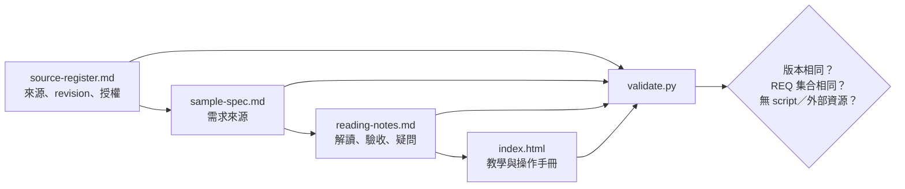
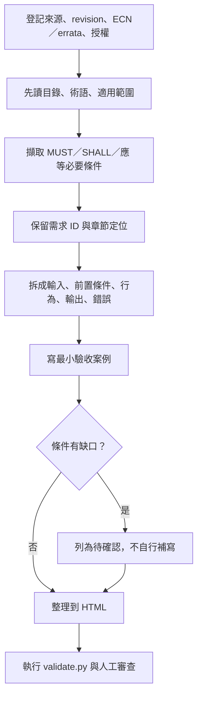
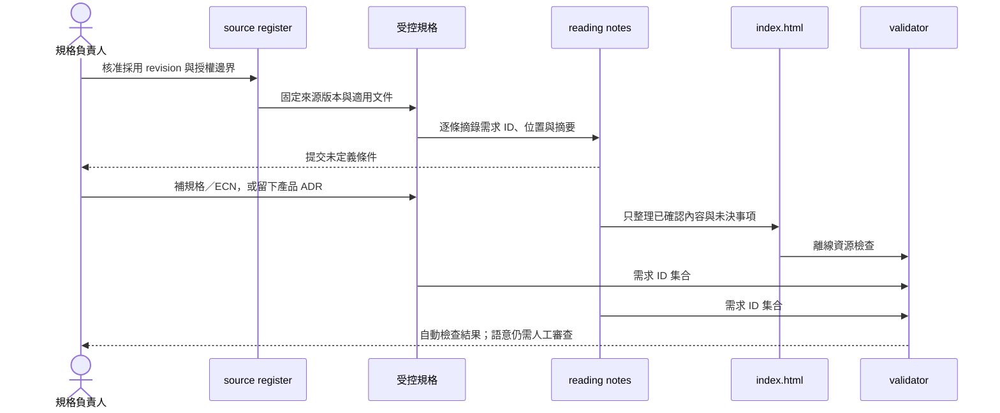

# Spec 閱讀、教學筆記與靜態 HTML 手冊案例

本案例示範把一份有明確 revision 的規格，整理成閱讀筆記、需求對照表與單檔 HTML，再用程式檢查可追溯性。`sample-spec.md` 是本專案建立的虛構規格，不是 PCIe、NVMe、Android 或任何產品的條文。

## 1. 案例檔案

| 檔案 | 角色 | 是否可公開 |
|---|---|---|
| `source-register.md` | 來源 ID、revision、位置、授權、採用範圍、查詢日期 | 案例可；真實專案依授權決定 |
| `sample-spec.md` | 虛構需求來源，定義 REQ-001～REQ-003 | 可 |
| `reading-notes.md` | 解讀、最小驗收案例與待確認問題 | 可 |
| `index.html` | 無 script、無外部資源的單檔手冊 | 可 |
| `validate.py` | 比對版本標記、REQ ID 集合與離線資源限制 | 可 |
| `SAMPLE.md` | 本操作手冊 | 可 |

所有內容都固定到 `SAMPLE-EVENT-EXPORT 1.0`。若來源 revision 改變，登記、原文、筆記與 HTML 必須在同一個 PR 更新。

## 2. 文件架構



資料流是單向的：來源決定可寫入的內容；筆記不能補造來源未定義的規則；HTML 只能整理已核對內容與明確的待確認項目。

## 3. 閱讀流程



### 每條需求的拆解格式

| 欄位 | 問題 |
|---|---|
| 來源 | 哪個文件、revision、章節、表格或條款？ |
| 主詞 | 誰必須執行？host、controller、app、tool 或 operator？ |
| 前置條件 | 在什麼狀態、模式或 capability 下適用？ |
| 輸入 | 欄位、型別、單位、範圍與編碼是什麼？ |
| 行為 | 必須做什麼？順序與時限是否有定義？ |
| 輸出 | 正常結果、status、side effect 與持久化行為是什麼？ |
| 錯誤 | 無效值、timeout、重試、例外狀態如何處理？ |
| 驗收 | 哪個 test、review 或量測可以證明？ |
| 未知 | 原文沒有說明的部分由誰裁定？ |

## 4. 案例如何處理三條需求

`sample-spec.md` 定義：

| 需求 | 已知內容 | 未自行推論的內容 |
|---|---|---|
| REQ-001 | 每筆事件一行 UTF-8；欄位順序為 sequence、level、code、message | message 的跳脫規則 |
| REQ-002 | 同一份輸出依 sequence 由小到大 | sequence 重複與 wrap-around |
| REQ-003 | 未知 code 保留原值，message 顯示 `UNKNOWN` | 未知 level 的處理 |

`reading-notes.md` 將每條需求轉成最小驗收案例，並把 sequence 重複、wrap-around、message 換行列入「待確認」。HTML 同時保留需求與未知項目，不把未知項目改寫成結論。

## 5. 時序圖：從 revision 到發布手冊



## 6. 從零建立規格手冊專案

```bash
cd /absolute/path/to/Work/ai-dev-platform
python3 -B scripts/init_product.py \
  --name pcie-reading-handbook \
  --display-name "PCIe Reading Handbook" \
  --domain generic \
  --ci github-actions \
  --product-type "規格閱讀與靜態手冊" \
  --target-platform "產品核准的 PCIe/NVMe revision" \
  --language-framework "Markdown、HTML、Python 3" \
  --build-command "python3 -B validate.py" \
  --test-command "python3 -B validate.py" \
  --lint-command "python3 -B validate.py" \
  --package-command "mkdir -p dist && python3 -m zipfile -c dist/spec-handbook.zip SAMPLE.md source-register.md sample-spec.md reading-notes.md index.html validate.py" \
  --artifact-path "dist/spec-handbook.zip" \
  --with-example \
  --dry-run
```

確認路徑後移除 `--dry-run`。建立完成後：

```bash
cd /absolute/path/to/Work/pcie-reading-handbook-cicd-platform
python3 -B validate.py
mkdir -p dist
python3 -m zipfile -c dist/spec-handbook.zip \
  SAMPLE.md source-register.md sample-spec.md reading-notes.md index.html validate.py
python3 -m http.server 8000 --bind 127.0.0.1
```

在瀏覽器開啟 `http://127.0.0.1:8000/index.html`。預覽完成後以 `Ctrl-C` 停止 server。`dist/spec-handbook.zip` 是可重建輸出，不提交到 Git。

## 7. 驗證器實際檢查什麼

`python3 -B validate.py` 目前檢查：

1. `sample-spec.md` 至少有一個 `REQ-[0-9]{3}` 識別字。
2. `reading-notes.md` 與 `index.html` 的 REQ ID 集合必須與規格相同；缺少或多出都失敗。
3. `source-register.md`、規格、筆記與 HTML 都包含 `SAMPLE-EVENT-EXPORT 1.0`。
4. HTML 不得包含 `<script>`。
5. HTML 的 `script`、`link`、`img`、`iframe`、`object` 不得指向 HTTP(S) 或 protocol-relative 外部資源。

成功輸出：

```text
[OK] 3 個需求識別字已出現在筆記與手冊
```

驗證器不能判斷摘要是否正確、驗收案例是否充分、章節引用是否真的對應原文，也不能判斷使用者是否有權公開內容。這些項目需要規格擁有者與領域 reviewer 審查。

## 8. 具體案例：閱讀 PCIe／NVMe 規格

不要把「PCIe」或「NVMe」當成單一文件。先在 `source-register.md` 分別登記產品真正採用的文件，例如：

```text
PCI Express Base Specification: <產品採用 revision>
適用 ECN／errata: <清單>
NVM Express Base Specification: <產品採用版本>
NVM Command Set Specification: <產品採用版本>
NVM Express PCIe Transport Specification: <產品採用版本>
Controller vendor guide: <文件 ID／revision>
查詢日期: YYYY-MM-DD
授權: 可否重製原文、可否對外發布摘要
```

截至 2026-08-25，PCI-SIG 公開頁把 PCI Express Base Specification Revision 7.0 列為 current approved specification；NVM Express 公開頁說明 NVMe 2.4 是由 Base、Command Set、Transport、Boot、Management Interface 等多份文件組成。這是公開頁面的當日狀態，不代表既有 SSD 產品應升級到該版本。

官方入口：[PCI-SIG PCI Express Base](https://pcisig.com/specification-overview/pci-express-base)、[NVM Express specifications](https://nvmexpress.org/specifications/)。產品採用版本必須依 controller capability、host support、certification、合約與已核准設計決定。

### 以一條 read command 規則做筆記

1. 在受控規格中找到命令欄位與適用章節，記下文件、revision、章節、表格編號；不要把完整會員文件貼進 public repo。
2. 在筆記中分開記錄 command field、namespace 前置條件、LBA 單位、length 編碼、錯誤 status 與 completion 行為。
3. 每個結論旁放來源定位；若同時需要 Base、Command Set 與 Transport，分列三個來源。
4. 將「規格明載」與「controller vendor 行為」放在不同欄位。
5. 產生正常、邊界、保留值、overflow、timeout 等驗收案例；沒有條文依據的預期結果標為待確認。
6. 經領域 reviewer 核對後，才整理到 HTML 的教學段落。

## 9. HTML 手冊編排

單檔手冊建議順序：


HTML 使用系統字型與 inline CSS，不使用 CDN。圖片若必須離線內含，可使用同目錄相對路徑或經大小與授權審核的 data URI，並擴充 validator 檢查檔案存在與 hash。本案例沒有圖片檔。

## 10. 真實規格的授權與機密邊界

| 情況 | public repository 可保存的內容 |
|---|---|
| 官方公開、允許引用 | 短摘要、連結、revision、章節定位、團隊自寫圖表 |
| 會員／付費規格 | 依授權允許的摘要、需求 ID、章節定位；通常不放完整原文 |
| NDA／客戶規格 | 只在核准的內部 repository／文件系統處理 |
| 內部產品決策 | ADR、測試預期與負責人；避免客戶識別與機密參數 |

無法確認散布權時先停止發布，請文件擁有者或法務確認。刪除目前檔案不代表 Git 歷史、PR、CI artifact 與 clone 中的副本已消失。

## 11. 變更與審查清單

- [ ] source register 的文件 ID、revision、ECN／errata、授權與查詢日期已更新。
- [ ] 每個結論都有來源定位或明確標為產品決策。
- [ ] 規格未定義的條件仍列在待確認區。
- [ ] REQ ID 在規格、筆記與 HTML 一致。
- [ ] `python3 -B validate.py` 通過。
- [ ] HTML 在網路關閉時仍可閱讀。
- [ ] 領域 reviewer 核對摘要與驗收案例，不只看格式。
- [ ] ZIP 不含受限原文、暫存檔、瀏覽器資料或憑證。
