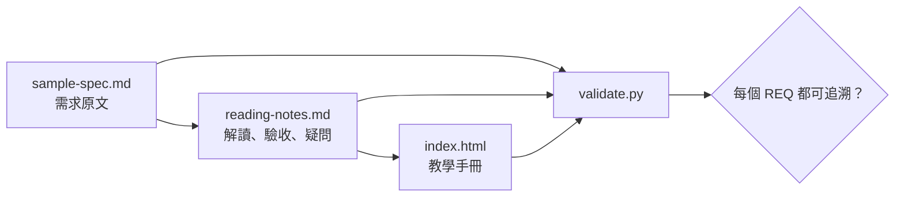

# 規格閱讀、教學筆記與靜態手冊範例

本範例供需要閱讀規格、留下可追溯筆記並交付離線 HTML 手冊的人使用。`sample-spec.md` 是虛構規格，不代表 NVMe、PCIe、Android 或任何真實產品要求。



## 使用步驟

1. 從規格逐條擷取穩定的需求識別字，不自行補足缺失條件。
2. 在 `reading-notes.md` 記錄原文摘要、可測試的驗收方式、未知項目與來源。
3. 將已確認內容整理到 `index.html`；未知項目保留「待確認」，不要寫成結論。
4. 驗證三份文件的需求識別字一致：

   ```bash
   cd examples/spec-notes
   python3 -B validate.py
   ```

5. 直接開啟 `index.html`，或在本機預覽：

   ```bash
   python3 -m http.server 8000
   ```

   瀏覽 `http://127.0.0.1:8000/`。頁面沒有 CDN、字型下載、分析程式或外部 JavaScript，可離線閱讀。

真實規格若受授權或保密條款約束，只保存團隊獲准保存的摘要、需求識別字與引用位置；不要把完整原文貼進公開儲存庫。
