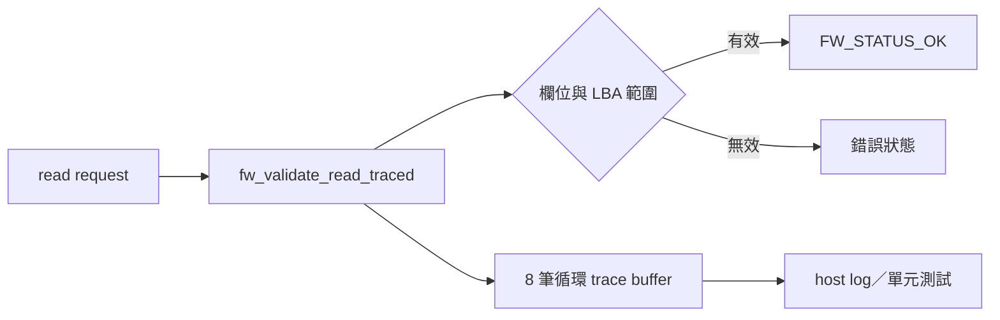

# SSD PCIe 韌體除錯與追蹤範例

本範例供韌體開發者練習「輸入驗證、固定容量追蹤緩衝區、host 單元測試與打包」。它是 C11 模擬程式，不實作 PCIe／NVMe 命令、不操作硬體暫存器，也不含控制器供應商資料；產生的 ELF 不能燒錄到 SSD。

## 資料流



每次驗證寫入 `READ_RECEIVED` 及最終 `READ_ACCEPTED`／`READ_REJECTED`。緩衝區滿時覆寫最舊紀錄，保留單調遞增的 sequence，方便找出事件順序。實際產品仍須依控制器記憶體、並行模型、隱私要求與 NVMe／PCIe 正式規格重新設計。

```bash
cd examples/ssd-pcie-fw
make all
make test
make lint
make package
./build/ssd-pcie-fw-sample.elf
```

測試涵蓋有效輸入、空指標、無效 namespace、LBA 越界、整數溢位與 trace 覆寫順序。需要真實命令語意時，以產品採用版本的 [NVM Express 規格](https://nvmexpress.org/specifications/)與供應商文件為準，不從此範例推論。
