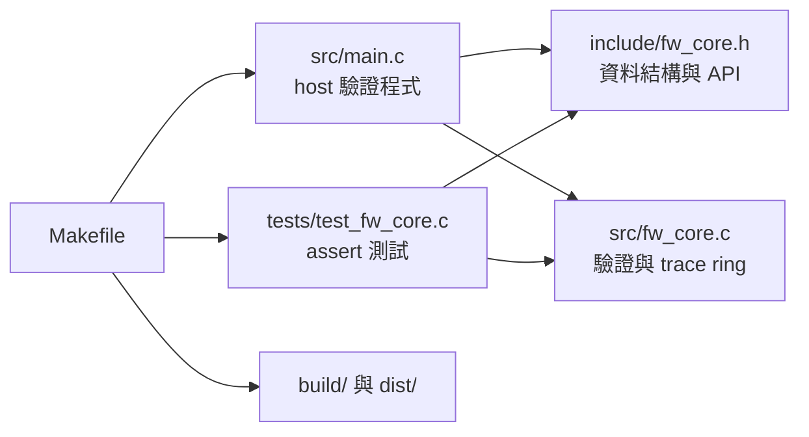
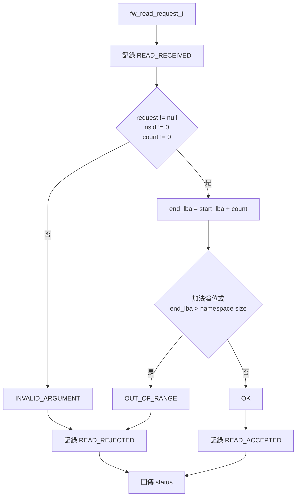
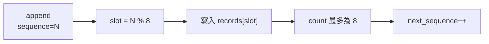
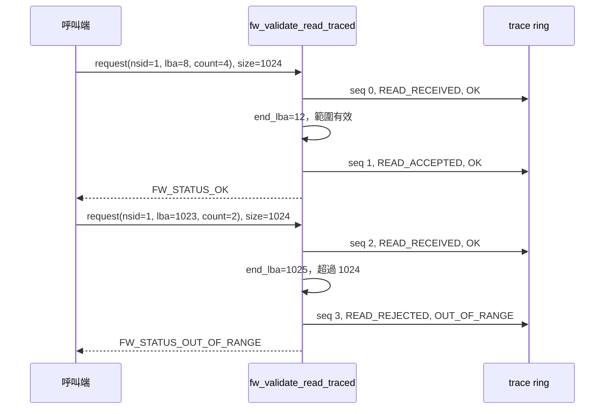

# SSD PCIe 韌體除錯與 trace code 案例

本案例示範如何把一個可重現的 read request 驗證問題，縮小成 C11 host 測試並留下固定格式 trace。它不實作 PCIe transaction、NVMe command、queue、DMA、硬體暫存器或 controller SDK；`dist/ssd-pcie-fw-sample.elf` 是主機執行檔，不能燒錄到 SSD。

## 1. 案例要驗證的行為

輸入是 `fw_read_request_t`：

| 欄位 | 型別 | 本案例規則 |
|---|---|---|
| `namespace_id` | `uint32_t` | 不可為 0 |
| `start_lba` | `uint64_t` | 必須與 `sector_count` 相加後不溢位 |
| `sector_count` | `uint16_t` | 不可為 0 |
| `namespace_sector_count` | `uint64_t` 函式參數 | `start_lba + sector_count` 不得超過此上限 |

輸出狀態由 `fw_status_t` 定義：

| 狀態 | 值 | 觸發條件 |
|---|---:|---|
| `FW_STATUS_OK` | 0 | 欄位有效且 LBA 範圍在 namespace 內 |
| `FW_STATUS_INVALID_ARGUMENT` | 1 | request 是 null、namespace 是 0 或 sector count 是 0 |
| `FW_STATUS_OUT_OF_RANGE` | 2 | LBA 加法溢位或結束位置超過 namespace |

## 2. 程式架構



| 檔案 | 可直接查到的內容 |
|---|---|
| `include/fw_core.h` | status、request、event、trace record、容量 8、函式宣告 |
| `src/fw_core.c` | 輸入驗證、溢位判斷、ring append、依舊到新讀取 |
| `src/main.c` | 建立一筆有效 request，列印兩筆 trace |
| `tests/test_fw_core.c` | 有效、null、namespace 0、越界、溢位、覆寫順序 |
| `Makefile` | C11 編譯、test、syntax lint、package、clean |

## 3. 驗證與 trace 資料流



每次 `fw_validate_read_traced()` 最多新增兩筆記錄：收到 request 時一筆、得出結果時一筆。傳入 null `trace` 時仍執行驗證，但不記錄事件。

## 4. Trace ring 的實際格式

`fw_trace_record_t` 保存：

- `sequence`
- `event`
- `status`
- `namespace_id`
- `start_lba`
- `sector_count`

事件列舉是 `FW_TRACE_READ_RECEIVED`、`FW_TRACE_READ_ACCEPTED`、`FW_TRACE_READ_REJECTED`；數值定義以 `include/fw_core.h` 為準。



`fw_trace_get(trace, oldest_index, record)` 以「目前最舊的一筆」為索引 0。當 12 筆事件已寫入容量 8 的 ring，保留 sequence 4 到 11；測試會比對最舊為 4、最新為 11。此案例沒有處理 `uint32_t next_sequence` 長時間執行後的 wrap-around。

## 5. 時序圖：有效與越界 request



## 6. 從零建立 SSD FW 專案

先依平台入門文件安裝 `Work/ai-dev-platform/`，再執行：

```bash
cd /absolute/path/to/Work/ai-dev-platform
python3 -B scripts/init_product.py \
  --name controller-fw \
  --display-name "Controller Firmware" \
  --domain ssd-pcie-fw \
  --ci github-actions \
  --with-example \
  --dry-run
```

確認輸出路徑後移除 `--dry-run`。建立完成後：

```bash
cd /absolute/path/to/Work/controller-fw-cicd-platform
make clean
make lint
make test
make all
make package
./build/ssd-pcie-fw-sample.elf
```

目前 `src/main.c` 的預期輸出是：

```text
seq=0 event=1 status=0 nsid=1 lba=0 count=8
seq=1 event=2 status=0 nsid=1 lba=0 count=8
```

數字對應關係定義在 `include/fw_core.h`。若型別或列舉改動，應更新輸出格式與測試，不要只改文件。

## 7. 具體 debug 操作

假設裝置記錄顯示 read request 在 namespace 尾端失敗：`nsid=1, start_lba=1023, sector_count=2, namespace_sector_count=1024`。

1. 在 `tests/test_fw_core.c` 建立同樣的最小 request。
2. 呼叫 `fw_trace_init()`，避免沿用前一次測試資料。
3. 呼叫 `fw_validate_read_traced()`。
4. 先比對回傳值是 `FW_STATUS_OUT_OF_RANGE`。
5. 用 `fw_trace_get()` 逐筆讀取，確認 `READ_RECEIVED` 在前、`READ_REJECTED` 在後，且 nsid、LBA、count 與輸入相同。
6. 執行 `make test`；修正驗證邏輯後，保留這筆測試作為 regression test。

對應測試骨架：

```c
const fw_read_request_t request = {1, 1023, 2};
fw_trace_buffer_t trace;
fw_trace_record_t record;

fw_trace_init(&trace);
assert(
    fw_validate_read_traced(&request, 1024, &trace) ==
    FW_STATUS_OUT_OF_RANGE
);
assert(fw_trace_get(&trace, 0U, &record));
assert(record.event == FW_TRACE_READ_RECEIVED);
assert(fw_trace_get(&trace, 1U, &record));
assert(record.event == FW_TRACE_READ_REJECTED);
assert(record.status == FW_STATUS_OUT_OF_RANGE);
```

這段程式只重現軟體邊界判斷。若裝置問題發生在 command submission、doorbell、DMA、completion timeout、link recovery 或 power state，需在產品端另外定義 trace point 與測試環境。

## 8. 接到真實韌體前要替換的部分

| 本案例 | 產品端要提供 |
|---|---|
| `fw_read_request_t` | 從產品採用的 NVMe command／內部 request 解碼後的明確欄位 |
| `namespace_sector_count` 參數 | 由已驗證的 namespace metadata 取得，定義單位與更新時機 |
| host `printf` | 核准的 UART、memory buffer、telemetry 或 crash dump sink |
| 固定 8 筆 ring | 依 SRAM、事件速率、保留時間與讀取方式估算容量 |
| 單執行緒程式 | ISR／task／多核心的同步、memory ordering 與 critical section |
| 連續 `uint32_t` sequence | wrap-around 規則、boot/session ID、必要時的 timestamp |
| 原始 LBA/nsid | 資料分類、遮罩、存取權與 log retention |
| host ELF | cross compile、linker script、image format、簽章、secure boot、燒錄與 HIL 測試 |

產品 trace schema 建議至少明定 event ID、欄位單位、producer context、buffer ownership、覆寫政策、時間基準、匯出方法與敏感資料分類。這些項目在本案例尚未實作。

## 9. 規格版本不能從案例推論

截至 2026-08-25，PCI-SIG 公開頁列出的 current approved PCI Express Base Specification 是 Revision 7.0；NVM Express 公開頁列出的 NVMe 2.4 是一組多文件規格，包含 Base、Command Set 與 Transport 等文件。本案例沒有實作這些 revision。

產品應在 `docs/domain-standards.md` 記錄實際採用的：

- PCI Express Base revision 與適用 ECN；
- NVMe Base、NVM Command Set、NVMe over PCIe Transport 的各自版本；
- controller vendor programming guide／errata 版本；
- 引用章節、查詢日期、授權與未決事項。

官方入口：[PCI-SIG PCI Express Base](https://pcisig.com/specification-overview/pci-express-base)、[NVM Express specifications](https://nvmexpress.org/specifications/)。完整條文若受會員或授權限制，不得複製到 public repository。

## 10. 驗證結果如何記錄

PR 或 debug handoff 至少附上：

```text
問題輸入：nsid、start_lba、sector_count、namespace size
預期狀態：
實際狀態：
trace sequence 範圍：
第一筆失敗事件：
執行指令：make clean lint test all package
執行環境：compiler 與版本
未驗證：實機、DMA、queue、timing、power state、正式簽章
```

`make` 使用 `-std=c11 -Wall -Wextra -Werror -pedantic -O2`；`make lint` 是編譯器 syntax-only 檢查，不是 MISRA、CERT C 或商用靜態分析器。
