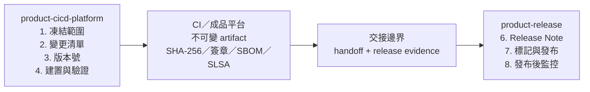

# Workflow：發行流程（Release）

本文件供產品發行的執行者與核准者使用。版本號、核准門檻與還原規則以 `governance/release.md` 為準。

## 跨儲存庫流程

第 1～4 步在 `product-cicd-platform` 進行；第 5 步是交接邊界；第 6～8 步在該產品專屬的 `product-release` 進行。

## 步驟

1. **凍結範圍（feature freeze）** — `product-cicd-platform`
   - 列出本版本包含的已合併變更。
   - 凍結後只接受必要的錯誤修正 PR。

2. **產生變更清單** — `product-cicd-platform`
   - 彙整自上個版本以來的 commit 與 PR。
   - 分類為新功能、修正、破壞性變更與已知問題。

3. **決定版本號** — `product-cicd-platform`
   - 依 `governance/release.md` 的語意化版本（Semantic Versioning）規則決定版本號。

4. **建置與驗證** — `product-cicd-platform`
   - 產生正式建置成品（artifact）。
   - 執行完整測試、必要的效能評測與快速驗證（smoke test）。
   - 產生 SHA-256 與軟體物料清單（Software Bill of Materials, SBOM）。
   - 產生 SLSA provenance，並對建置成品產生 OpenSSL SHA-256 分離式簽章。領域原生簽章（Android App Signing／韌體供應商簽章）仍須依產品規範另行驗證。
   - 所有必要 CI 檢查通過後，才能進入第 5 步。

5. **交接到 `product-release`** — 交接邊界
   - 依 `templates/task-handoff.md` 產生供人閱讀的交接文件，保存在 `product-cicd-platform/.ai/handoffs/` 或 CI 紀錄，不提交到發行儲存庫。
   - 依 `templates/release-evidence.json.template` 產生機器可驗證的發行證據（release evidence）。
   - 建置成品存放在 CI／成品平台的不可變位置。發行儲存庫只保存發行證據、Release Note、Git tag 與必要管理檔，並以 URI、SHA-256、簽章和 SBOM 參照成品。
   - 先執行 `python3 -B ../ai-dev-platform/scripts/verify_release_layout.py .`，確認沒有原始碼、建置成品或第三方 skill。
   - 核准者不得與產生建置成品的執行者相同；獨立性規則見 `governance/review.md`。

6. **撰寫 Release Note** — `product-release`
   - 使用 `templates/release-note.md`。
   - 內容以第 5 步的變更清單為準，不直接貼上 commit log。

7. **標記與發布** — `product-release`
   - 在功能分支 commit 發行證據與 Release Note，經必要 CI 與獨立核准合併到 `main`；不得直接推送 `main`。
   - 在合併後的 `main` 建立尚未推送、指向 HEAD 的版本標籤（tag）。若採 squash merge，不得沿用 PR 分支的 commit 或 tag。
   - 執行 `scripts/verify_release_readiness.py`；任一關卡失敗都不得推送 tag、發布或推進。完整參數見 `docs/release-evidence.md`。
   - Readiness 通過後才推送 tag，並將已核准的建置成品發布到對應通路。

8. **發布後監控** — `product-release`
   - 依產品定義的觀察期監控錯誤回報與效能指標。
   - 發現嚴重問題時，依 `governance/release.md` 的還原 (rollback) 程序處理。
   - 需要修改程式碼時，回到 `product-cicd-platform` 執行 `workflow/bugfix.md`。
